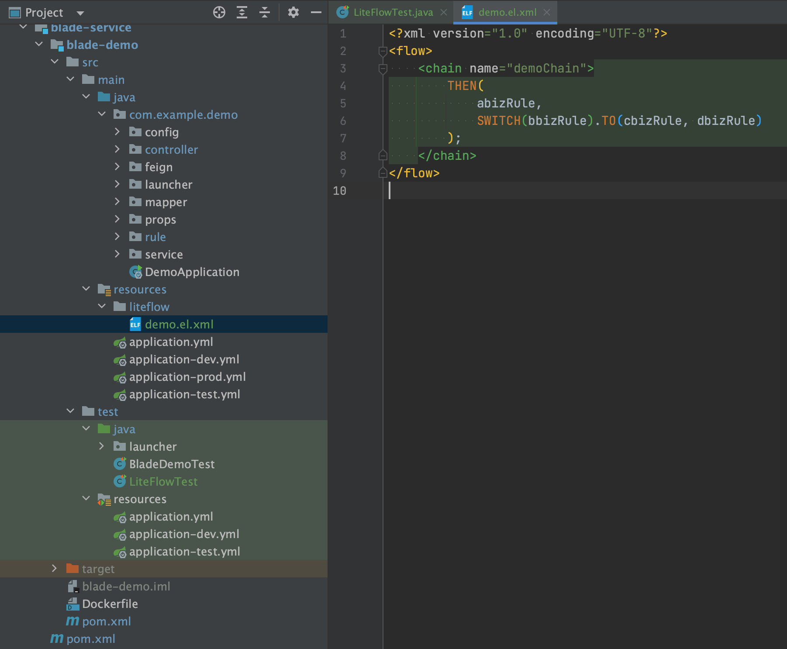
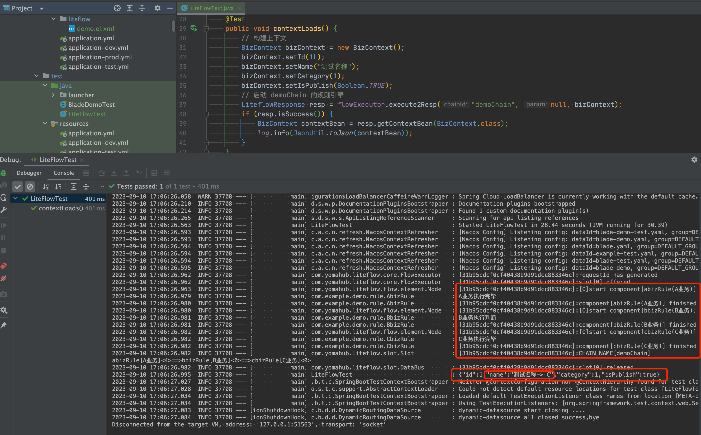

## 简介

* LiteFlow为解耦复杂逻辑而生，如果需要对复杂业务逻辑进行新写或者重构，用LiteFlow便是一个很好的选择。
* 它是一个轻量，快速的组件式流程引擎框架，组件编排，帮助解耦业务代码，让每一个业务片段都是一个组件，并支持热加载规则配置，实现即时修改。
* 需要注意的是，LiteFlow只做基于逻辑的流转，而不做基于角色任务的流转。如果业务场景需要做基于角色任务的流转，推荐使用flowable工作流。
* LiteFlow官网：https://liteflow.cc/


## 架构图


## 什么场景下需要用到

1. 一般满足如下条件时，我们就需要用规则引擎对业务进行拆分了

* 当一个业务的逻辑逐渐复杂，需要有多个不同的逻辑同时执行，并且有先后顺序
* 除了逻辑的先后顺序之外，还需要做各种判断，当满足某个条件时才需要执行
* 逻辑的顺序以及条件可能会进行变更，逻辑本身可以相互独立或者只有轻微的关联性

2. 上面的场景像极了工作流的需求，但是工作流更为重量级，其中涉及到了用户、部门、角色等概念

3. 而规则引擎的适用场景仅限于逻辑流程的处理，不涉及到角色

4. 比如一个审批业务，期间有多种不同的角色需要审核批复，这种情况是肯定需要工作流来处理

5. 比如一个优惠券业务，不涉及到角色审批，但是逻辑非常复杂，并且随时可能变化。比如什么用户在什么时间段什么促销产品的条件下，能领哪些优惠券

6. 针对这种业务，如果从头开始写if else，会非常的累人了。也只有熟悉各种设计模式的架构师，才能驾驭，但这个成本太高，不太符合实际工作场景

7. 如果我们把整个优惠券业务拆分成独立的模块，然后通过流程判断的逻辑，统一进行控制，让代码底层自动根据流程的规定去执行不同模块的业务逻辑

8. 那么问题就会变得非常简单，我们还可以给模块再次拆分成多个新的子模块，在流程内嵌套流程。这样一来，哪怕不精通设计模式，也能很轻松地开发出一个容易拓展和维护的复杂业务模块来

9. 在没拆分之前，我们通过手写if else来判断大部分逻辑，只能做到如下的效果，效果单一且维护性差

   

10. 但是拆分之后，只要逻辑模块清晰，流程清晰，我们就可以很轻松地将业务拆分为如下的效果，灵活多变，维护性强，接手的同事也可以很快理清思路

    

11. 下面我们就来实际操作一下如何进行规则引擎的使用，在操作之前请先完整过一遍官方文档，有个大概的了解，否则无法直接进行上手


## 准备工作

1. 在需要进行业务拆分的服务引入对应依赖

   ```xml
   <dependency>
       <groupId>org.springblade</groupId>
       <artifactId>blade-starter-liteflow</artifactId>
   </dependency>
   ```

2. 在工程内创建一个rule包用于存放拆分后的规则引擎文件

3. 在工程的资源包创建liteflow文件夹用于存放规则引擎配置

4. 具体如下图所示

   

5. 若使用idea，可以安装官方提供的插件LiteFlowX辅助开发

   

   


## 创建业务规则类与配置文件

1. 在rule包创建多个类，我们简单以a、b、c、d命名

   

2. 创建规则类有两点需要注意：

   * 继承 `NodeComponent` 并且实现 `process`方法 
   * 使用`@LiteflowComponent`注解声明，并且设置不重复的`id`

3. 若规则类不是单纯的节点，需要进行判断，比如switch，则需要继承 `NodeSwitchComponent` 并且实现` processSwitch` 方法

4. 创建上下文类，用于传递参数、mapper、service等各种所需要的类。由于LiteFlow多线程启动，request无法在内部获取，所以请求参数也需要传入上下文类

   

5. 在liteflow文件夹下创建规则配置，本次以最简单的顺序执行为例

   

6. 创建配置需要注意如下几点：

   * 将配置文件创建在`resources/liteflow`资源文件夹下，以`xxx.el.xml`格式命名
   * 以`chain`为节点定义一个完整的业务模块，通过`name`区分
   * 使用`liteflow`的表达式语法来约定各个模块之间执行的逻辑
   * 上图的表达式指定四个业务模块按顺序依次执行，上一个执行完才会执行下一个


## 常见规则表达式

### **1.串行编排**

当我们想要依次执行a、b、c、d四个组件时，直接使用`THEN`关键字即可。

```xml
<chain name="chain1">
    THEN(a, b, c, d);
</chain>
```

### **2.并行编排**

如果想并行执行a、b、c三个组件的话，可以使用`WHEN`关键字。

```xml
<chain name="chain1">
    WHEN(a, b, c);
</chain>
```

### **3.选择编排**

如果想实现代码中的switch逻辑的话，例如通过a组件的返回结果进行判断，如果返回的是组件名称b的话则执行b组件，可以使用`SWITCH`关键字。

```xml
<chain name="chain1">
    SWITCH(a).to(b, c, d);
</chain>
```

### **4.条件编排**

如果想实现代码中的if逻辑的话，例如当x组件返回为true时执行a，可以使用`IF`关键字。

```xml
<chain name="chain1">
    IF(x, a);
</chain>
```

如果想实现if的三元运算符逻辑的话，例如x组件返回为true时执行a组件，返回为false时执行b组件，可以编写如下规则文件。

```xml
<chain name="chain1">
    IF(x, a, b);
</chain>
```

如果想实现if else逻辑的话，可以使用`ELSE`关键字，和上面实现效果等价。

```xml
<chain name="chain1">
    IF(x, a).ELSE(b);
</chain>
```

如果想实现else if逻辑的话，可以使用`ELIF`关键字。

```xml
<chain name="chain1">
    IF(x1, a).ELIF(x2, b).ELSE(c);
</chain>
```

### **5.使用子流程**

当某些流程比较复杂时，我们可以定义子流程，然后在主流程中引用，这样逻辑会比较清晰。

例如我们有如下子流程，执行C、D组件。

```xml
<chain name="subChain">
   THEN(C, D);
</chain>
```

然后我们直接在主流程中引用子流程即可。

```xml
<chain name="mainChain">
    THEN(
     A, B,
     subChain,
     E
    );
</chain>
```


## 开始测试

1. 编写测试用例，注意测试用例使用test环境变量启动，他会去nacos请求blade-test.yaml的配置，注意不要遗漏

   

2. 启动后查看控制台日志，顺序执行无误，上下文数据也获取正确

   

3. 现在我们来做下简单改造，将b改成switch节点，并且修改上下文的值，查看是否成功，具体修改如下

   

   

   

   

4. 执行单元测试，可以看到ABC执行成功，D未执行因为不满足条件

   


## 后记

* 经过本章节学习，大家应该已经入门，请多多阅读官方的文档，会有很多其他好用的功能可以使用

* 若想加深对其理解，可以查看bladex如下模块进行学习

  

  

  

  

  

  
