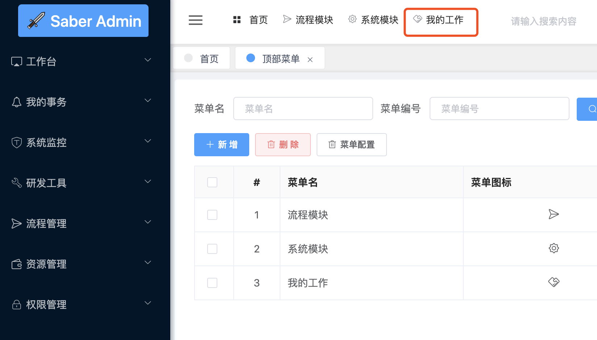

## 简介
* 顶部菜单主要作用为将很多模块进行分组，并显示在系统顶部，点击后可以快速切换菜单
* 如此一来，可以使得项目更加简介，效率更高，具体表现形式如下

## 顶部菜单配置
1. 打开`系统管理`的`顶部菜单模块`
2. 新增对应的信息

3. 分配下级菜单(注意：用户必须要在角色管理分配了对应菜单，点击顶部菜单后才可显示)

4. 刷新系统发现增加了刚刚配置的菜单

5. 点击后左侧菜单刷新成功

