## 数据库隔离方案
* 系统默认为字段隔离，若后续业务扩张起来，可以考虑开启数据库隔离插件
* 开启数据库隔离后原先的代码几乎不需要变动，可以通过注解或者全局切面来控制数据库隔离的业务表
* 为了成本考虑，BladeX设计了适应中国式多租户需求的解决方案。可以在前期资源较紧张的时候配置一个数据库所有租户，或者5个数据库平分所有租户
* 当然等后期业务扩张完毕，系统资金到位，可以配置为一个数据库一个租户，又因为默认采用字段隔离为辅助，这对后续数据库迁移、数据汇总统计带来极大的便利
* 数据库隔离方案开启后仍然需要配置字段隔离，因为大多数情况下，一个数据库往往会分配给多个租户，而一数据库一租户的情况相对较少。所以这种场景下，就算是按数据库分配了租户，也是需要有字段隔离的方案的
* 到了大后期，会有N个数据库对应NN个租户，如果数据量特别大，需要做统计汇总，那么这时候有字段隔离就会显得很轻松。因为业务数据统一汇总到统计表的时候可以用租户ID来区分，就能非常方便地得知哪些数据属于哪些租户。而一开始就设置纯数据库隔离不带字段隔离的方案，在最后统计汇总的时候将会遇到较大的困难

## 数据库隔离注解配置
1. 开启数据库隔离配置
~~~yaml
# 租户表维护
blade:
  #多租户配置
  tenant:
    #动态数据源功能
    dynamic-datasource: true
    ......................
~~~
2. 启动服务（以BladeX-Boot工程为例），若控制台看到如下日志则说明数据库隔离配置启动成功
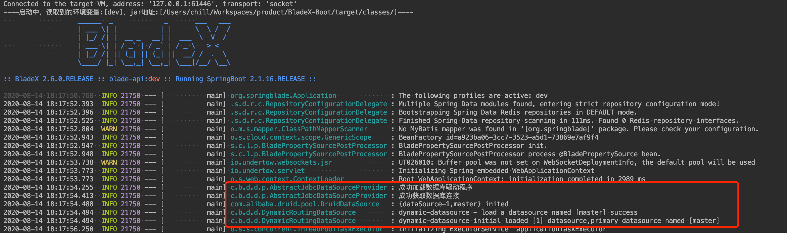
3. 前往 **研发工具->数据源管理** 进行租户数据源的配置（boot工程默认连接的是bladex_boot数据库，这里我们设置租户的数据源为bladex库）
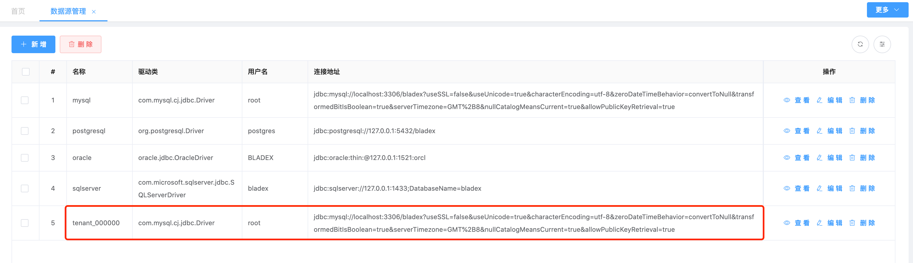
4. 前往 **系统管理->租户管理** 配置刚刚新建的tenant_000000数据源
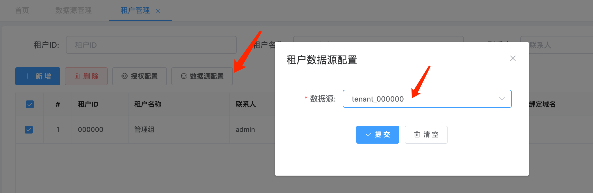
5. 修改两个数据库的blade_notice表，令两个库表数据不同
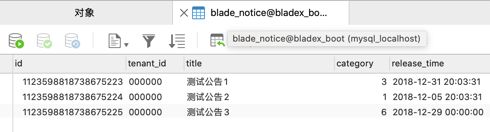
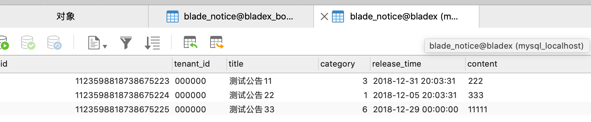
6. 在`NoticeController`头部增加注解`@TenantDS`，这样便可以指定该控制器下所有方法都走对应租户绑定的数据库（底层控制若查找不到对应的数据库则会使用master数据库）
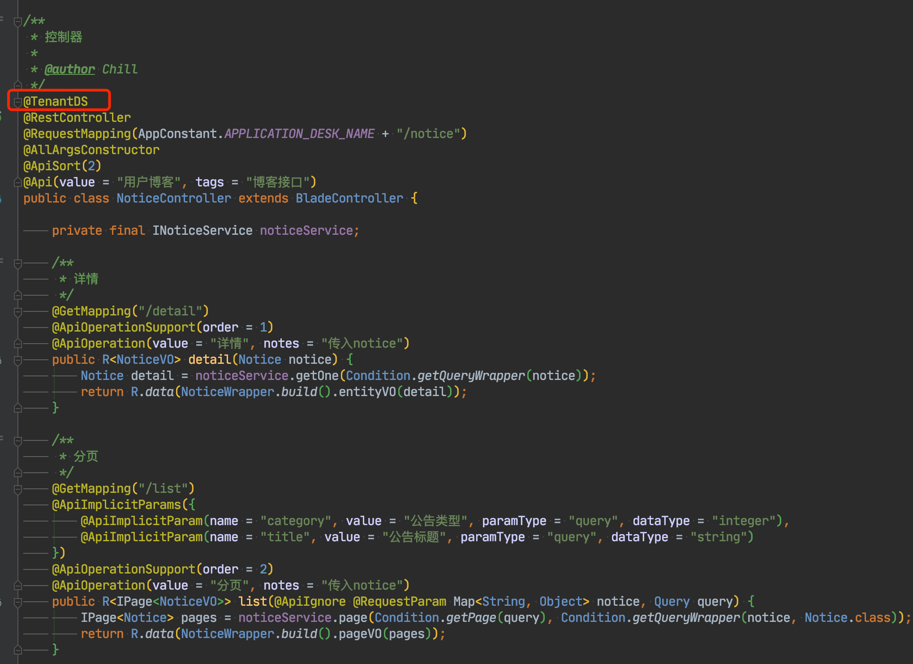
7. 重启工程，可以看到增加初始化了租户ID为000000的数据源
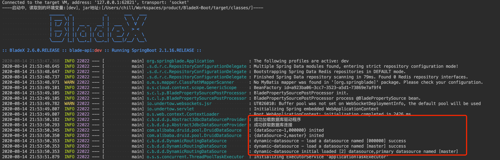
8. 访问列表，发现列表返回的是刚刚配置的租户ID为000000库的数据
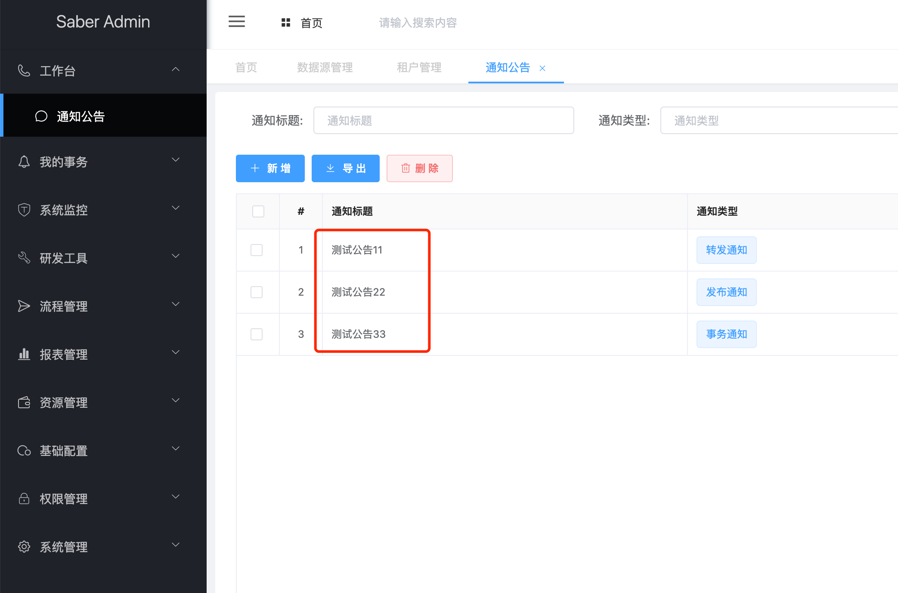
9. 取消注解`@TenantDS`，再次启动服务，访问列表会发现数据切换回了master源
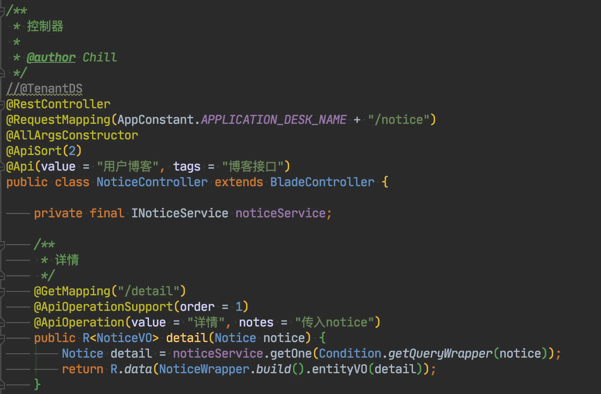
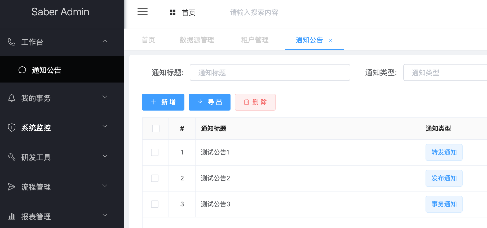

## 数据库隔离全局配置
1. 开启数据库全局隔离配置
~~~yaml
# 租户表维护
blade:
  #多租户配置
  tenant:
    #动态数据源功能
    dynamic-datasource: true
    #动态数据源全局扫描
    dynamic-global: true
    ......................
~~~
2. 接着上一节保持`@TenantDS`注解为注释状态

3. 重启服务，访问列表，可以看到又切换回了刚刚配置的租户ID为000000库的数据
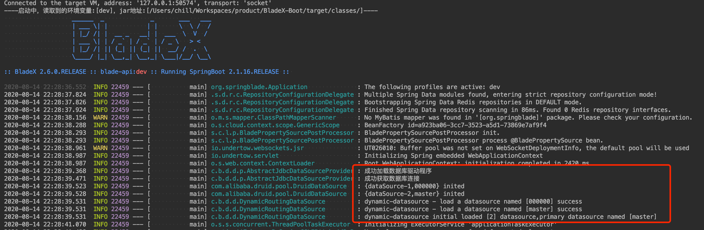
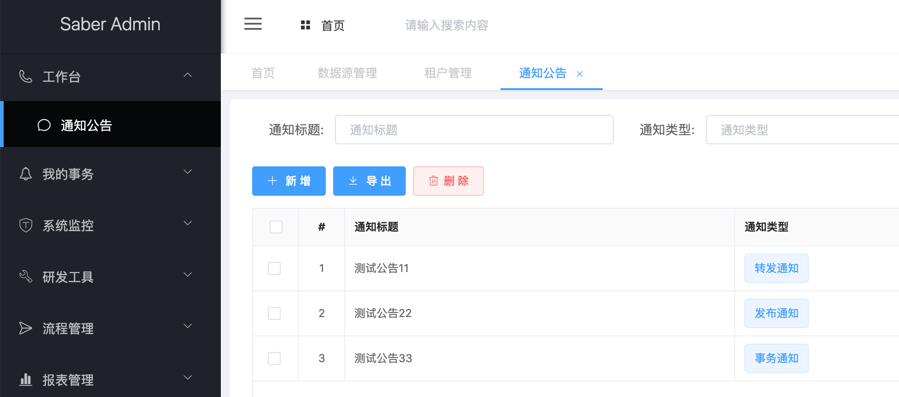
4. 这样一来，全局的操作都会进行租户数据源的切换了，非常方便。但是有些情况，一些业务表必须要用到master数据源，如果全局都切换必然是不符合中国式需求的
5. 对于这种情况，BladeX提供了一个排除的注解`@NonDS`，加上之后就不会受全局插件的影响了
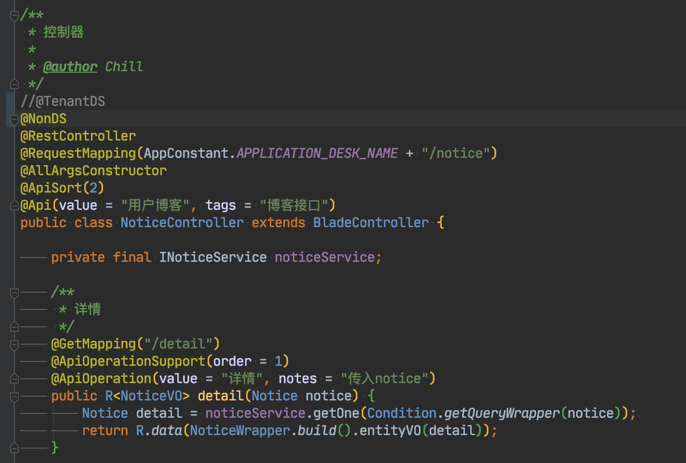
6. 重启服务并访问列表，可以看到又回到了master数据源
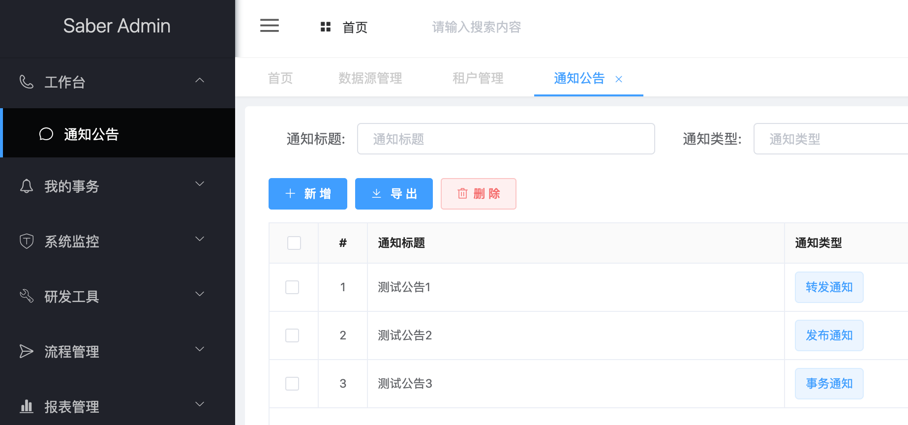

## 后记
* 为了降低使用难度以及后续的数据统计、对接难度，BladeX默认将自带的系统业务模块都加上了`@NonDS`注解
* 这样便不会受全局插件的影响从而导致原先业务出现问题了，升级后业务调整几乎无痛
* 加上`@NonDS`注解的提交具体请看对应commit，大家可以对照着更新修改原有工程：[https://git.bladex.vip/blade/BladeX/commit/a0ca1e6e7223d6341dfb783879c405137a9ce36e](https://git.bladex.vip/blade/BladeX/commit/a0ca1e6e7223d6341dfb783879c405137a9ce36e)

