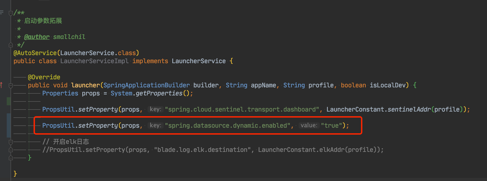

## BladeX 动态数据源配置
* 启用多租户数据库隔离，会默认关闭mybatis-plus多数据源插件的启动，从而使用自定义的数据源识别
* 若不需要租户数据库隔离只需要字段隔离，而又需要用到多数据源的情况，需要前往LauncherService单独配置

## 异步任务切换数据源

* 异步任务下无法取到request，那对应的tenantId也就无法获取，如果在异步任务使用`@TenantDS`注解便会失效
* 对于这种情况我们也有相应的解决方案，那就是直接使用原生的 DynamicDataSourceContextHolder.push 方法
* 具体使用方法如下：https://sns.bladex.vip/q-5045.html

