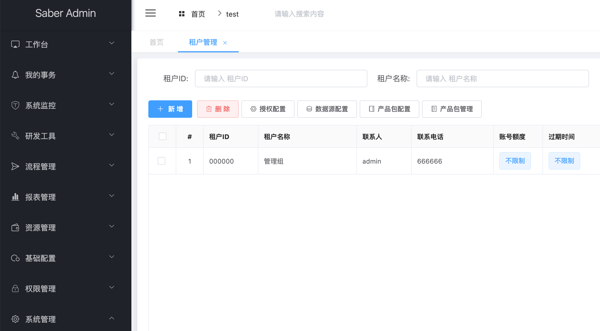
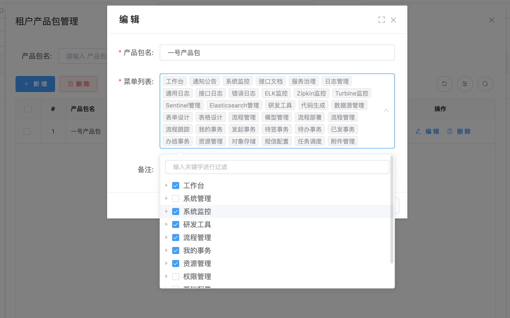
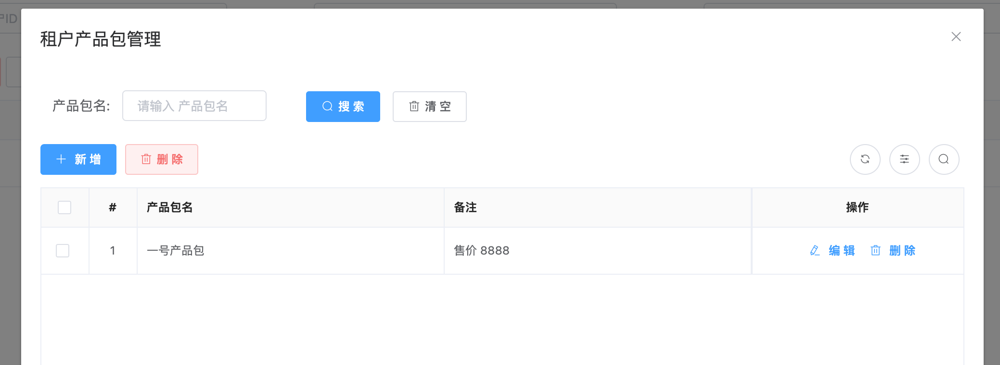
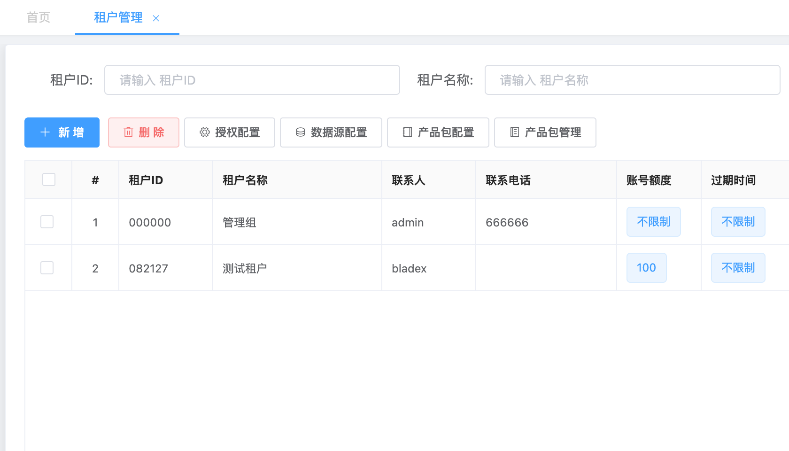
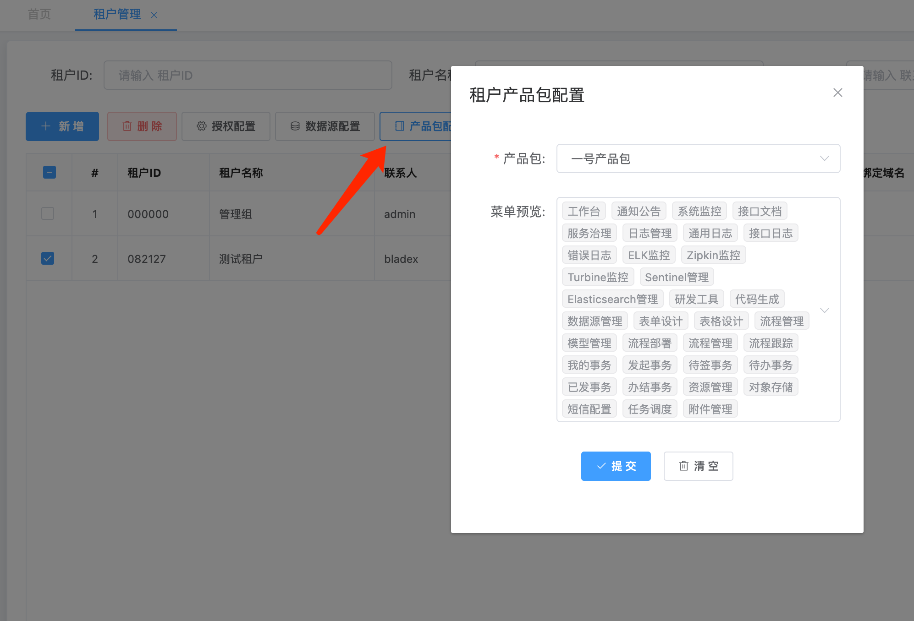
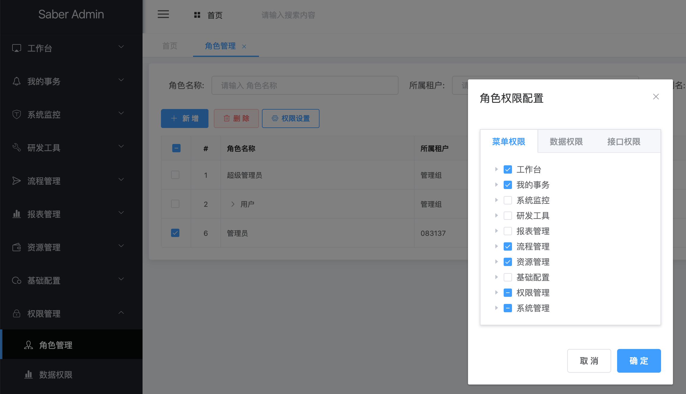
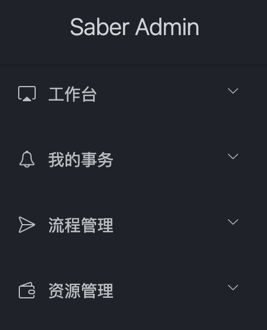
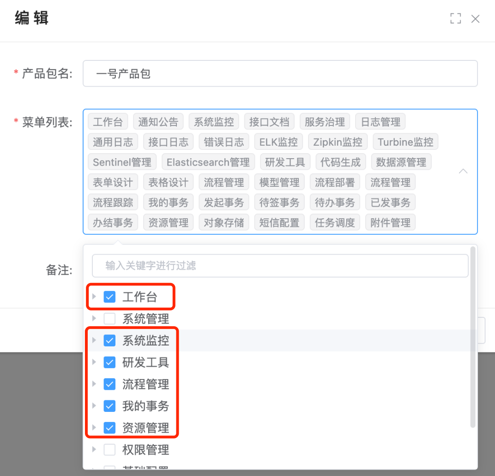
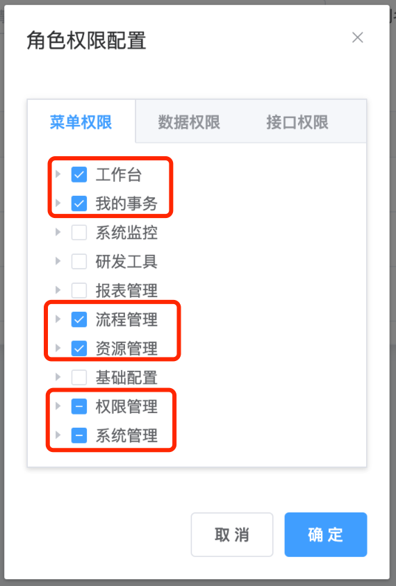

## 简介

* 全名租户菜单产品包，用于给租户单独分配一套菜单权限
* 主要面向于SaaS系统有多套产品功能销售的使用场景
* 我们可以提前预设好各种不同档次的产品功能，并为其配置好菜单权限
* 不同租户购买不同的产品功能，则为这些租户绑定不同的产品包
* 对应租户名下的所有角色用户都只能使用产品包所配置的菜单模块
* 这样一来就免去了重复配置的操作，管理员也可以做统一管理

## 操作流程

1. 打开`租户管理`模块，点击`产品包管理`。注意：产品包目前只有超管才有权限可以操作

   

2. 配置一个产品包

   

   

3. 创建一个租户

   

4. 绑定刚刚创建的产品包

   

5. 查看自动创建的租户管理员权限。该默认权限在参数管理配置菜单code集合来生效，若角色权限为` A、B、C`，租户产品包绑定了`A、B`，则该租户角色最终的权限为`A、B`，是一个`交集`，大家需要注意。

   

   

6. 登录刚刚创建的测试租户，帐号密码均为admin，租户编号填写为刚刚系统自动分配，登录成功后菜单如下

   

7. 产品包与默认角色权限对比如下

   

   

8. 可以看到，角色权限配置了`权限管理`和`系统管理`，但是因为产品包没有、产品包配置了`系统监控`但是角色权限没有，两者取了交集之后最终的菜单便是最终的菜单了。

## 注意

* 租户创建时默认的admin密码以及admin权限都在参数管理内可配置
* 租户产品包的菜单权限与超级管理员给租户管理员配置的角色权限两者取并集后则为租户角色的最终权限
* 租户管理员给下属角色分配的时候也只能看到并集之后的最终菜单权限

