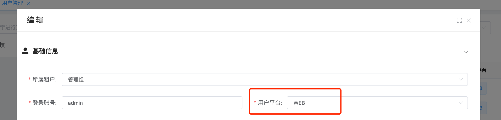
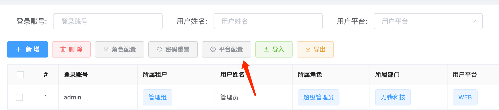
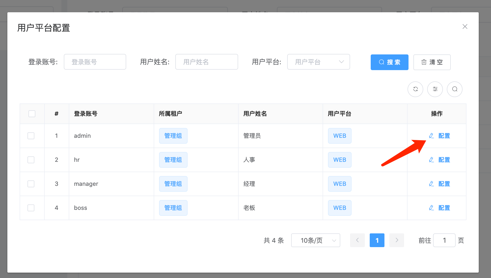
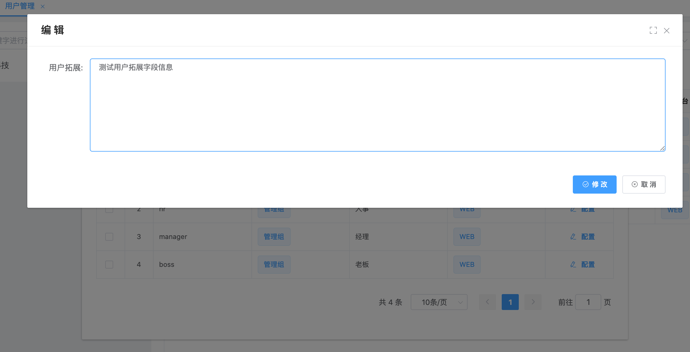
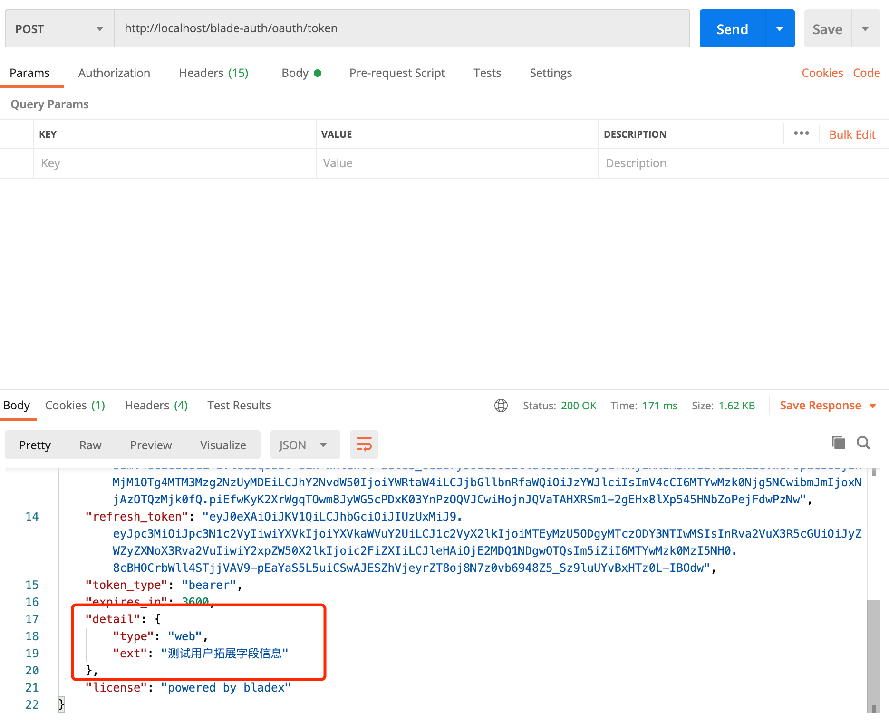
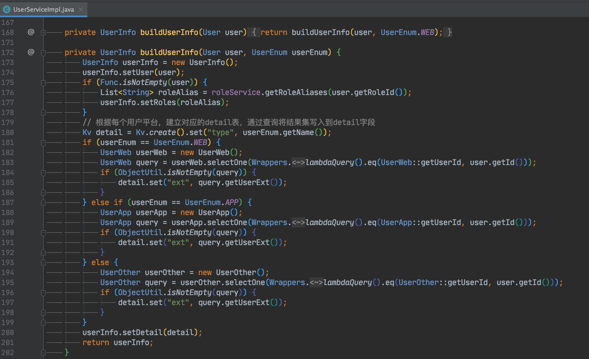
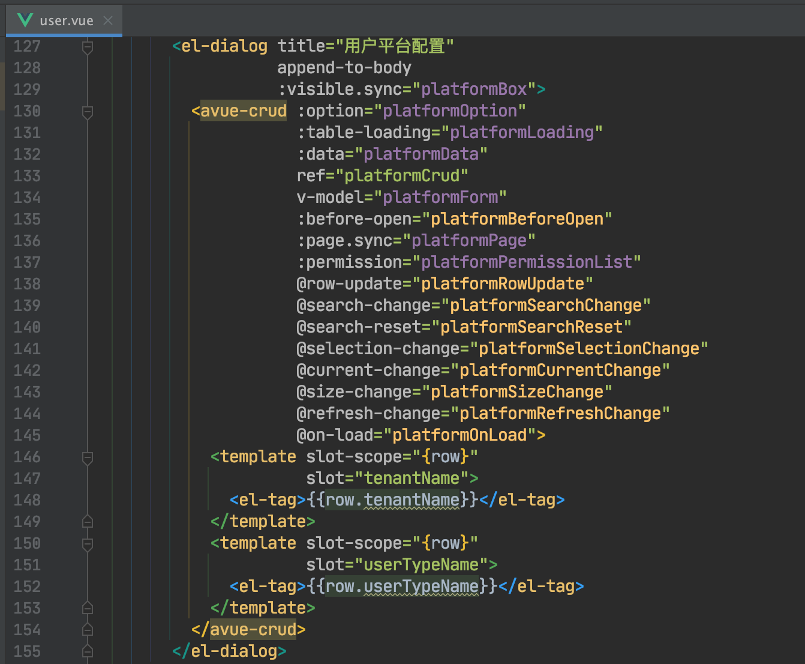
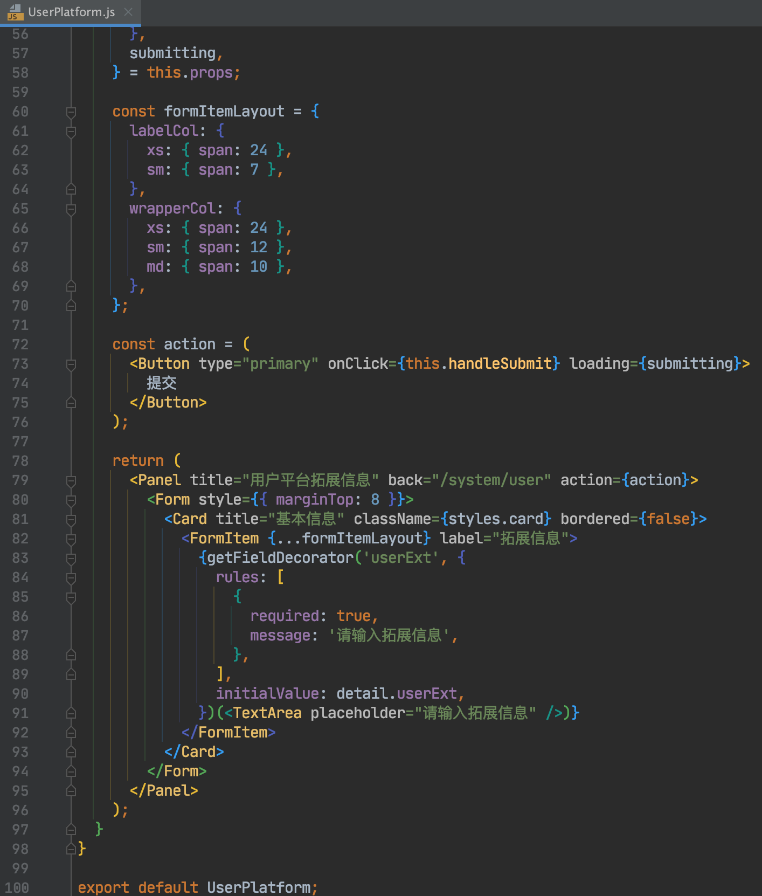

## 令牌信息拓展
* 一个系统通常会有很多种类的用户，而不同的用户会有不同的属性
* 比如网站用户、移动端用户、管理端用户都会有独立的属性
* BladeX增加了用户平台可拓展功能，大家可以很方面地将用户的信息用于拓展，拓展后就可以生成至令牌内

## 操作步骤
1. 打开`用户管理`配置用户平台字段

2. 打开`平台配置`，配置不同平台用户的相关信息

3. 提交拓展字段

4. 使用postman调用查看token返回

5. 这样便可以在token内获取到不同平台用户对应的拓展字段了

## 后记
* 不同产品对应的用户平台多有不同，所以BladeX默认搭好了架子，只提供一个字段作为例子
* 后续大家需要根据明确的产品需求来拓展字段
* 具体拓展可见如下文件

