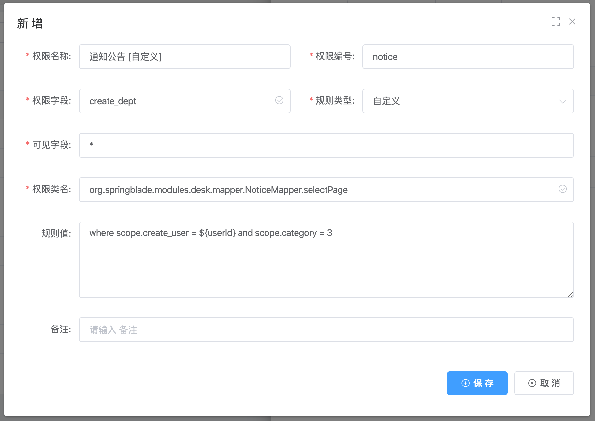
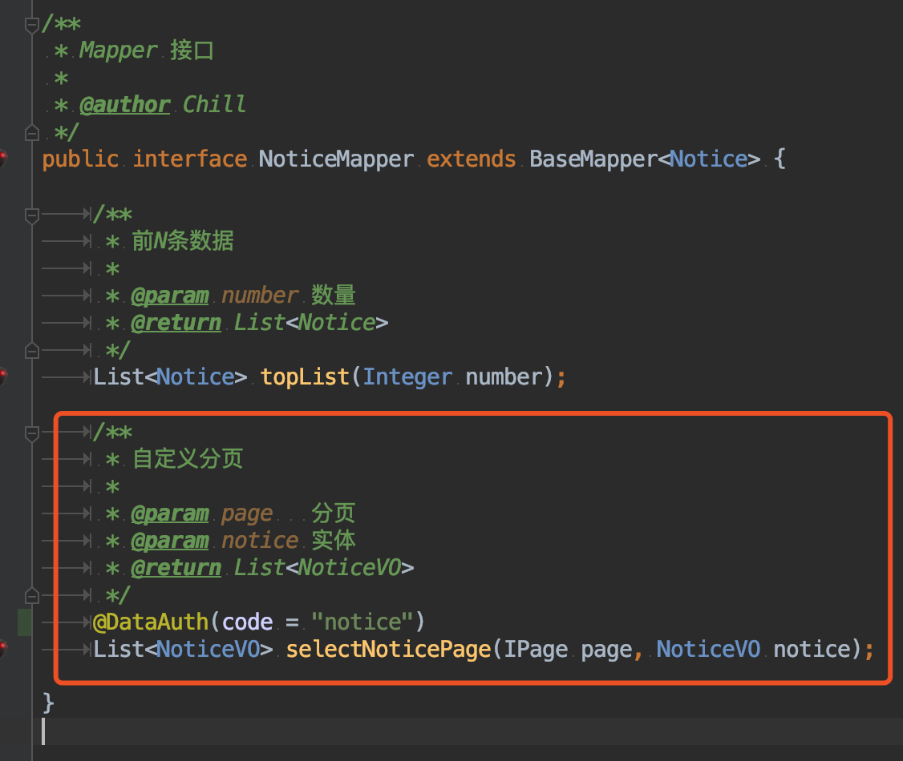
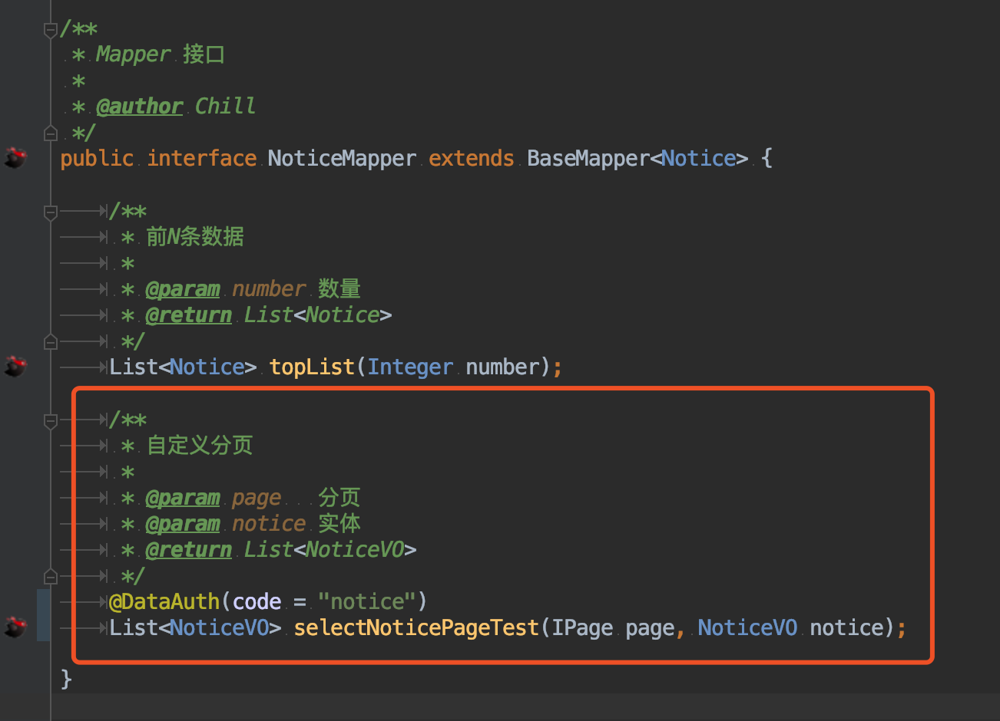
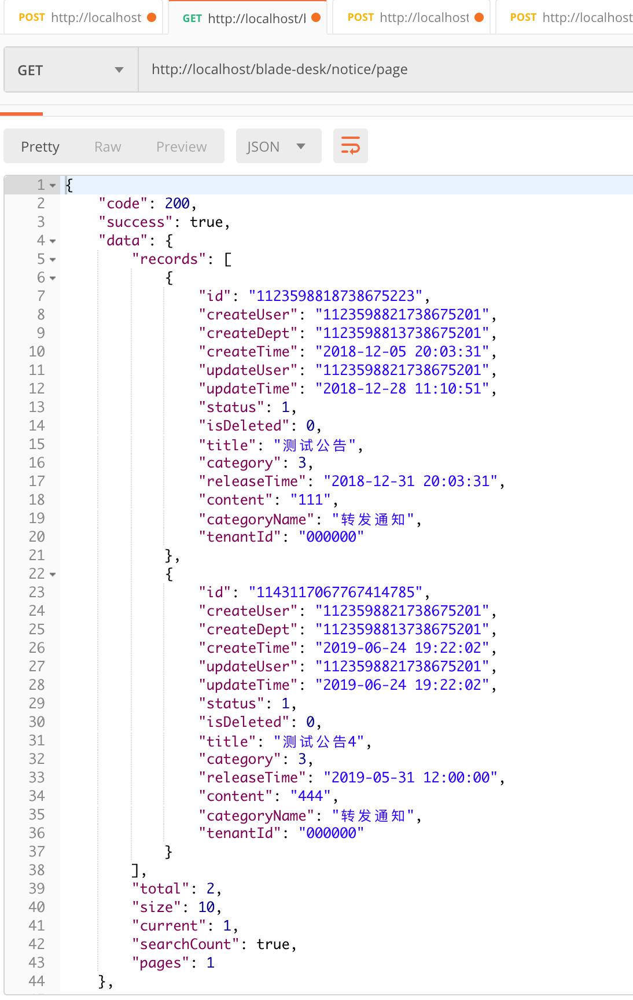
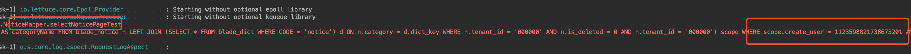

## 注解半自动配置
* 看完了上面两章节，相信大家已经有了一个大概了了解
* 本章节为大家介绍最后一个花里胡哨但很有用的功能，注解半自动配置

## 开始配置
1. 承接上一章，我们配置了一个通知公告的数据权限

2. 会发现这种规则是绑定对应的方法的，一个方法对应一个或多个规则（多个取第一个配置），那如果有一个规则我的使用频率非常高，我简单配置下就想用在对应的各个方法，应该如何操作？
3. 这时候注解半自动配置的用处就来了，我们来看如下的配置

4. 注解内的`code`属性值，其实就是对应上图的`权限编号`（同样是如果有多个编号，那么就取第一个配置）
5. 修改方法名确保不会被刚刚的动态配置扫描到（对应的service、xml也需要改名），重启工程，使用postman调用接口，发现返回了两条数据

6. 查看控制台打印sql，发现生成无误

## 注
* 如此一来，对于某些懒人用户，就可以配置少数的几个通用数据规则，来达到多个不同方法名共享同一个配置的目的了
* BladeX骚操作很多，等大家仔细发掘～
