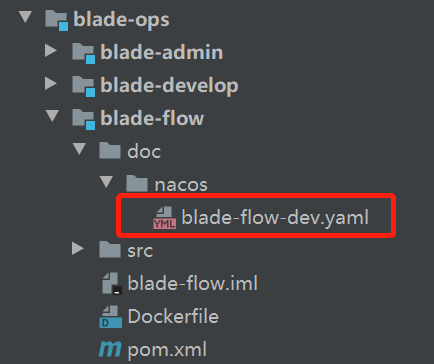
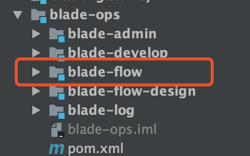
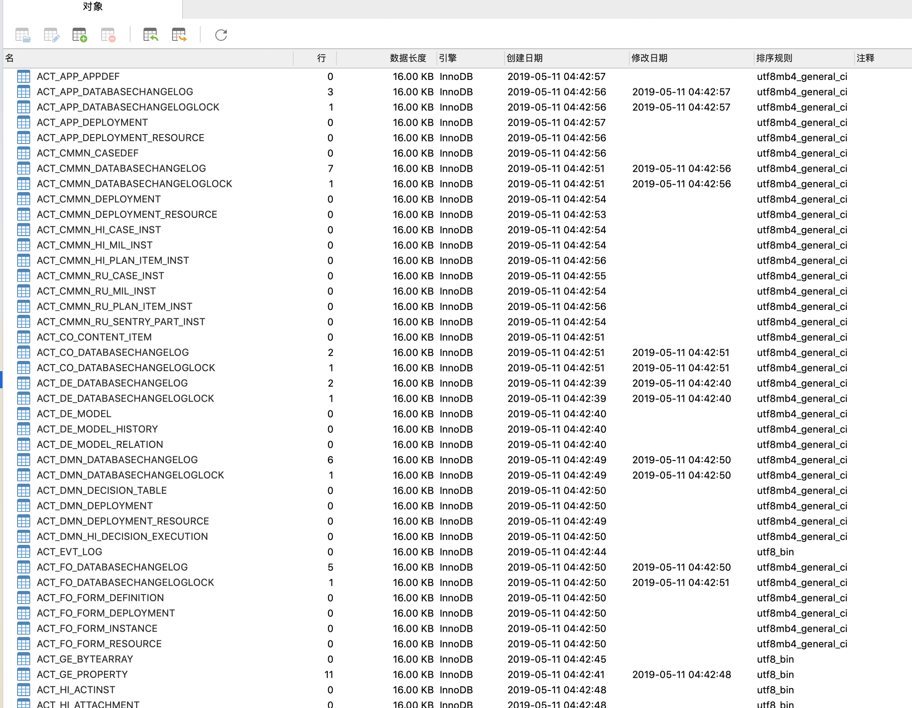
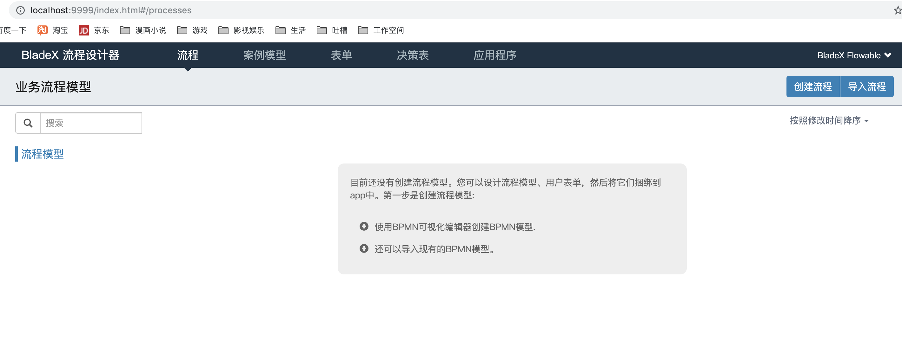
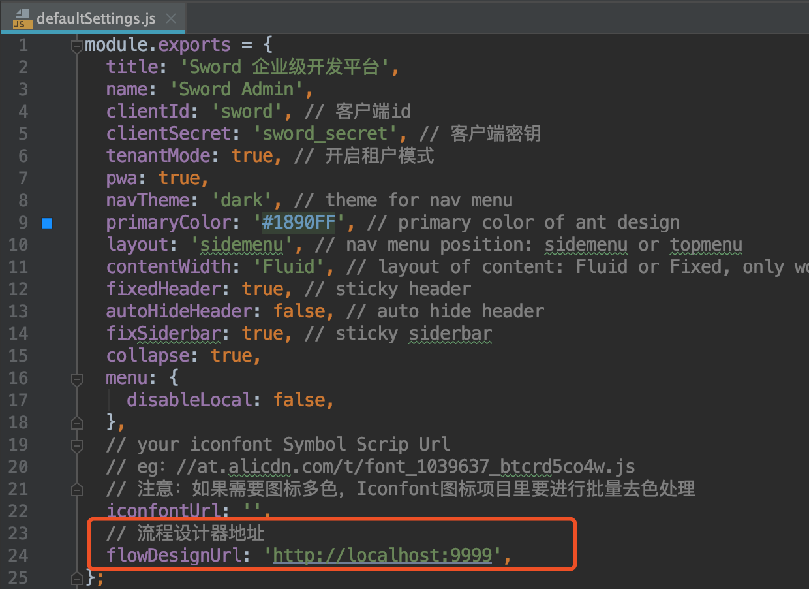

## 启动步骤
1. bladex将工作流模块设计为一个微服务，对外提供api，并且单独使用一个库，与业务库隔离
2. 单独创建一个库bladex_flow (bladex-boot工程无需创建)
3. nacos新建配置blade-flow-dev.yaml

4. 此配置针对blade-flow服务（工作流核心服务，对外发布服务）

5. 先执行工作流数据库脚本，具体可以前往**1.4.1章节**查看，数据库初始化完毕后启动blade-flow服务
  
6. 若前端使用的是Sword，则需要前往私服下载Flowable-Design项目单独启动，启动之后点击 [http://localhost:9999/index.html](http://localhost:9999/index.html) 验证是否可以正常访问流程设计器系统。Saber已经无缝集成NutFlow设计器，无需单独启动。
  
7. 前端框架sword修改对应流程设计器的地址
  
  10.启动其他服务后，**对redis执行flushdb**，再访问前端即可

## 注意
* 如果是前端Sword工程启动，则单独下载Flowable-Design工程启动，如果前端是Saber则可以忽略
下载地址：[https://git.bladex.vip/blade/Flowable-Design](https://git.bladex.vip/blade/Flowable-Design)
* BladeX工程需要单独创建blade_flow的数据库
* BladeX-Boot使用工作流无需再创建库，flowable会与其公用一个库
