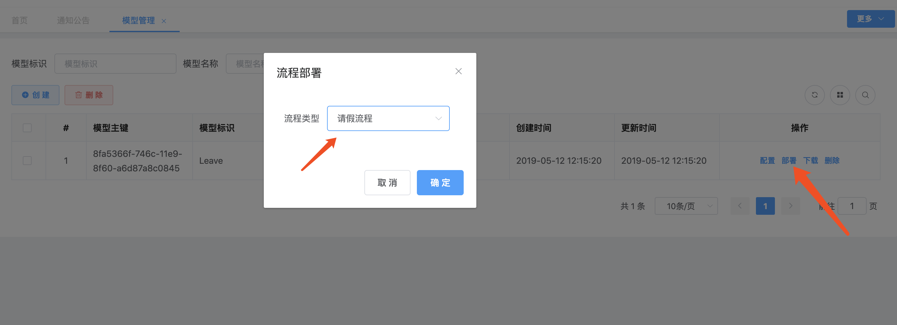
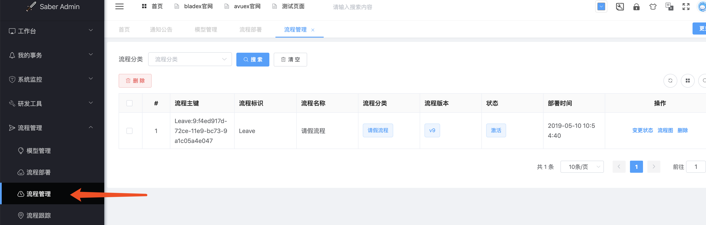
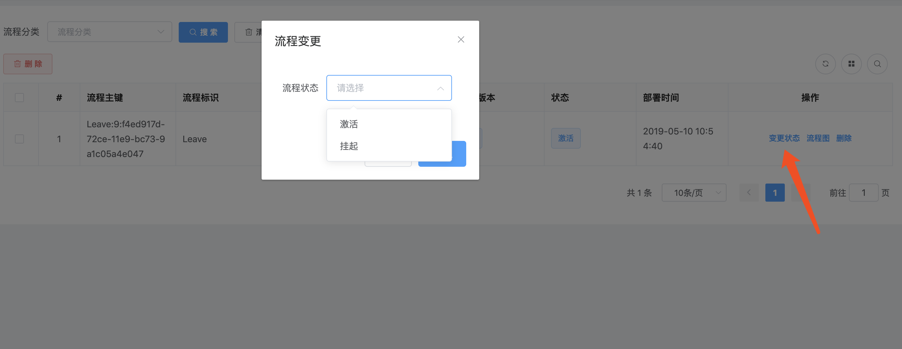
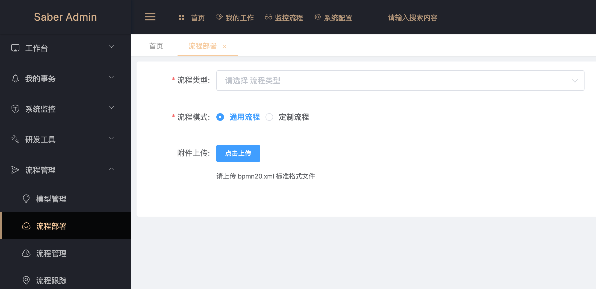
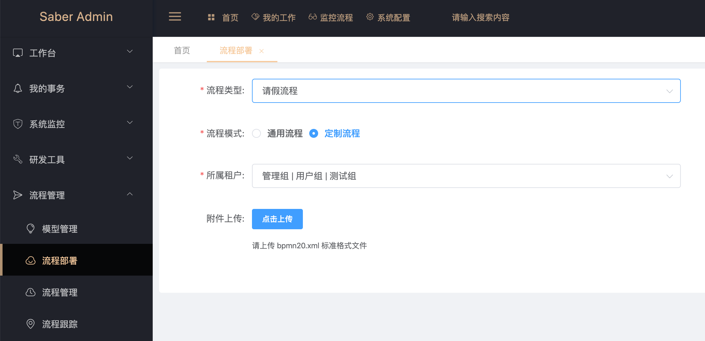

## 根据模型部署
1. 对刚刚新建的数据点击部署，并选择流程类型为 请假流程

2. 查看流程管理，发现已经多出了一条流程数据

3. 若流程暂时不需要使用，则可以变更状态控制激活还是挂起

## 上传文件部署
1. 进入流程部署页面，选择流程类型并上传文件

2. 如果选择通用流程，则流程部署后所有租户都可使用
3. 如果选择定制流程，则需要指定对应的租户，这样只有指定的租户才可以使用部署的流程

