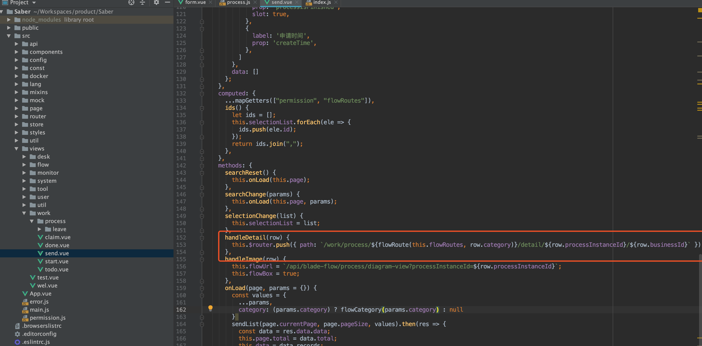
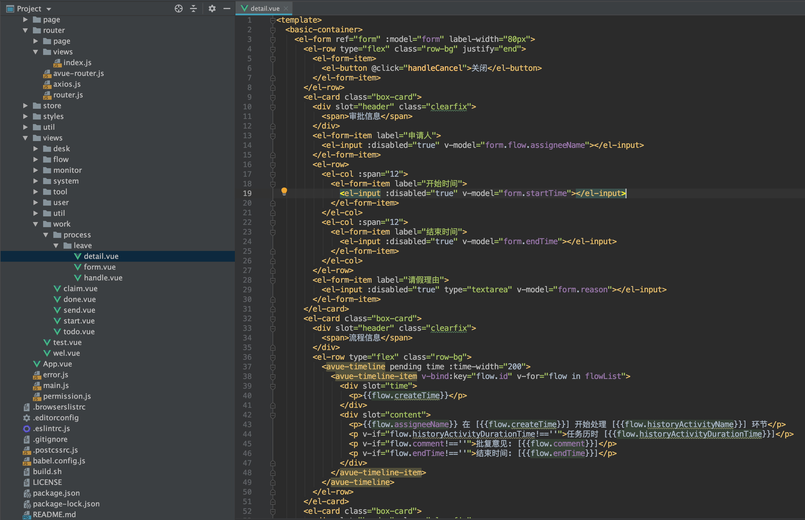
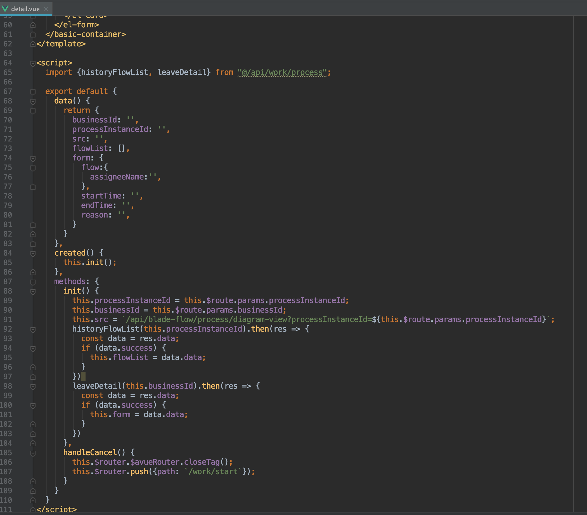
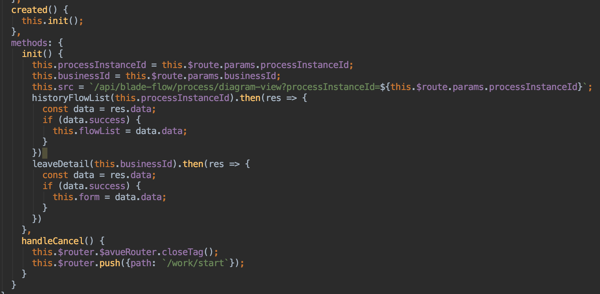
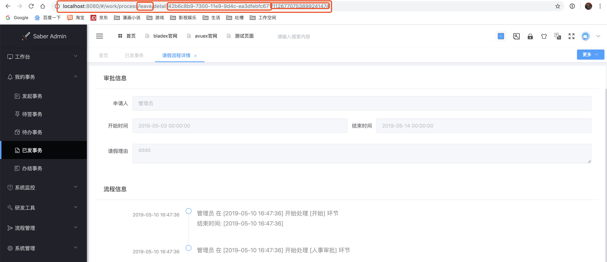
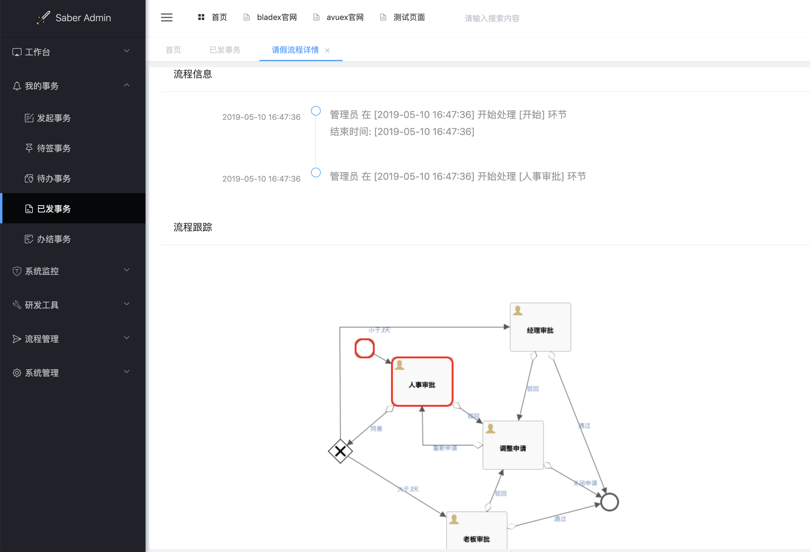

## 详情页面编写
1. 与流程发起一样，也需要通过流程路由进而动态跳转至流程对应的详情页
2. 我们看一下流程详情对应的跳转链接

3. 其中涉及到了流程路由、流程任务实例id、流程业务id
4. 我们前往路由文件配置详情的路由

5. 创建详情页面

6. 思路很简单,页面创建的时候获取url传参的参数，并且调用接口并将返回数据渲染在页面上展示，具体代码如下，大家可以寻找对应的api接口查看下是如何实现的，原理比较简单就不详细解说了

7. 文件配置好之后，点击详情便可查看到对应流程的详细信息了

