## 审批页面编写
审批页面套路与详情一致，只不过在详情页面上加了`批复意见`和`同意`、`驳回`的按钮事件，下面我们来看一下审批页面如何编写
1. 看一下流程处理对应的链接，同样也是根据流程路由进行动态跳转至对应表单
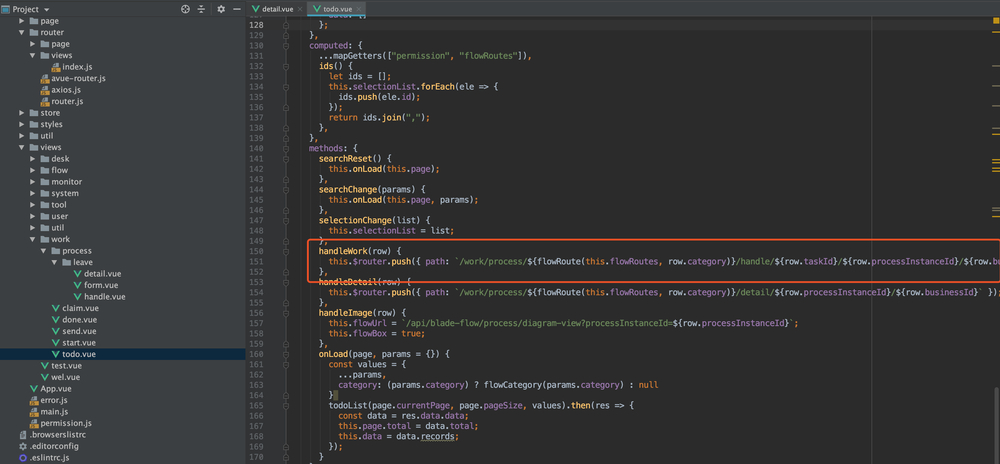
2. 进行表单路由配置
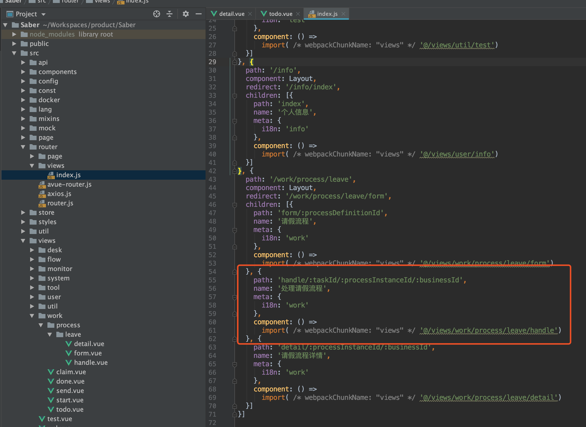
4. 创建处理页面，其实可以在详情页的基础上进行功能添加
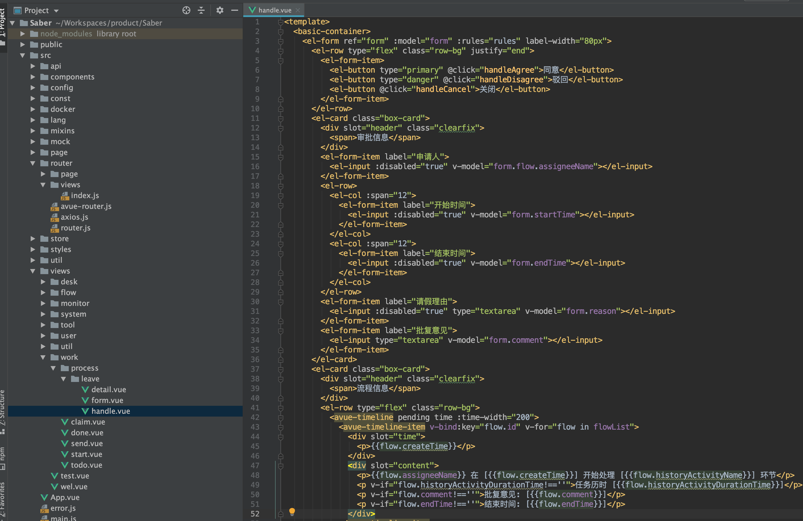
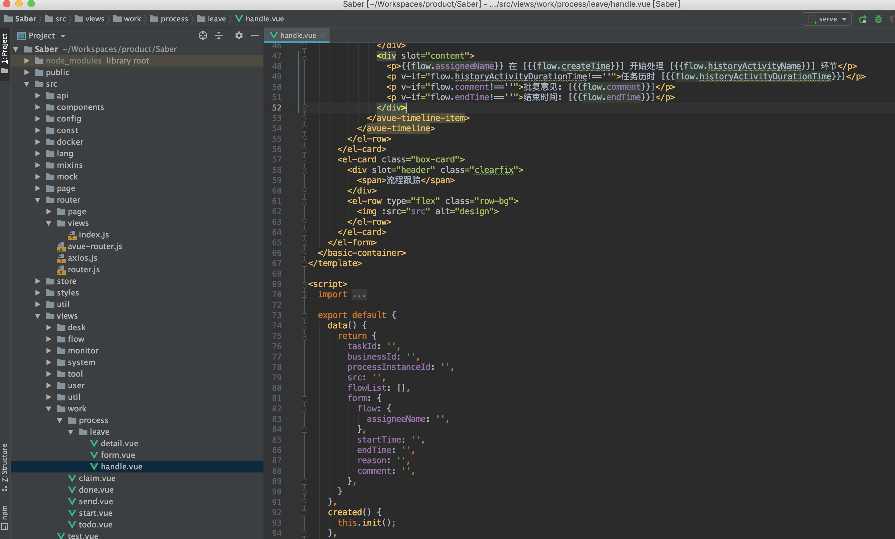
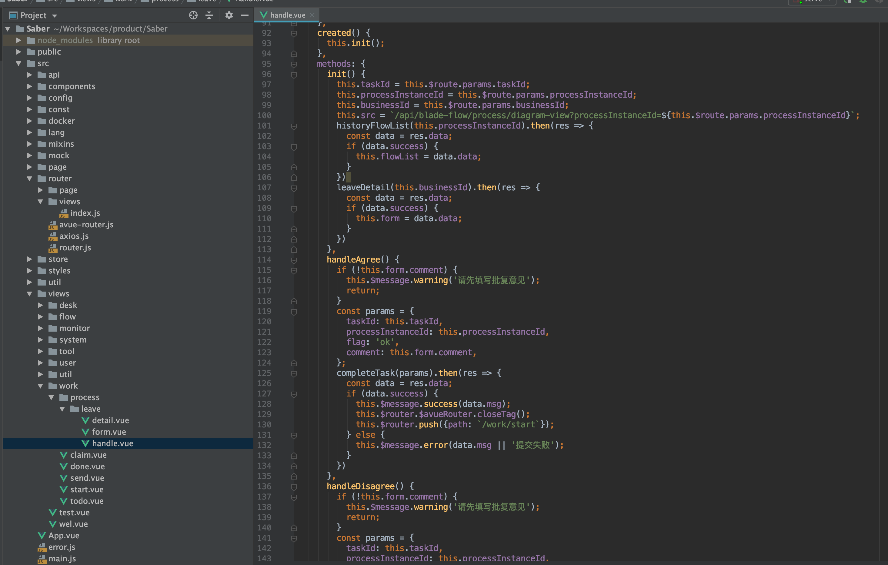
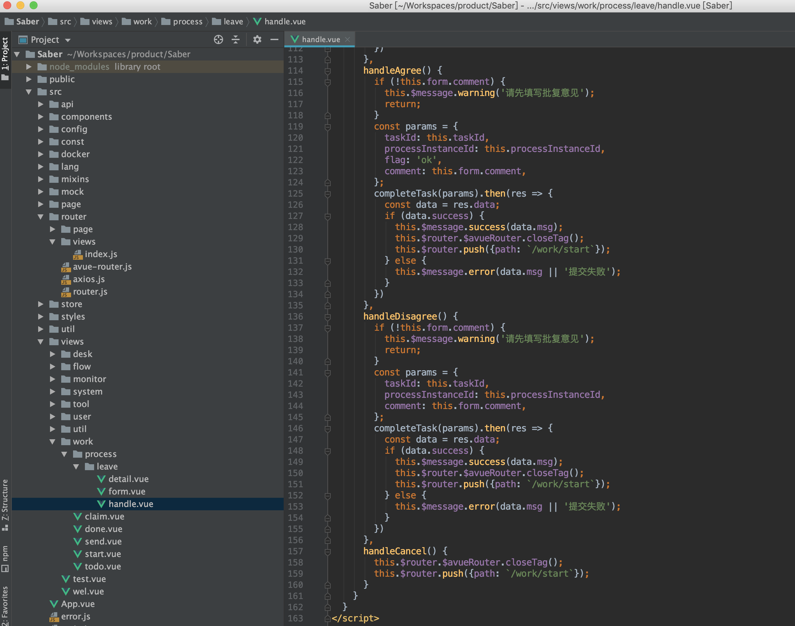
5. 其中需要注意的就是`同意`与`驳回`的按钮事件,两者调用的方法与参数几乎是一致的，但是`同意`多了一个参数，那就是 `flag:'ok'`，这样传至后端接口，便可以知道这条任务该如何往下运行
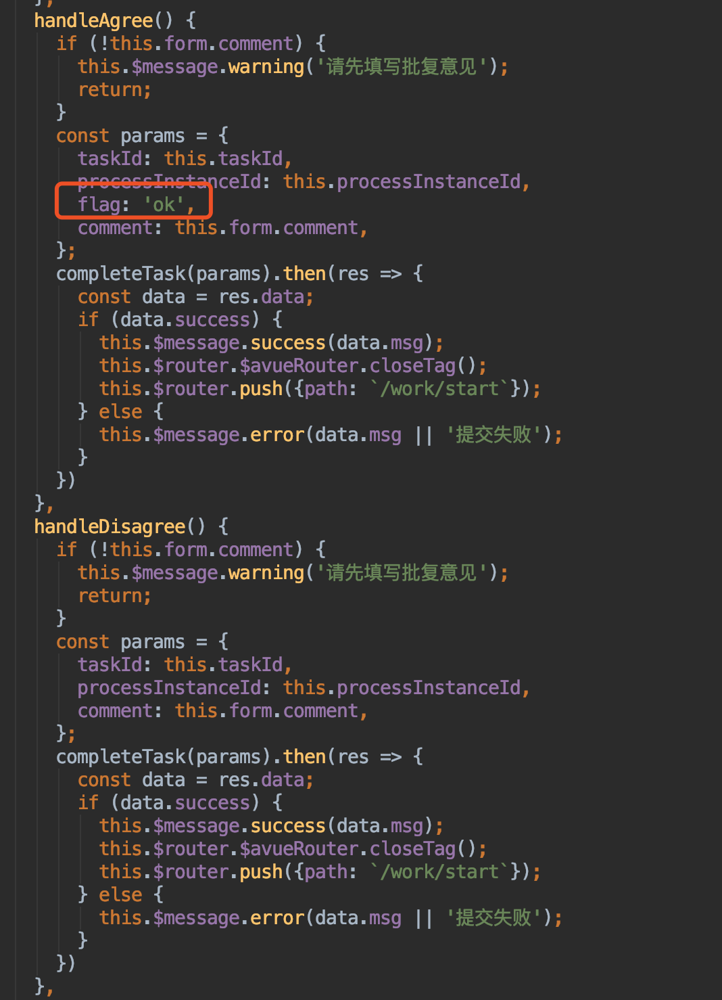
6. 我们来看一下completeTask的后端实现
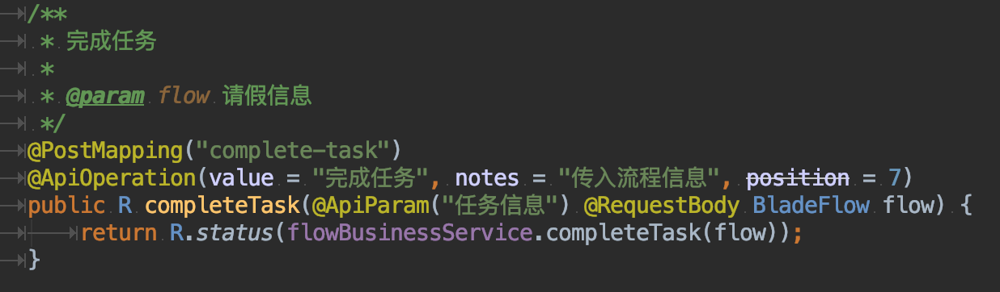
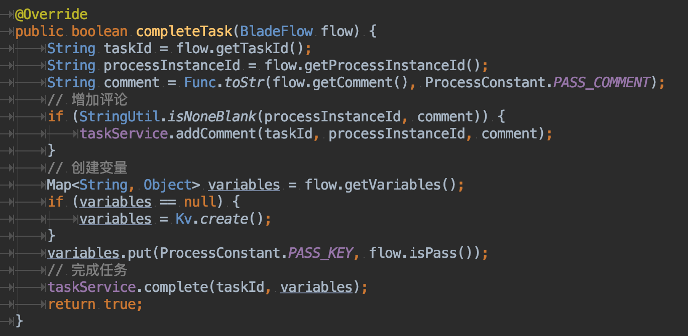
7. 由上可看出，任务完成实现代码非常简单，获取所需的任务id、流程id、批复意见，组装成map后调用flowable官方的taskService进行任务的操作，最后达成自动流转的功能
8. 最后我们来看一下批复模块的界面
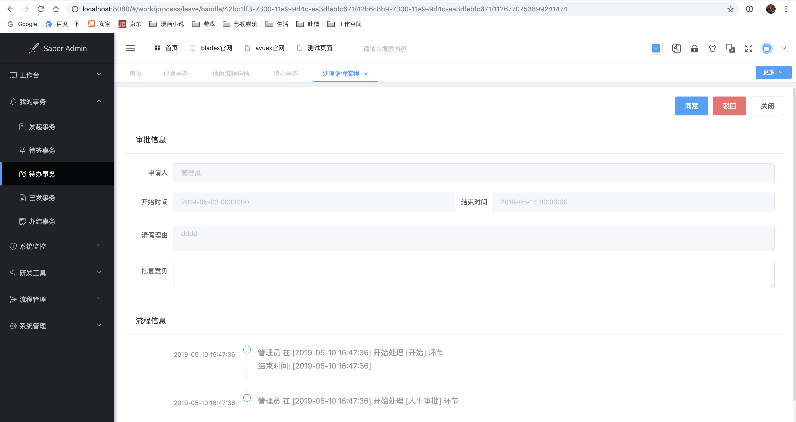
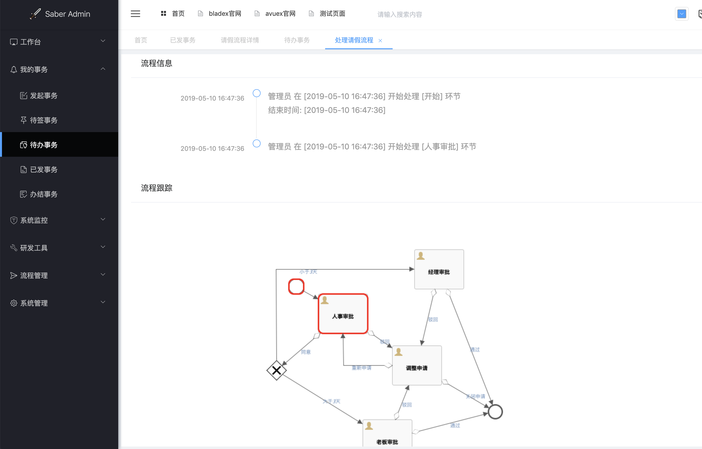

## 结尾语
* 工作流是一个相对复杂的系统，本文档只是为大家起到引路的作用，并不能手把手教大家从零开始入门工作流
* 希望大家要多看官方文档，了解基本运行流程后再进行流程的开发
* 后续BladeX将不定期对工作流模块进行拓展，敬请期待～

