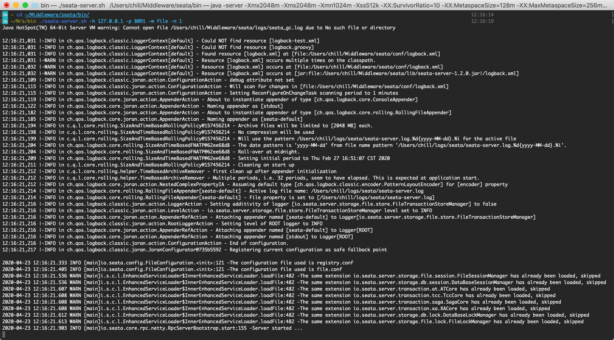
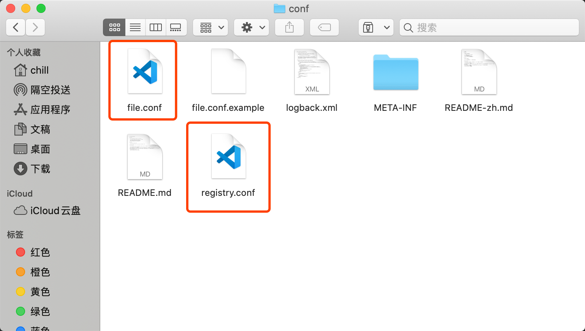
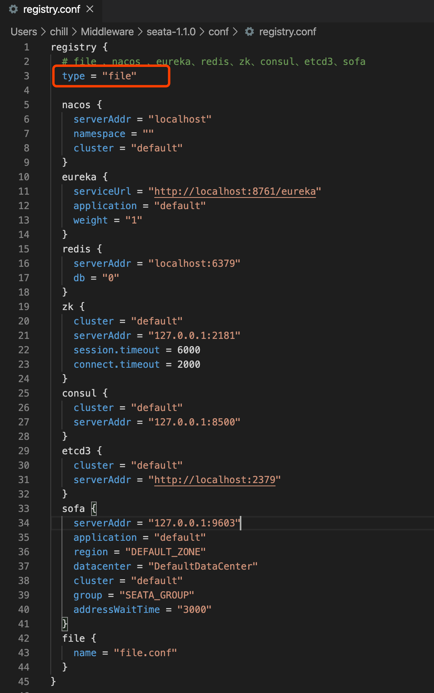
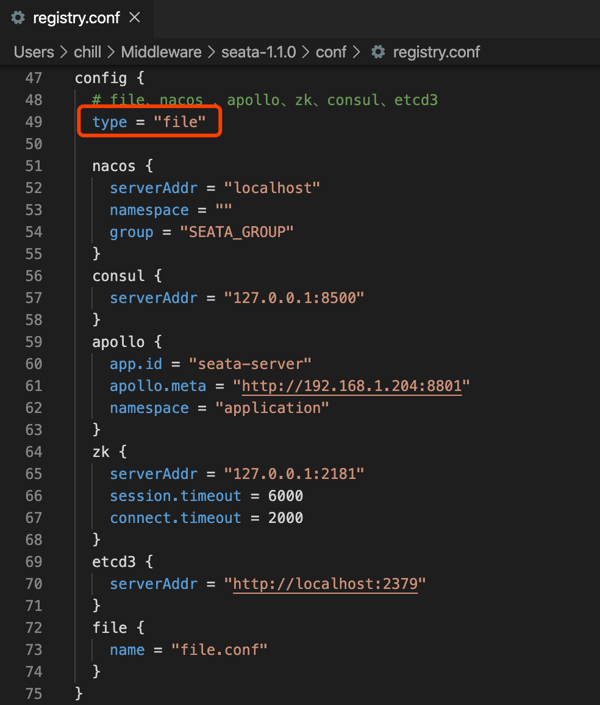
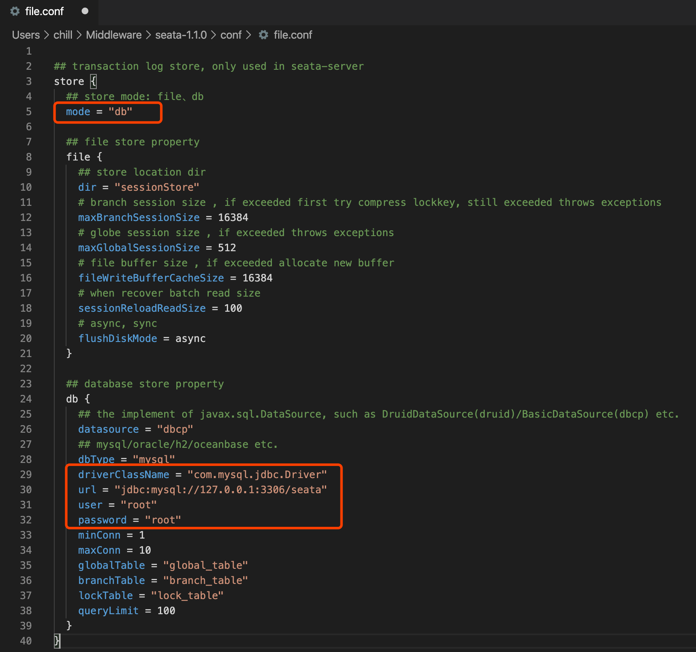
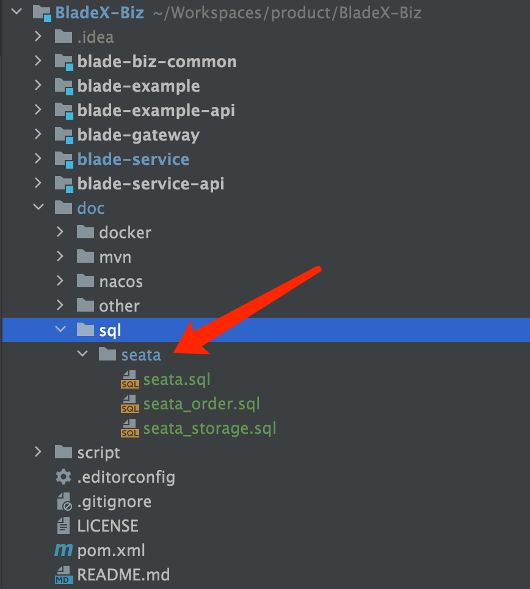
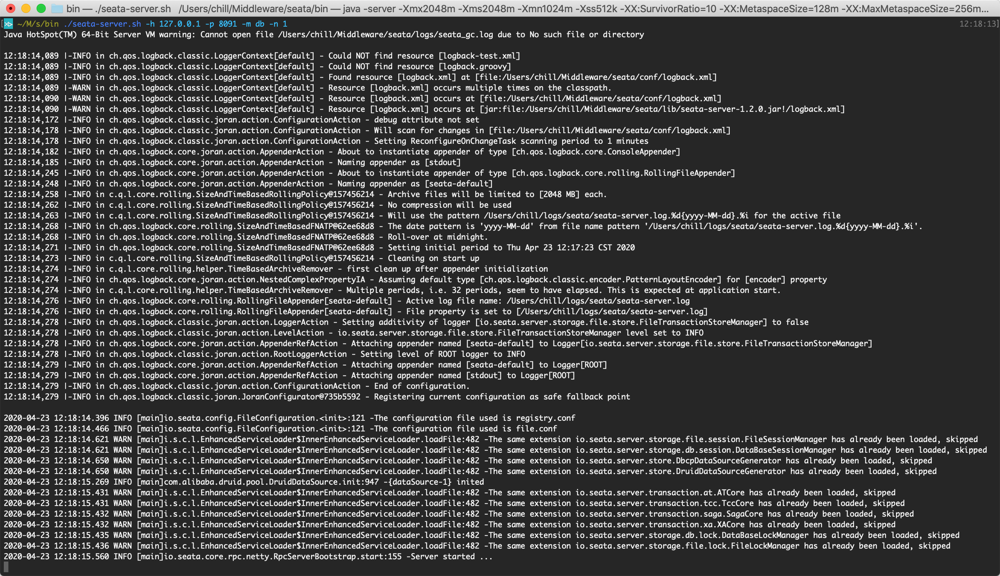

## file模式启动
1. 前往官方项目主页下载1.4.1版并解压(后续会随着版本升级而采用最新版本)：[https://github.com/seata/seata/releases](https://github.com/seata/seata/releases)
2. 不需要改动配置进入 `bin` 目录执行命令：`./seata-server.sh -h 127.0.0.1 -p 8091 -m file -n 1 `

## db模式启动
1. 同样使用刚刚下载的编译包，进入对应目录

2. 找到`conf`文件夹，主要关注如下两个文件
  

3. 打开`registry.conf`，配置`config`和`registry`的节点都为`file`
  
  

4. 打开`file.conf`，配置`mode`为`db`并配置相关数据库链接
  

5. 创建数据库`seata`并且执行对应的`sql`脚本

  

6. 进入 `bin` 目录执行命令：`./seata-server.sh -h 127.0.0.1 -p 8091 -m db -n 1 `
  
