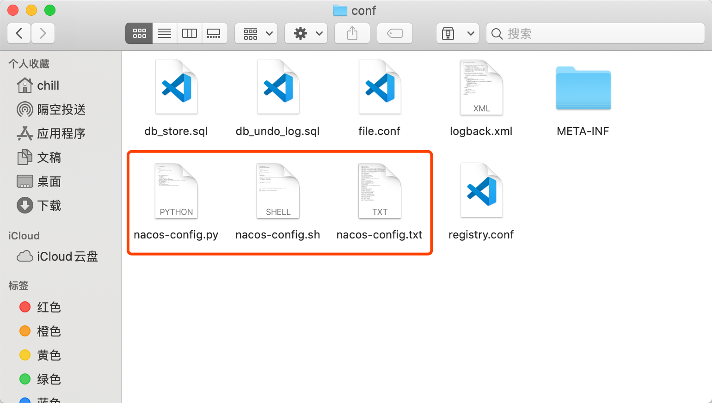

## 配置Nacos对接Seata-Server
1. 由于1.x版本不再带有nacos相关的脚本和配置，所以我们需要下载旧版本把配置拷出来
2. 前往官方项目主页下载0.9.0版并解压：[https://github.com/seata/seata/releases](https://github.com/seata/seata/releases)
3. 进入`conf`文件夹拷贝如下三个配置到`seata`conf文件夹下

4. 修改`nacos-config.txt`内相关的配置，主要修改下图红框内的配置

5. 执行命令初始化nacos配置
~~~
> sh nacos-config.sh 127.0.0.1
~~~

**注意**：win下的nacos会有问题，需要将脚本做如下修改才能同步到配置

~~~
URL="http://$nacosIp:8848/nacos/v1/cs/configs?dataId=$key&group=SEATA_GROUP&content=$value"
URL=${URL%$'\r'}
result=`curl -X POST ${URL}`
~~~
6. 刷新nacos查看配置，发现已经自动生成了一批SEATA-GROUP组下的配置，说明配置成功

7. 打开`seata-1.2.0/conf/registry.conf` ,修改type为nacos

8. 创建数据库`seata`并且执行对应的`sql`脚本

9. 进入 `bin` 目录执行命令：`./seata-server.sh -h 127.0.0.1 -p 8091 -m file -n 1 `

## 后记
* 本章仅作为nacos启动流程参考，实际生产还需要再多观望下官方的更新
* 目前seata针对nacos有些许小问题，另外nacos网络也可能成为不稳定因素
* 所以目前暂时不推荐使用nacos配置上生产，更推荐file+db的模式，等待后续给力了再考虑nacos的方式

