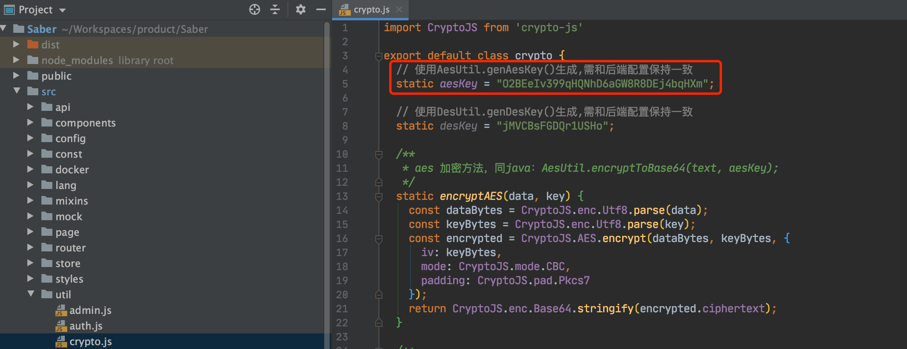
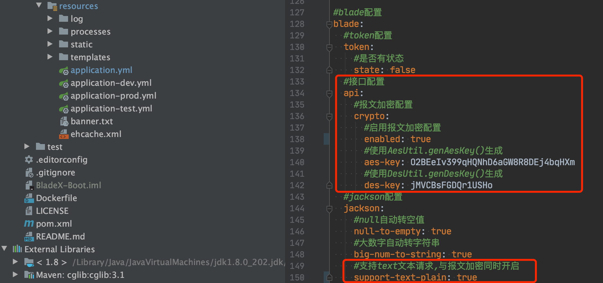

## 配置
1. 先使用后端的`AesUtil.genAesKey()`生成对应的密钥串：`O2BEeIv399qHQNhD6aGW8R8DEj4bqHXm`
2. 在前端的加密类进行配置
~~~javascript
export default class crypto {
  // 使用AesUtil.genAesKey()生成,需和后端配置保持一致
  static aesKey = "O2BEeIv399qHQNhD6aGW8R8DEj4bqHXm";

  // 使用DesUtil.genDesKey()生成,需和后端配置保持一致
  static desKey = "jMVCBsFGDQr1USHo";
  .............................................
}
~~~

3. 在后端的配置文件进行配置
~~~yaml
#blade配置
blade:
  #接口配置
  api:
    # 报文加密配置
    crypto:
      # 启用报文加密配置
      enabled: true
      # 使用AesUtil.genAesKey()生成
      aes-key: "O2BEeIv399qHQNhD6aGW8R8DEj4bqHXm"
      # 使用DesUtil.genDesKey()生成
      des-key: "jMVCBsFGDQr1USHo"
  #jackson配置
  jackson:
    # 支持text文本请求,与报文加密同时开启
    support-text-plain: true
~~~

4. 在需要使用报文加密功能的模块引入如下依赖
~~~xml
<dependency>
    <groupId>org.springblade</groupId>
    <artifactId>blade-starter-api-crypto</artifactId>
</dependency>
~~~
5. 保持前后端的密钥都一致后，配置完毕，下面我们进入实战章节
