## API接口测试
> 这一节我们主要来测试一个简单完整的加密解密流程，令大家快速熟悉他的运行逻辑
1. 采用一个测试的Json串 （时间戳虽然较久远，但这是BladeX正式发布前夕的数据，具有纪念意义）`{"id":1, "title":"测试标题", "category":1, "releaseTime":"2018-12-31 20:08:08"}` 
AES加密后对应的加密串为：`bl+qQde9x2/sIAR5DMpZSqlD29SHj35fvhdunIOVxL+ki1rSM/n04rWS7diIJzc6d7X+FnATWaH7Gmyg/kg0o+W4fmCYer46xyqYrgxW7L0x/yzb6WH6A2Hkt0juXdk7`
2. 复制刚刚我们测试的加密串
3. 编写一个最简单的API进行测试，使用`@ApiDecrypt`注解声明需要解密的参数 ，以下两种选其一便可，效果相同
~~~java
@RestController
@RequestMapping(AppConstant.APPLICATION_DESK_NAME + "/notice")
public class NoticeController extends BladeController {

	/**
	 * 使用通用注解与AES枚举声明，直接获取解码后的数据
	 */
	@PostMapping("/crypto-by-type")
	public R<Notice> cryptoByType(@ApiDecrypt(CryptoType.AES) Notice notice) {
		return R.data(notice);
	}

	/**
	 * 使用AES专用注解声明，直接获取解码后的数据
	 */
	@PostMapping("/crypto-by-annotation")
	public R<Notice> cryptoByAnnotation(@ApiDecryptAes Notice notice) {
		return R.data(notice);
	}

}
~~~
4. 使用postman进行调用，把加密串以`data`的参数名传参，若需要修改`data`参数定义请参考5.9.1章节`配置说明`，发现数据返回成功（这里需要获取token再调用，之前已有较多章节说明，若不清楚请再回看5.1章节）
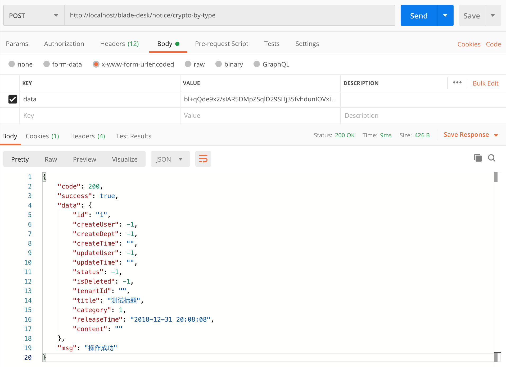
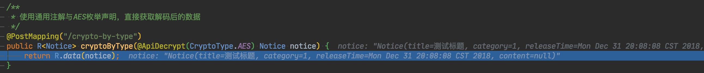
5. 解密已经生效，现在我们再加上一个注解`@ApiEncrypt`
~~~java
@RestController
@RequestMapping(AppConstant.APPLICATION_DESK_NAME + "/notice")
public class NoticeController extends BladeController {

	/**
	 * 使用通用注解与AES枚举声明，直接获取解码后的数据
	 */
	@ApiEncrypt(CryptoType.AES)
	@PostMapping("/crypto-by-type")
	public R<Notice> cryptoByType(@ApiDecrypt(CryptoType.AES) Notice notice) {
		return R.data(notice);
	}

	/**
	 * 使用AES专用注解声明，直接获取解码后的数据
	 */
	@ApiEncryptAes
	@PostMapping("/crypto-by-annotation")
	public R<Notice> cryptoByAnnotation(@ApiDecryptAes Notice notice) {
		return R.data(notice);
	}

}
~~~
6. 重启服务后再次调用postman，可以发现返回数据也已经加密
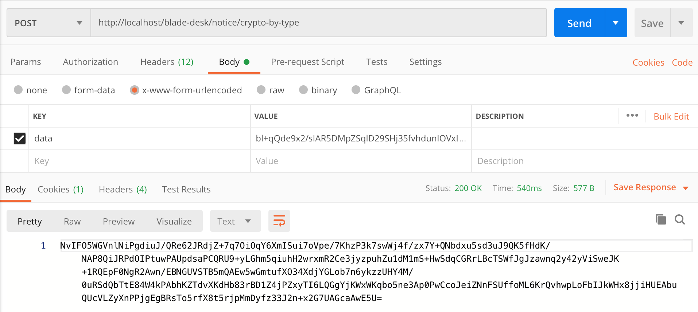
7. 拷贝返回的加密串，到前端调用工具类解密，可以发现解密成功，数据无误
~~~javascript
const encrypt = "NvIFO5WGVnlNiPgdiuJ/QRe62JRdjZ+7q7OiOqY6XmISui7oVpe/7KhzP3k7swWj4f/zx7Y+QNbdxu5sd3uJ9QK5fHdK/NAP8QiJRPdOIPtuwPAUpdsaPCQRU9+yLGhm5qiuhH2wrxmR2Ce3jyzpuhZu1dM1mS+HwSdqCGRrLBcTSWfJgJzawnq2y42yViSweJK+1RQEpF0NgR2Awn/EBNGUVSTB5mQAEw5wGmtufXO34XdjYGLob7n6ykzzUHY4M/0uRSdQbTtE84W4kPAbhKZTdvXKdHb83rBD1Z4jPZxyTI6LQGgYjKWxWKqbo5ne3Ap0PwCcoJeiZNnFSUffoML6KrQvhwpLoFbIJkWHx8jjiHUEAbuQUcVLZyXnPPjgEgBRsTo5rfX8t5rjpMmDyfz33J2n+x2G7UAGcaAwE5U=";
const decrypt = crypto.decryptAES(encrypt, crypto.aesKey);
const result = JSON.parse(decrypt);
console.log(decrypt);
console.log(result);
~~~
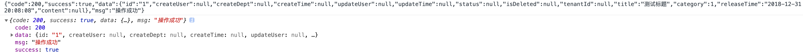

## API接口进阶
>上一小节进行了简单的API加密解密调用，这一节我们来看一下这个工具的一些高级用法
1. 因为使用param方式传参，会有数据量的限制，在一些大数据量提交的场景就不适用了，所以我们提供了body提交方式。将`@ApiDecrypt`注解从参数处移至方法处, 并加上`@RequestBody`注解，修改如下：
~~~java
@RestController
@RequestMapping(AppConstant.APPLICATION_DESK_NAME + "/notice")
public class NoticeController extends BladeController {

	/**
	 * 使用通用注解与AES枚举声明，直接获取解码后的数据
	 */
	@ApiEncrypt(CryptoType.AES)
	@ApiDecrypt(CryptoType.AES)
	@PostMapping("/crypto-by-type")
	public R<Notice> cryptoByType(@RequestBody Notice notice) {
		return R.data(notice);
	}

	/**
	 * 使用AES专用注解声明，直接获取解码后的数据
	 */
	@ApiEncryptAes
	@ApiDecryptAes
	@PostMapping("/crypto-by-annotation")
	public R<Notice> cryptoByAnnotation(@RequestBody Notice notice) {
		return R.data(notice);
	}

}
~~~
2. 重启服务后调用postman，发现数据返回成功，与之前无误。
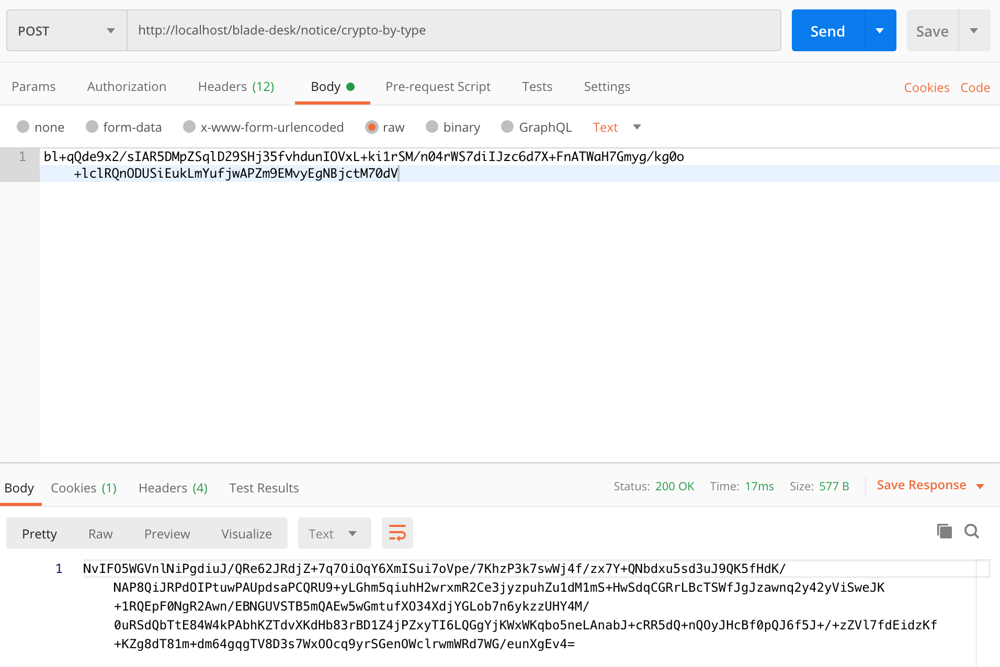
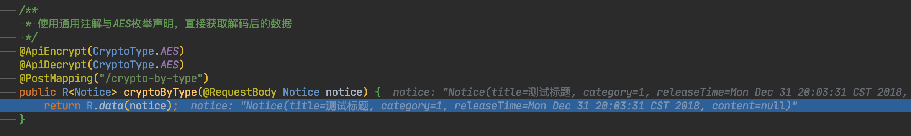

3. 为了令代码更加简洁，提供了一个组合注解`@ApiCrypto`，将加密解密合二为一，但需要注意但是：这个注解只可适用于body传参，param传参不适用。修改代码后如下：
~~~java
@RestController
@RequestMapping(AppConstant.APPLICATION_DESK_NAME + "/notice")
public class NoticeController extends BladeController {

	/**
	 * 使用通用注解与AES枚举声明，直接获取解码后的数据
	 */
	@ApiCrypto
	@PostMapping("/crypto-by-type")
	public R<Notice> cryptoByType(@RequestBody Notice notice) {
		return R.data(notice);
	}

	/**
	 * 使用AES专用注解声明，直接获取解码后的数据
	 */
	@ApiCryptoAes
	@PostMapping("/crypto-by-annotation")
	public R<Notice> cryptoByAnnotation(@RequestBody Notice notice) {
		return R.data(notice);
	}

}
~~~
4. 重启服务后调用postman，发现返回无误
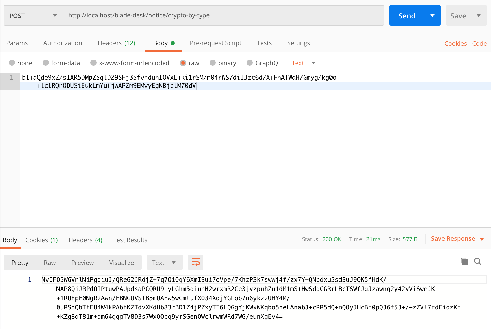
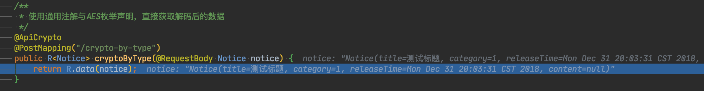
5. 在大多数场景，我们都会把报文加密API放到统一的controller，所以有一个最简洁的写法，就是把注解直接放到类上面，具体代码如下：
~~~java
@ApiCrypto
@RestController
@RequestMapping(AppConstant.APPLICATION_DESK_NAME + "/notice")
public class NoticeController extends BladeController {

	/**
	 * 使用通用注解与AES枚举声明，直接获取解码后的数据
	 */
	@PostMapping("/crypto")
	public R<Notice> crypto(@RequestBody Notice notice) {
		return R.data(notice);
	}

}
~~~
6. 重启服务后调用postman，发现返回无误

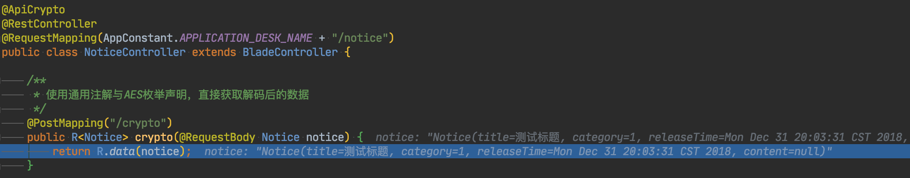
7. 当然注解全类配置后，想要独立一个接口采用param传参也是完全可以的，具体代码如下：
~~~java
@ApiCrypto
@RestController
@RequestMapping(AppConstant.APPLICATION_DESK_NAME + "/notice")
public class NoticeController extends BladeController {

	/**
	 * 使用通用注解与AES枚举声明，直接获取解码后的数据
	 */
	@PostMapping("/crypto")
	public R<Notice> crypto(@RequestBody Notice notice) {
		return R.data(notice);
	}

	/**
	 * 使用通用注解与AES枚举声明，直接获取解码后的数据
	 */
	@PostMapping("/crypto-by-param")
	public R<Notice> cryptoByParam(@ApiDecryptAes Notice notice) {
		return R.data(notice);
	}

}
~~~
8. 重启服务后调用postman，发现返回无误
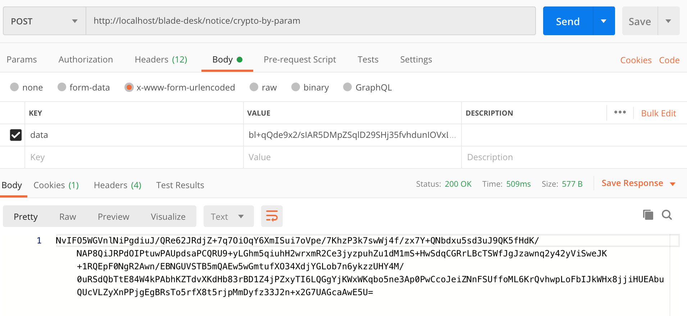
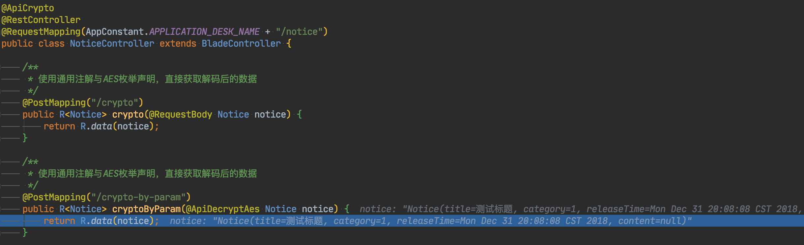
9. 基本流程已经完毕，更多操作等待大家发掘～

## 后记
* 通过这一节的操作，我们完整测试了整个调用链
* 数据从前端到后端再到前端，调用一圈后实现全程加密传输，这对整个系统关键API运行起到了至关重要的作用
* 报文加密工具同时支持param与body两种方式传参，支持小数据量与大数据量的传输，用户可以根据不同的场景自由选择
* 通常在只需要传递一两个参数的情况，推荐使用param传参。在post请求提交表单数据、大量数据的时候推荐使用body传参。
* 推荐使用AES加密方式传输，这样性能更高，可以提升接口的负载能力。
* 下面我们就来着手改造notice模块，使其支持全流程的加密传输
