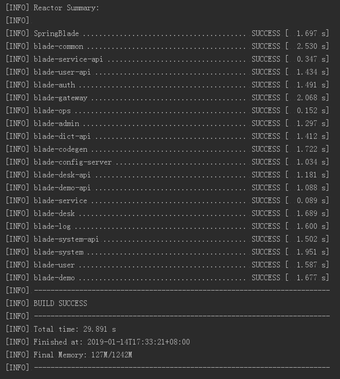
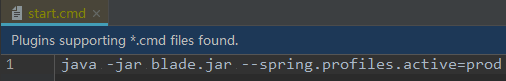
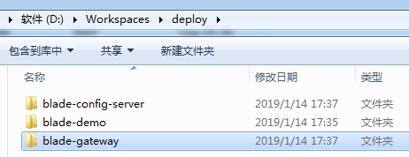
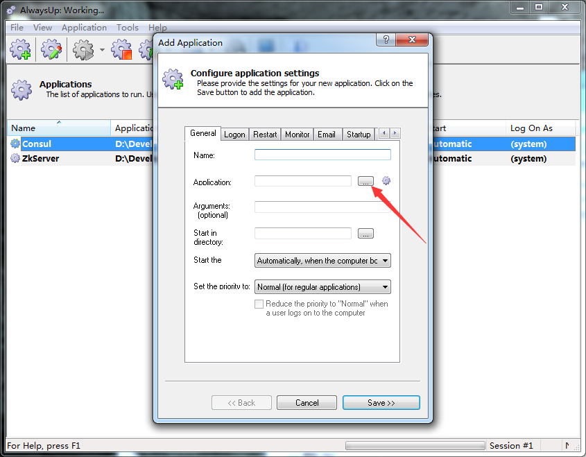
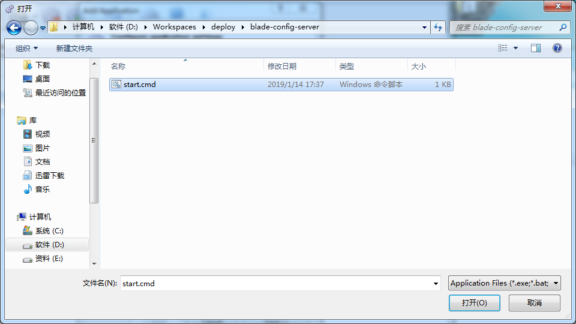
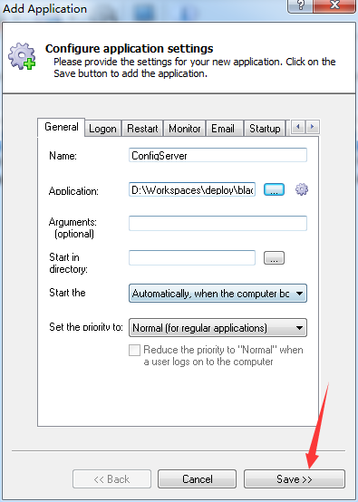
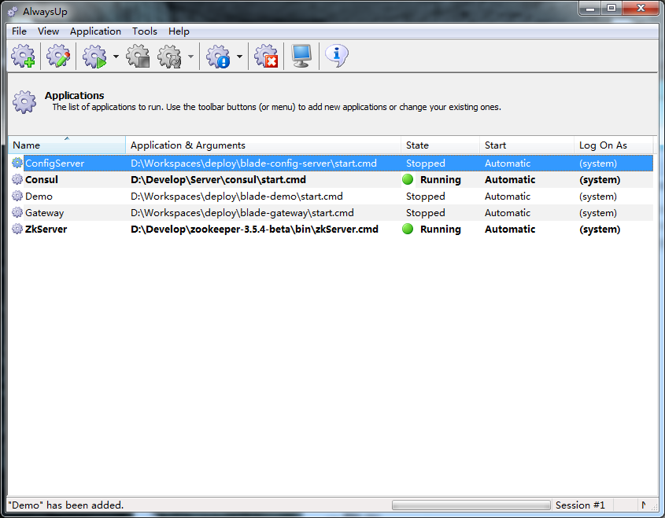
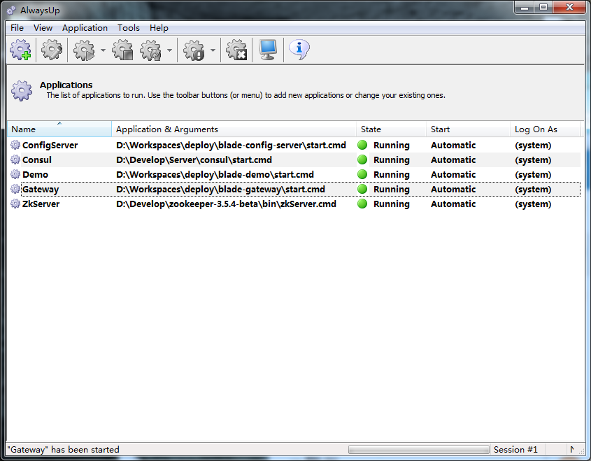
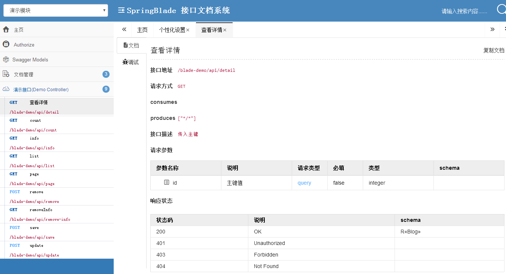

## 说明
虽然很不建议将微服务部署在windows平台，但总有很多不可抗力的因素，会导致某些项目只能部署在windows平台，所以下面给出一个相对简单的部署方案。

## 部署所需
* java环境
* mysql数据库
* redis服务
* nacos服务

## 部署辅助
* AlwaysUp是一款能将可执行文件、批处理文件及快捷方式作为Windows系统服务，并且进行管理和监视确保100%运行。当程序崩溃、挂起、弹出错误对话框时，AlwaysUp 能自动重启程序，并运行自定义的检查功能确保程序一直可用。AlwaysUp能发送详细的Email电子邮件使你清楚地了解崩溃、重启等事件。 
* 官网地址：https://www.coretechnologies.com/products/AlwaysUp/

## 部署步骤
### 注：新版本有些服务可能已经不存在，大家可以无视截图内不存在的服务。
1. 安装好所需服务以及AlwaysUp。
2. 工程目录下执行`mvn clean package`获取打包后的`jar`。

3. 编写windows启动脚本（可参考`/script/service.cmd`）

4. 拷贝至部署的文件夹中

5. 我们先以3个服务测试为例

6. 打开AlwaysUp增加脚本

7. 先启动`ConfigServer`服务，再依次启动其他服务

8. 全部启动后如下图所示
 
9. 访问聚合文档，查看可以正常访问，说明windows部署方案可行

