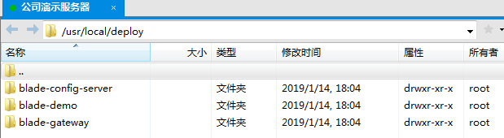
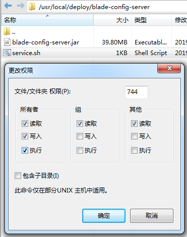
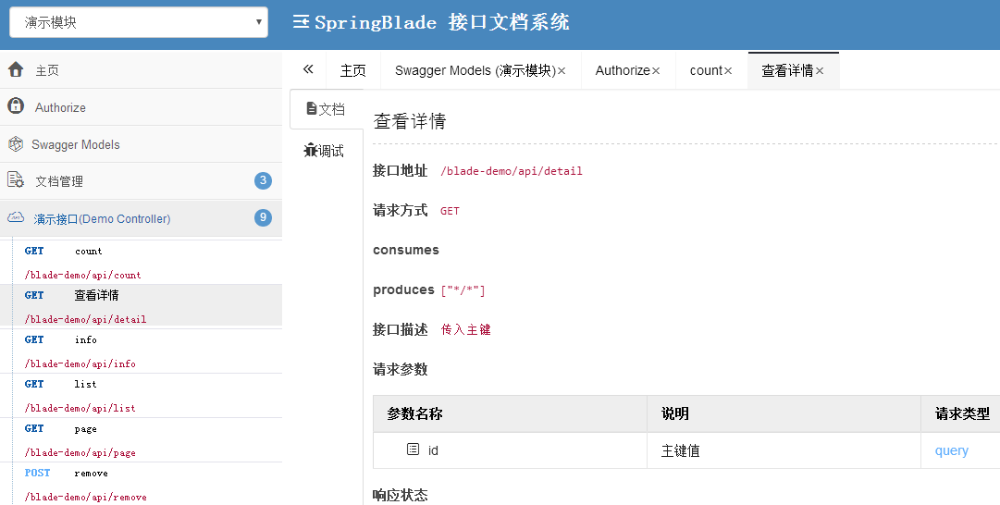

## 说明
linux下使用jar直接部署，也并不是很推荐的方式，就算搭配上Jenkins做持续构建，想要增加服务数量来降低服务器压力，也并不是很方便，所以大家学习下即可，了解下linux下基础的部署方式。最后还是推荐上docker或k8s。

## 部署所需
* java环境
* mysql数据库
* redis服务
* nacos服务

## 部署步骤
1. 工程目录下执行`mvn clean package`获取打包后的`jar`。

2. 编写启动脚本（可参考`/script/service.sh`）
~~~
APP_NAME=app.jar

#使用说明，用来提示输入参数
usage() {
echo "Usage: sh 执行脚本.sh [start|stop|restart|status]"
exit 1
}

#检查程序是否在运行
is_exist(){
pid=`ps -ef|grep $APP_NAME|grep -v grep|awk '{print $2}' `
#如果不存在返回1，存在返回0
if [ -z "${pid}" ]; then
return 1
else
return 0
fi
}

#启动方法
start(){
is_exist
if [ $? -eq "0" ]; then
echo "${APP_NAME} is already running. pid=${pid} ."
else
nohup java -jar $APP_NAME > /dev/null 2>&1 &
fi
}

#停止方法
stop(){
is_exist
if [ $? -eq "0" ]; then
kill -9 $pid
else
echo "${APP_NAME} is not running"
fi
}

#输出运行状态
status(){
is_exist
if [ $? -eq "0" ]; then
echo "${APP_NAME} is running. Pid is ${pid}"
else
echo "${APP_NAME} is NOT running."
fi
}

#重启
restart(){
stop
start
}

#根据输入参数，选择执行对应方法，不输入则执行使用说明
case "$1" in
"start")
start
;;
"stop")
stop
;;
"status")
status
;;
"restart")
restart
;;
*)
usage
;;
esac

~~~
3. 将jar包与脚本通过FTP拷贝至服务器，并给其设置执行权限，也可通过命令行执行：`chmod 744 service.sh`

4. 进入对应目录依次执行脚本 `./service.sh start` 即可
5. 访问服务器地址，查看已经成功

