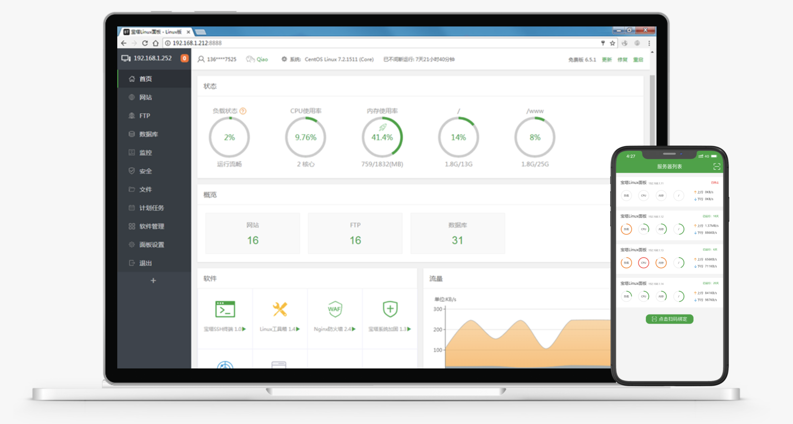
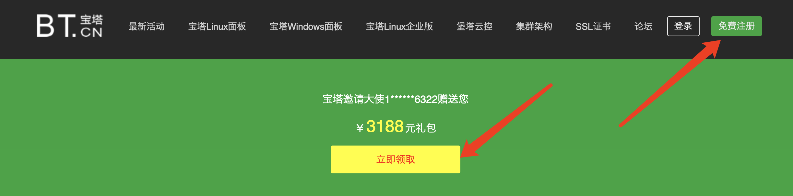
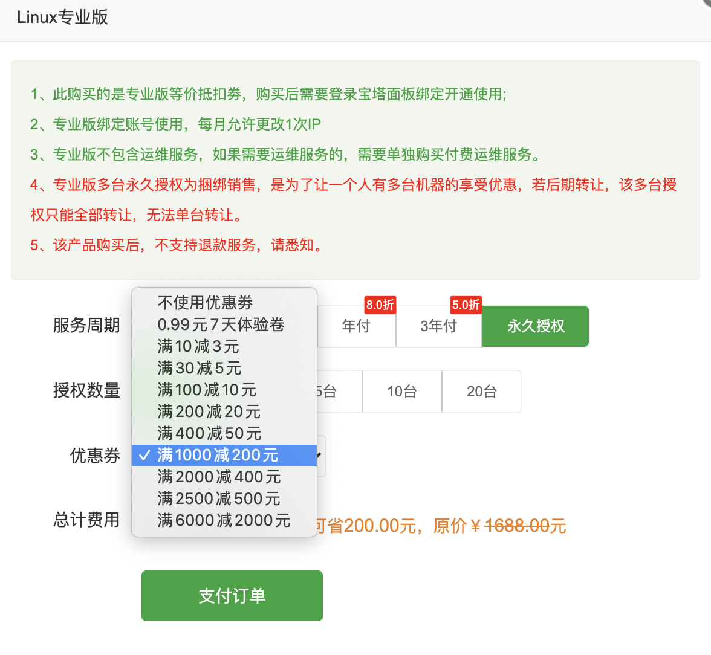

## 简介

* 宝塔面板是提升运维效率的服务器管理软件，支持一键LAMP/LNMP/集群/监控/网站/FTP/数据库/JAVA等100多项服务器管理功能

  

* 官网地址：https://www.bt.cn

* 开源地址：https://github.com/aaPanel/BaoTa

* 使用手册：http://docs.bt.cn

* 请大家看完bladex的部署流程后，回头再看一遍上述的使用手册，这样可以再次加深对他的掌握

## 版本说明

* 宝塔分免费版与收费版，免费版完全开源，收费版增加更多实用插件

* 宝塔本身免费版就已经足够强大，推荐大家直接使用免费版本

* 若需要付费版体验更强大的功能，可以通过这个邀请链接注册获取优惠券：https://www.bt.cn/?invite_code=MV9namxtdXM=

  

  

