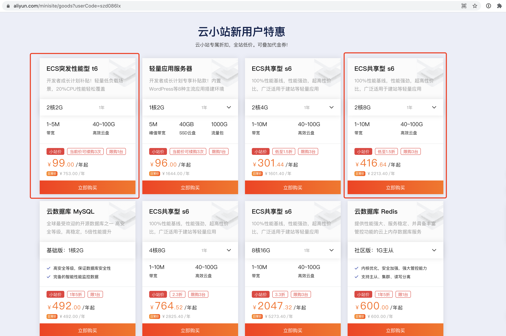
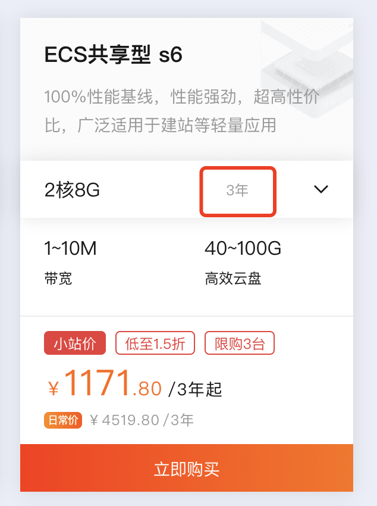
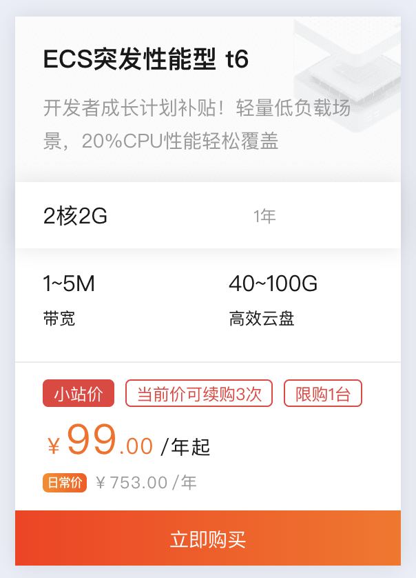

## 准备工作

> **注意⚠️：宝塔部署需要一个纯净的操作系统，切勿在已有环境尤其是生产服务器上安装！**

* 准备一台纯净的centos系统，这里我们以阿里云的centos7.x为例

* **已有服务器可以直接跳过本章节**

* 若没有服务器需要实验，新账号可以通过这个链接购买：https://www.aliyun.com/minisite/goods?userCode=szd086lx

  

* 若需要长期使用作为自己的测试机，为了不浪费帐号首次购买的优惠，推荐购买如下服务器，`2c8g` 3年1171元

  

* 若只需要进行简单实验并不想花太多钱，推荐购买如下服务器，`2c2g` 仅需99元1年

  