## 开始安装

> 注意⚠️：宝塔部署需要一个纯净的操作系统，切勿在已有环境尤其是生产服务器上安装！

1. 登录已经准备好**纯净系统的服务器**, 请自行选择熟悉的软件连接登录

2. 执行如下命令自动安装

   ~~~shell
   [root@blade-test ~]# yum install -y wget && wget -O install.sh http://download.bt.cn/install/install_6.0.sh && sh install.sh
   ~~~

   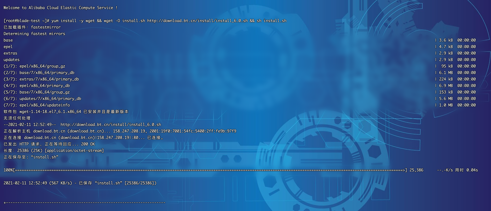

   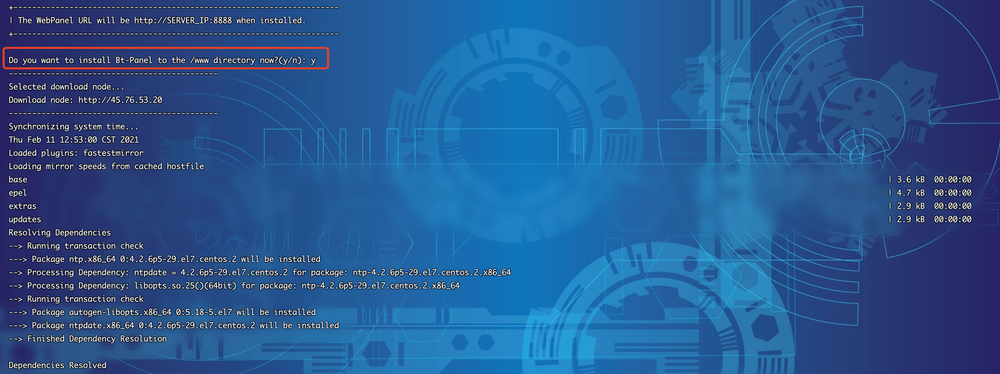

   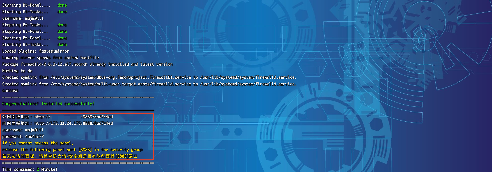

3. 注意记录最底部的面板地址、username、password，不要丢失，然后访问地址输入帐号密码进行登录

   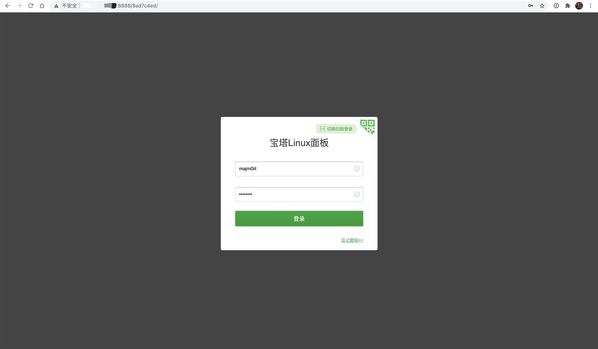

4. 初次登陆也许会相对耗时，此时系统在初始化，稍等片刻就可以看到进入了面板欢迎页，选择同意并进入面板

   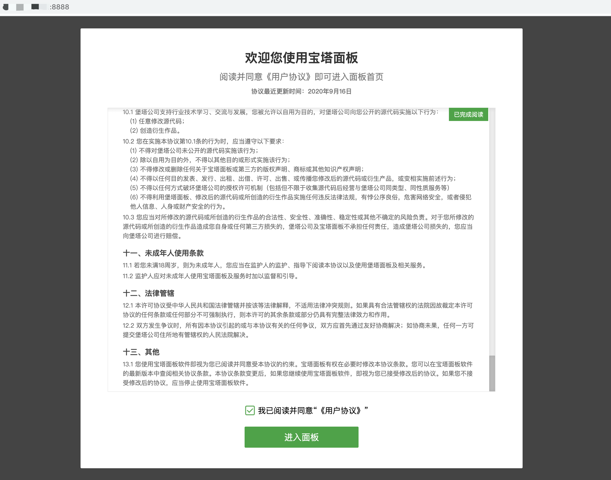

5. 进入首页后会弹出默认环境安装，我们选择左侧的一键套件，选择mysql5.7，点击一键安装后耐心等待安装完毕

   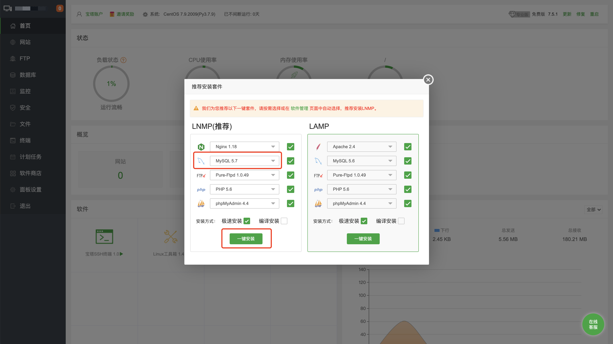

   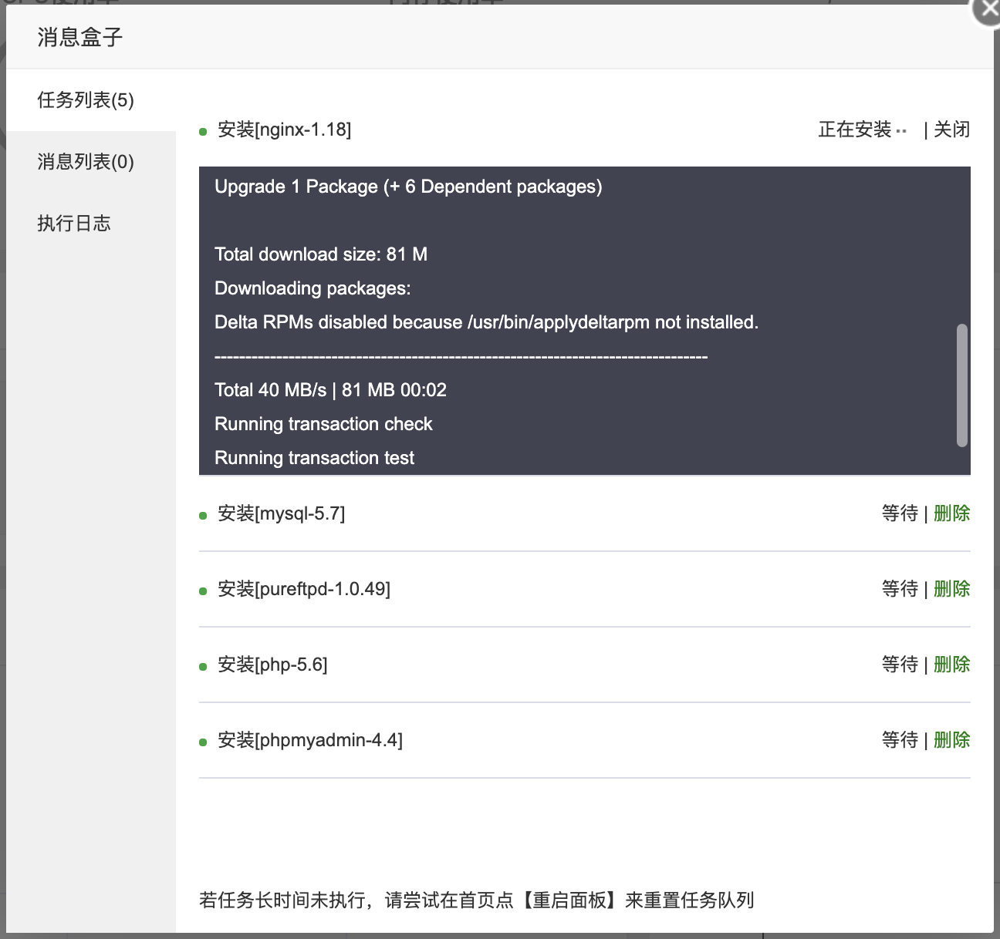

6. 绑定宝塔官方的帐号，若未注册可访问这个链接：https://www.bt.cn/?invite_code=MV9namxtdXM=

   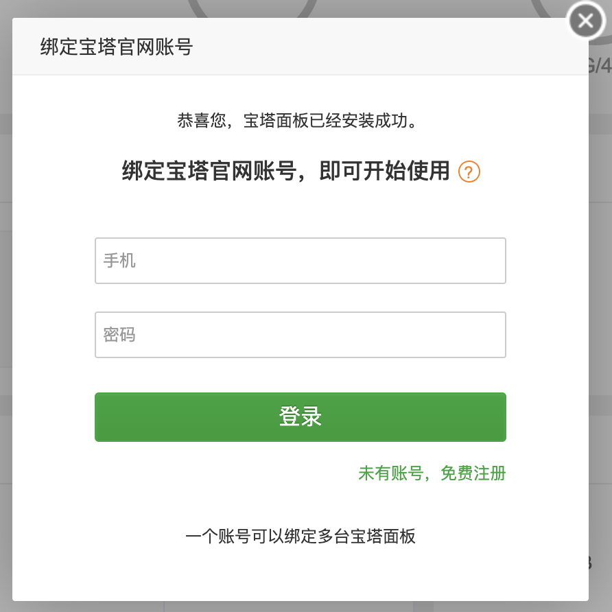

7. 完整首页，看到这一步就说明可以了

   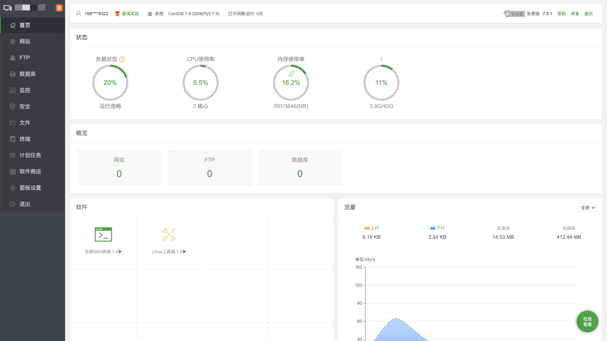

## 创建站点

1. 宝塔基础环境安装完毕，下面我们来尝试创建一个站点，用于给后续的前端部署做准备

2. 我们先创建一个站点，格式为外网ip+端口，注意到云服务器的**安全组规则**给端口开放访问权限

   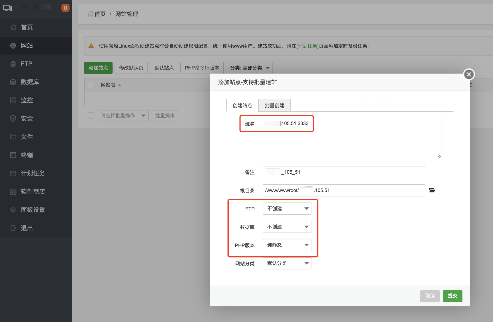

   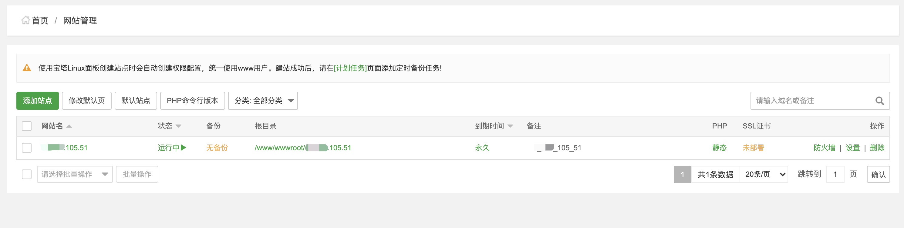

3. 访问设定的ip和端口，可以看到显示创建成功

   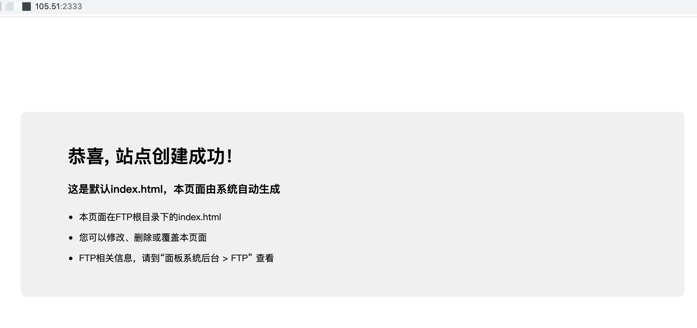

4. 点进根目录，找到index.html，修改一下内容

   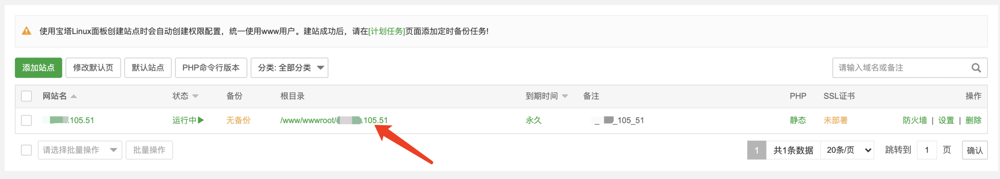

   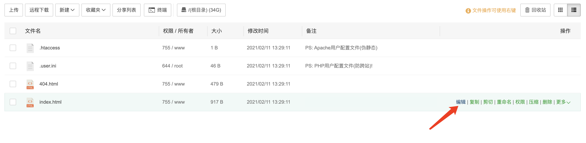

   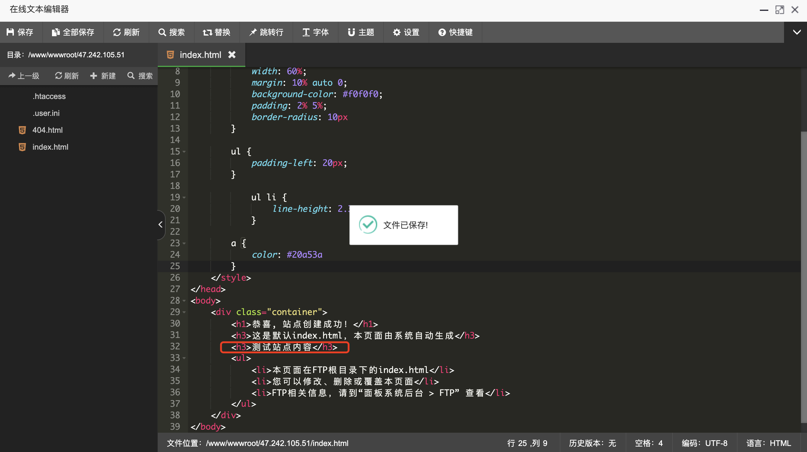

5. 刷新界面，发现刚添加的信息已经显示成功，说明站点创建成功，下一步我们就可以开始准备BladeX部署了

   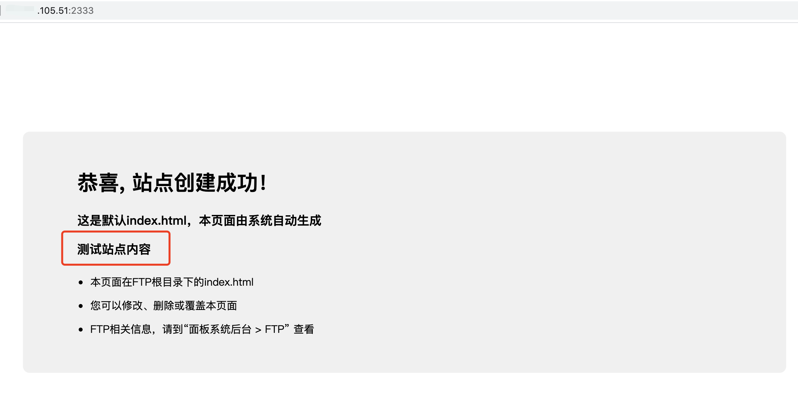

