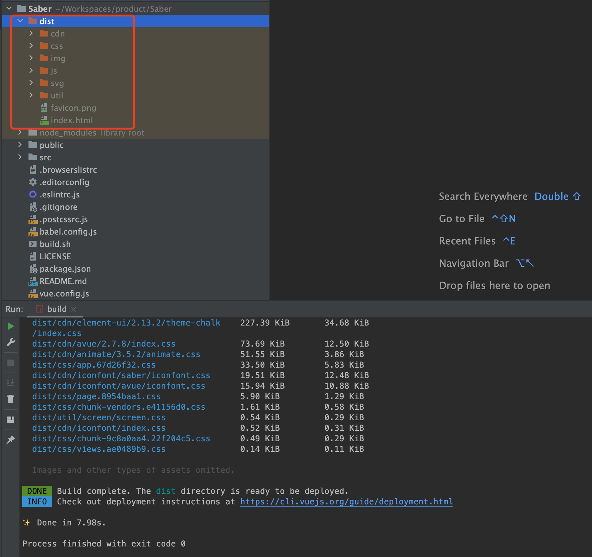
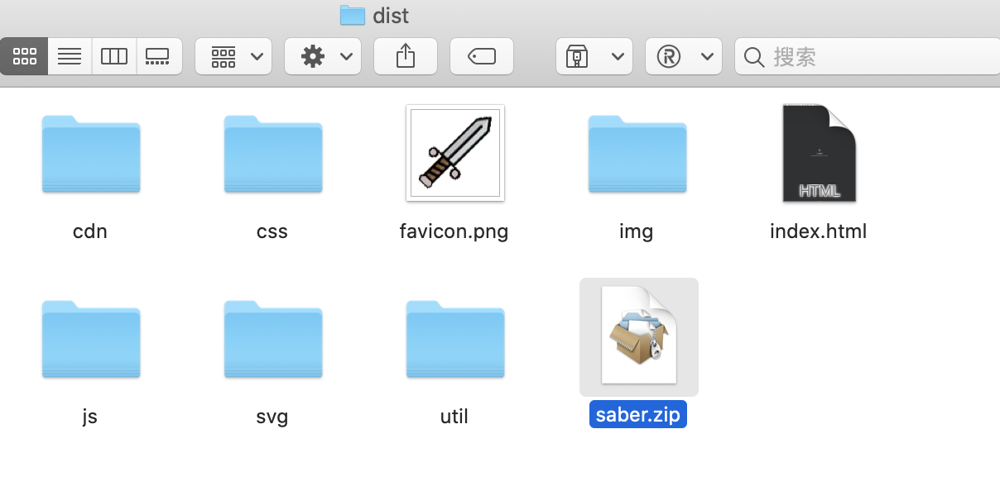
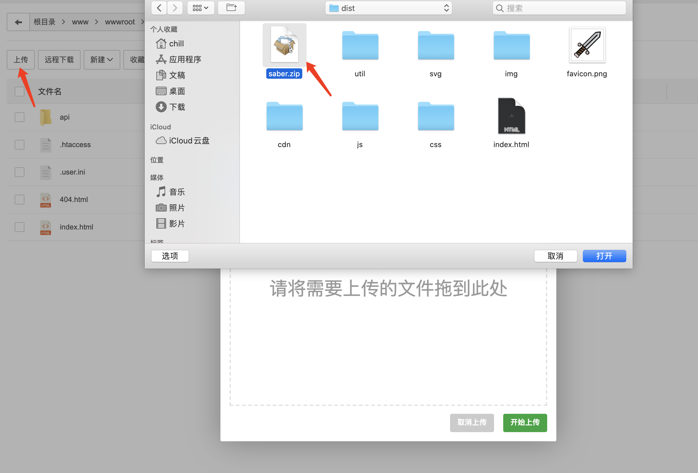
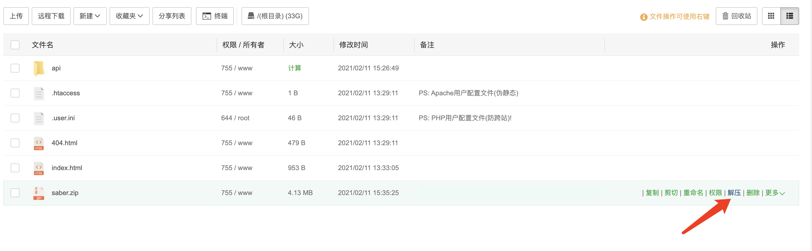
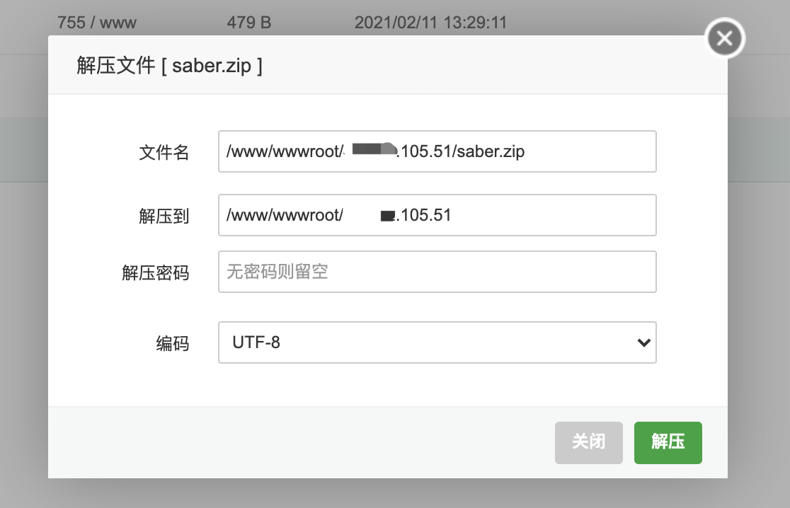
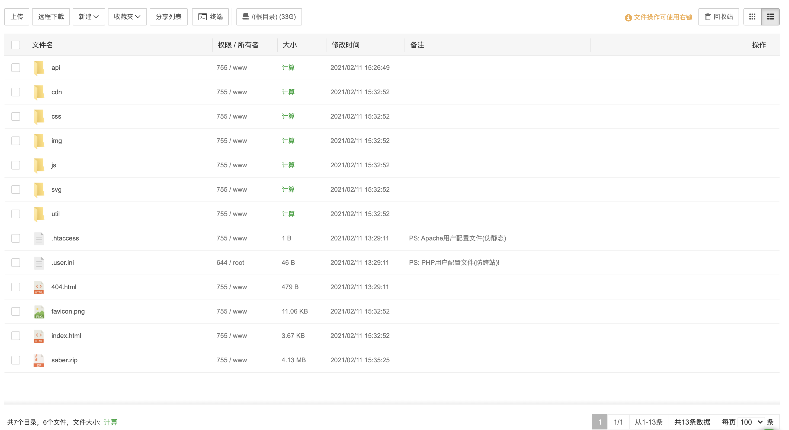
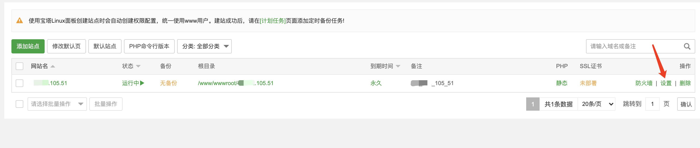
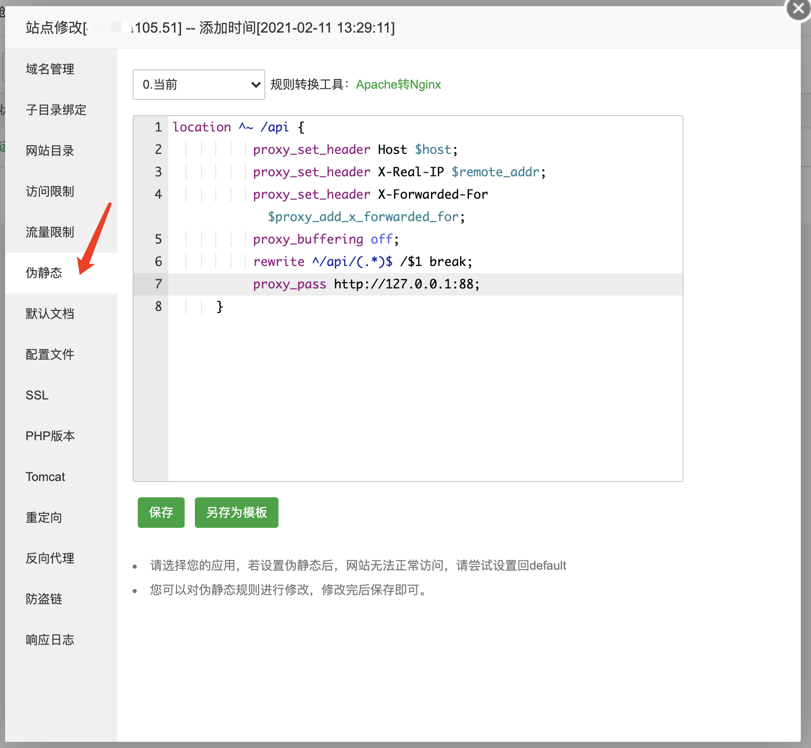
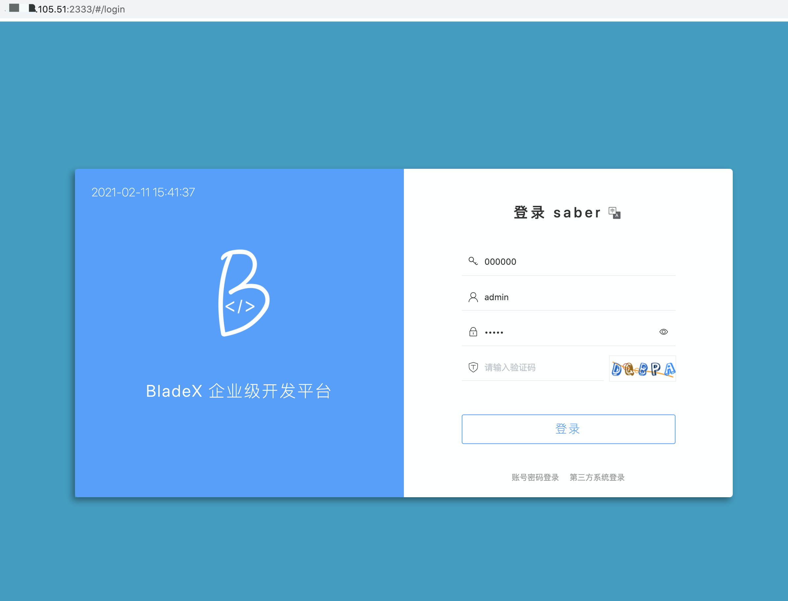
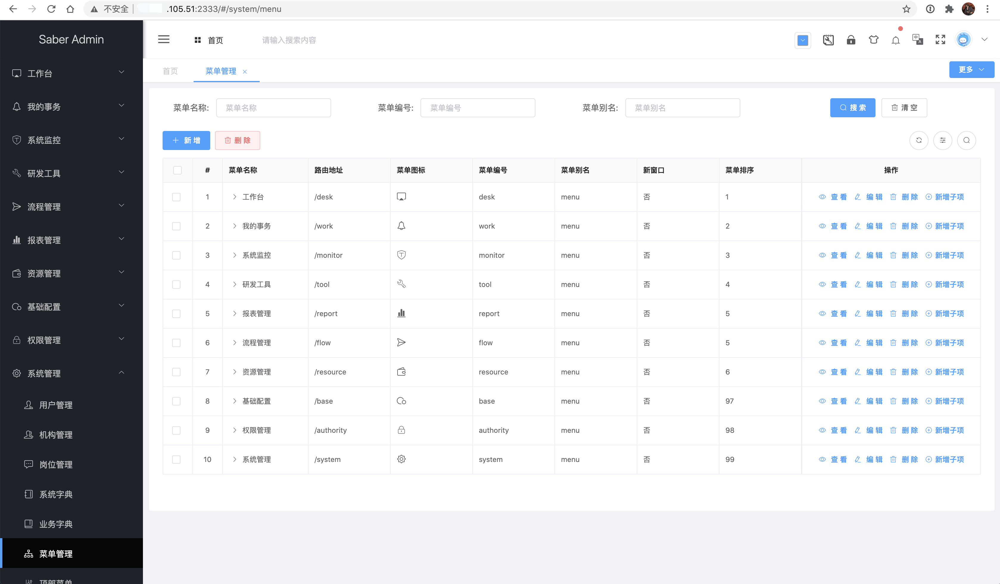

## 部署Saber

1. 本章节以Saber为例进行部署，其实Sword方式也是一致的

2. 进入Saber根目录执行` yarn run build`，并进入dist目录，将目录文件打成压缩包

   

3. 将压缩包上传至宝塔创建的站点根目录后点击`解压`

   

   

   

   

4. 解压后目录如下

   

5. 返回站点目录点击设置，找到`伪静态`栏目，填入后端反向代理配置

   ~~~shell
   location ^~ /api {
              proxy_set_header Host $host;
              proxy_set_header X-Real-IP $remote_addr;
              proxy_set_header X-Forwarded-For $proxy_add_x_forwarded_for;
              rewrite ^/api/(.*)$ /$1 break;
              proxy_pass http://127.0.0.1:88;
         }
   ~~~

   

   

6. 刷新地址，发现Saber正确展示，验证码也正确展示

   

7. 点击登录，可以正确展示，至此BladeX的部署就已经全部完工

   

   

