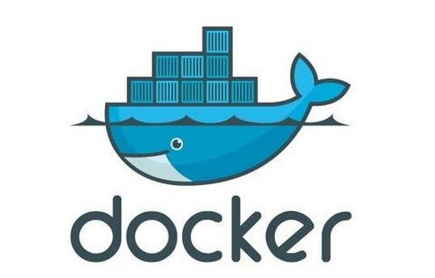

## 什么是Docker 

Docker 是一个开源的应用容器引擎，你可以将其理解为一个轻量级的虚拟机，开发者可以打包他们的应用以及依赖包到一个可移植的容器中，然后发布到任何流行的 Linux 机器上。

## 为什么要使用Docker 

### 更高效的利用系统资源

由于容器不需要进行硬件虚拟以及运行完整操作系统等额外开销，Docker对系统资源的利用率更高，无论是应用执行速度，内存消耗以及文件存储速度，都要比传统虚拟机技术更高效。因此，相比虚拟机技术，一个相同配置的主机，往往可以运行更多数量的应用。

### 更快速的启动时间

传统的虚拟机技术启动应用服务往往需要数分钟，而Docker容器应用，由于直接运行与宿主内核，无序启动完整的操作系统，因此可以做到妙级，甚至毫秒级的启动时间，大大的节约了开发，测试，部署的时间。

### 一致的运行环境

开发过程中一个常见的问题是环境一致性问题，由于开发环境，测试环境，生产环境不一致，导致有些bug并未在开发过程中被发现，而Docker的镜像提供了除内核外完整的运行时环境，确保了应用运行环境一致性。从而不会再出现（这段代码在我机器上运行没问题啊）zz这类问题。

### 持续交付和部署

对于开发和运维人员来说，最希望的就是一次创建或配置，可以在任意地方正常运行。

使用Docker可以通过定制应用镜像来实现持续集成，持续交付，部署。开发人员可以通过Dockerfile来进行镜像构建，并结合持续集成系统进行集成测试，而运维人员则可以在生产环境中快速部署该镜像，甚至结合持续部署系统进行自动部署

### 更轻松的迁移

由于Docker确保了执行环境的一致性，使得应用的迁移更加容易，Docker可以在很多平台上运行，无论是物理机，虚拟机，公有云，私有云，甚至是比较本，其运行结果是一致的，因此用户可以很轻易的将在一个平台上运行的应用，迁移到另一个平台上，而不用担心运行环境的变化导致应用无法正常运行的情况。

### 更轻松的维护和扩展

Docker使用的分层存数以及镜像的技术，使得应用重复部分的复用更为容易，也使得应用的维护更新更加简单，基于基础镜像进一步扩展镜像也变得非常简单，此外，Docker团队同各个开源项目团队一起维护了一大批高质量的官方镜像，既可以直接在生产环境使用，又可以作为基础进一步定制，大大的降低了应用服务的镜像制作成本。

## 说明
基于docker部署springcloud为主力推荐的方案，当然在服务器集群的情况下，肯定是推荐使用k8s，那么下面我们先入门一下，如何使用docker来部署。
