## 部署所需
* java环境
* mysql数据库
* redis服务
* docker服务
* docker镜像库
* nacos服务
（参考地址：https://github.com/nacos-group/nacos-docker）
（需要修改官网的docker-compose将network设置成与springblade的docker-compose设置的一致）


## Harbor部署前准备
**注意⚠️：若觉得Harbor部署麻烦，可以将BladeX-Tool与BladeX的源码拷贝至服务器，先在BladeX-Tool根目录执行 mvn clean install，再到BladeX根目录执行 mvn clean install，若均没问题，则再在BladeX根目录执行 mvn clean package docker:build 便可以把docker镜像安装至本机，无需再用Harbor，可直接跳至下一小节查看。**

* Harbor创建一个新的项目，命名为：`blade`。
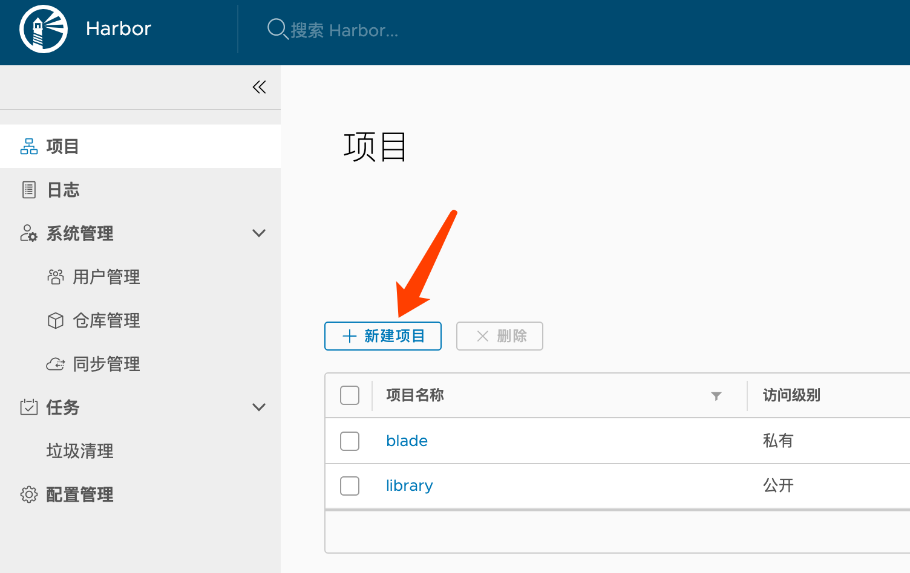
* Harbor再新建一个对应的`blade`账号，分配好角色用于接受推送过来的镜像。
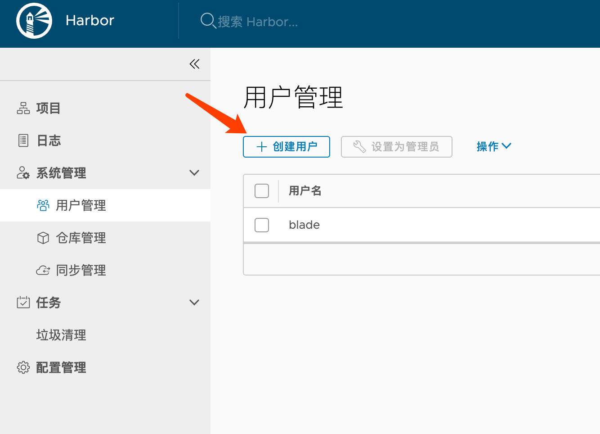


## 使用docker构建工程步骤
**1. 使用harbor作为私有库,需要配置maven,找到setting.xml( `linux可以使用find / -name settings.xml`)加入以下配置**

```
<servers>
  <server>
    <id>192.168.0.188</id>
    <username>admin</username>
    <password>admin12345</password>
    <configuration>
      <email>smallchill@163.com</email>
    </configuration>
  </server>
</servers>

<pluginGroups>
  <pluginGroup>io.fabric8</pluginGroup>  
</pluginGroups>
```

**2. docker开启远程访问**

如果没有远程访问,会报 `Connect to 192.168.0.188:2375 [/192.168.0.188] failed: Connection refused: connect`

在`/usr/lib/systemd/system/docker.service`,配置远程访问。主要是在[Service]这个部分，**在harbor服务器**，加上下面两个参数：

```
[root@localhost harbor]# vi /lib/systemd/system/docker.service

ExecStart=
ExecStart=/usr/bin/dockerd -H tcp://0.0.0.0:2375 -H unix://var/run/docker.sock
```
⚠️ **注意：请务必确认2375端口没有开放到公网，否则将会带来安全隐患**


**3. 配置http访问**
* 因为docker1.3.2版本开始默认docker registry使用的是https，我们设置Harbor默认http方式，所以当执行用docker login、pull、push等命令操作非https的docker regsitry的时就会报错。  
解决办法：在服务器与开发机配置`/etc/docker/daemon.json`

```
[root@localhost harbor]# vi /etc/docker/daemon.json 
{
  "registry-mirrors": ["https://3dse7md.mirror.aliyuncs.com"]
}
```

将其修改为：

```
{
  "registry-mirrors": ["https://3dse7md.mirror.aliyuncs.com"],
  "insecure-registries":["192.168.0.188"]
}
```
* mac可以在Preferences-->Docker Engine里配置以下地址


**4. 在每个需要构建子项目的pom.xml下加入配置,内容可参考如下**

```
<build>
  <plugins>
    <plugin>
        <groupId>io.fabric8</groupId>
        <artifactId>docker-maven-plugin</artifactId>
        <configuration>
            <skip>${docker.fabric.skip}</skip>
        </configuration>
    </plugin>
  </plugins>
</build>
```

**5. 在每个需要构建子项目的根目录下加入Dockerfile,内容可参考如下**

```
FROM bladex/alpine-java:openjdk8-openj9_cn_slim

MAINTAINER bladejava@qq.com

RUN mkdir -p /blade/gateway

WORKDIR /blade/gateway

EXPOSE 80

ADD ./target/blade-gateway.jar ./app.jar

ENTRYPOINT ["java", "-Djava.security.egd=file:/dev/./urandom", "-jar", "app.jar"]

CMD ["--spring.profiles.active=test"]
```

**6. 在工程根目录的/script/docker/app/docker-compose.yml下加入配置，后续作为服务器启动脚本，内容可参考如下**

```
blade-gateway:
  image: "${REGISTER}/blade-gateway:${TAG}"
  ports:
  - 80:80
  networks:
    blade_net:
      ipv4_address: 172.30.0.81
```

* 在项目根目录下执行构建命令 `mvn clean package docker:build docker:push ` 等待推送完毕
* 截取其中一个服务的推送日志
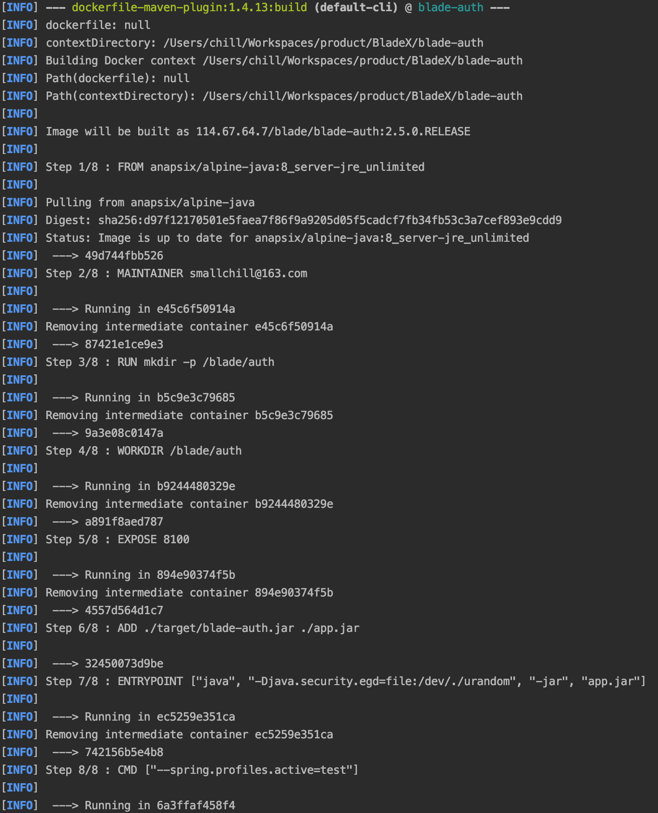
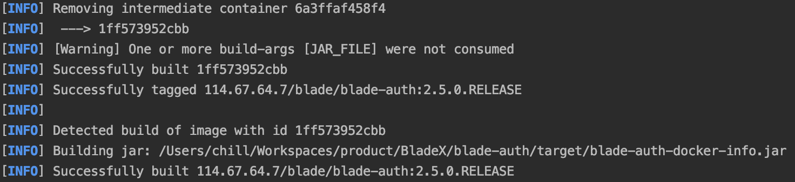
* 登录harbor查看docker镜像已经推送成功
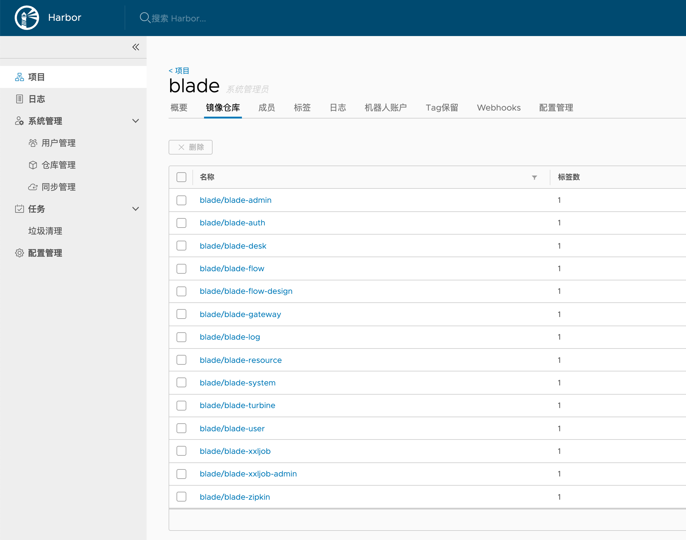
* 点击进入blade/blade-auth可以看到详细信息
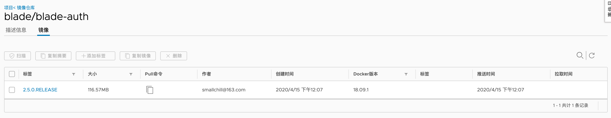


## 配置web服务以及网关反向代理
1. 我们先看一下部署脚本内的nginx文件夹结构，其中`api`是针对gateway的反代配置，`web`是针对前端的配置
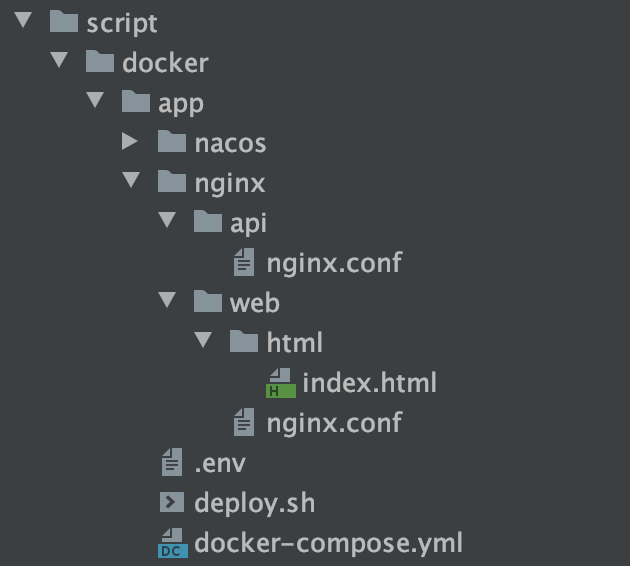
2. 先看一下`api`文件夹下的`nginx.conf`，画出重点
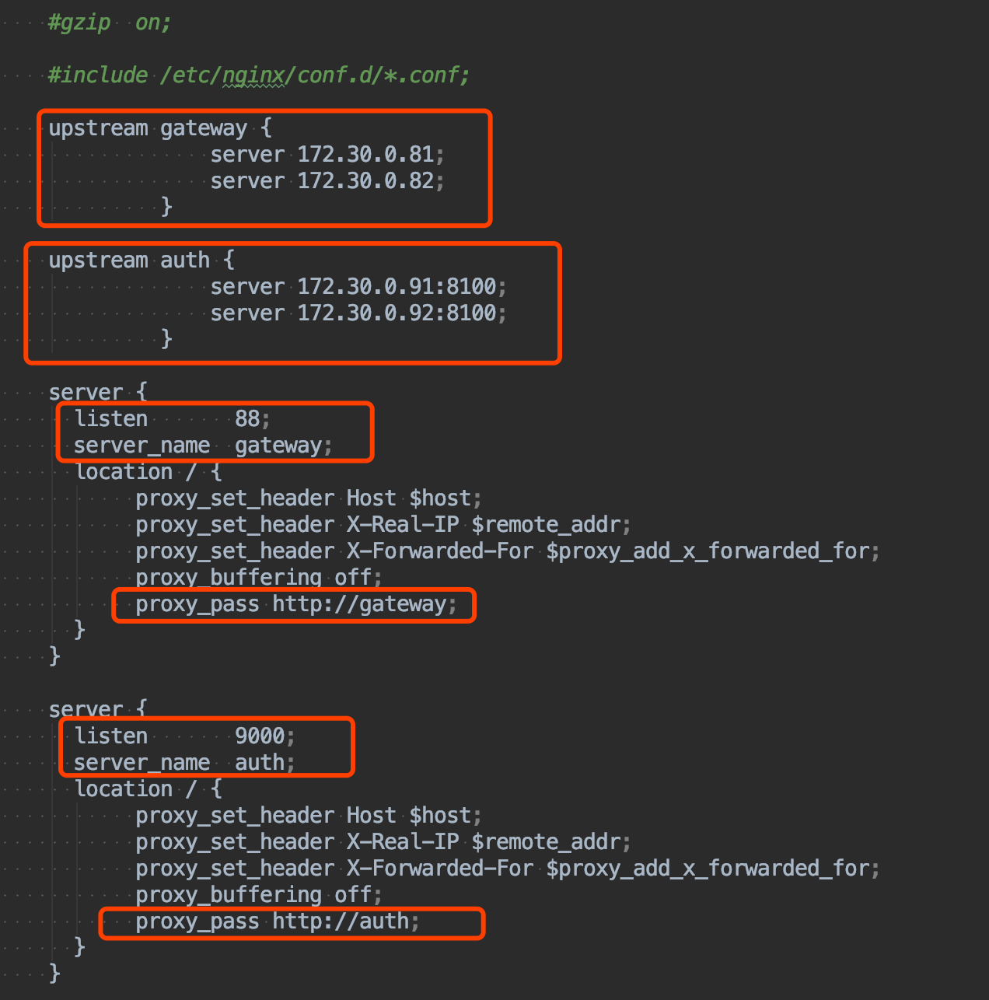
* 配置了gateway和auth两个服务的反向代理
* 其中gateway分配为88端口，auth分配为9000端口
* docker-compose分别指定了81和82端口的gateway，与api的配置文件一致
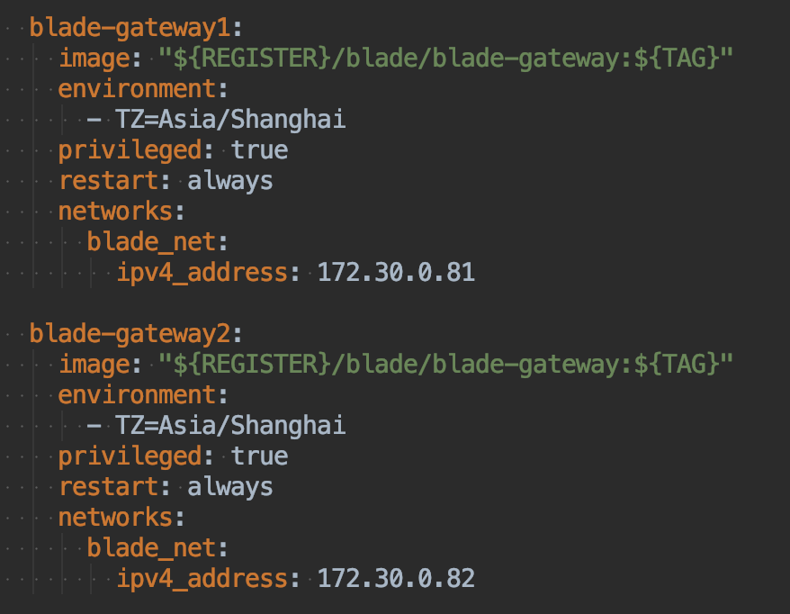
* 其中`blade-auth`也有代理，是因为授权码模式需要直接访问auth服务，所以会单独代理出一个地址。若不需要，可以删除不用。
3. api内的nginx端口设置为88，那么只要宿主机放开88端口，同时映射到外网，那么对应的 http://宿主机ip:88 就是反向代理后的网关地址了，在这基础上进行域名绑定相信对于大家也不是什么难事。
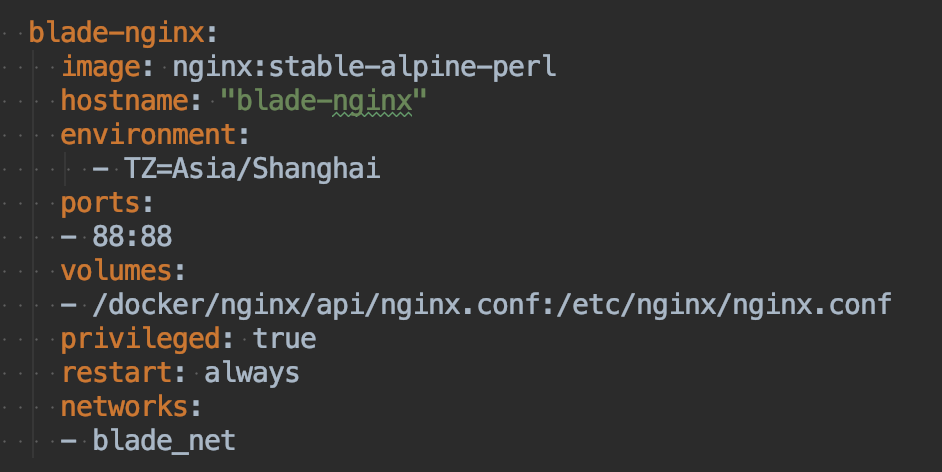
4. 再看一下`web`文件夹下的`nginx.conf`，同样画出重点
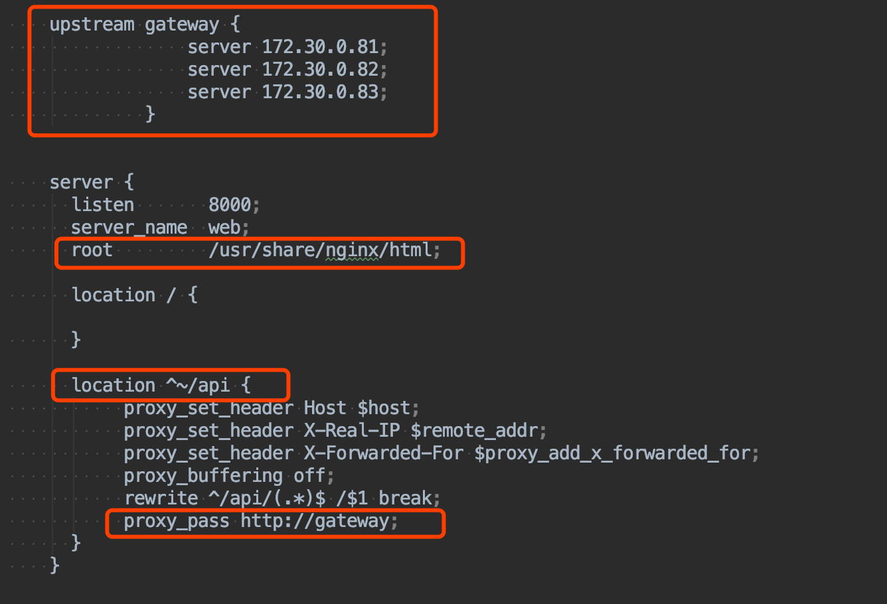
* 定义了gateway，进行反向代理，同时反向代理前缀指定为`/api`，这是框架内置规则，不能更改
* 将文件放入`/usr/share/nginx/html`内，并由nginx指定，通过部署脚本，会将对应文件拷贝至指定路径
 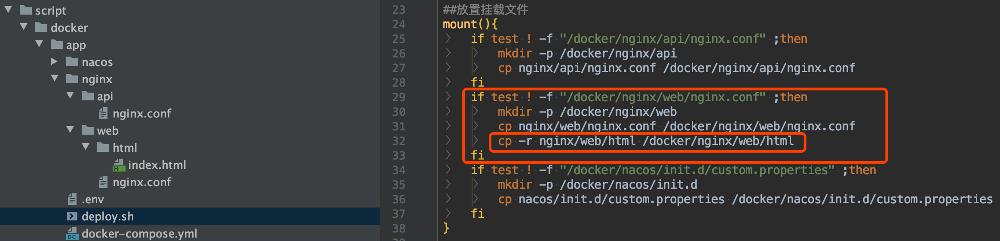
* docker-compose通过指定挂载，便可以将宿主机的文件挂载到docker内进行启动
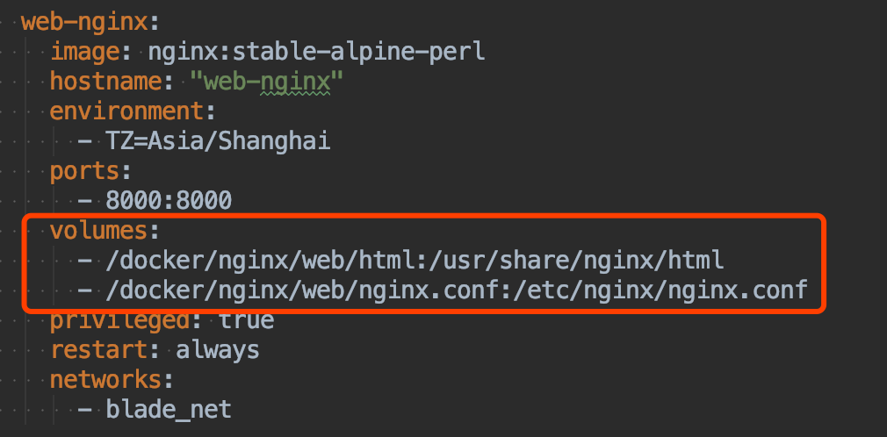
* 如此一来，前端部署也搞定了，部署中以index.html作为了示例，那么大家生产部署的时候，只需要前端先build，然后把构建后的文件放到如下目录下便可以了
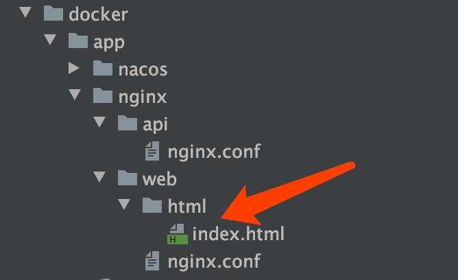


## 使用docker-compose启动服务
* 若有新的服务，需要在工程根目录的/script/docker/app/docker-compose.yml加入配置，内容可参考如下
**注意⚠️：REGISTER 与 TAG 变量都在.env文件配置，记得修改并拷贝至服务器**
~~~yaml
blade-gateway:
  image: "${REGISTER}/blade-gateway:${TAG}"
  ports:
  - 80:80
  networks:
    blade_net:
      ipv4_address: 172.30.0.81
~~~
* 配置好脚本集后，将下图文件拷贝至部署文件夹 ( 注意要把`.env`文件也一起拷贝，有时候ftp、eclipse等软件会不显示 )
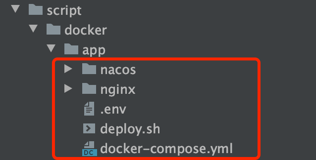

* 进入该目录，给`deploy.sh`赋予执行权限 `chmod 744 deploy.sh`
* 部署执行`docker ps` 查看目前启动的docker服务
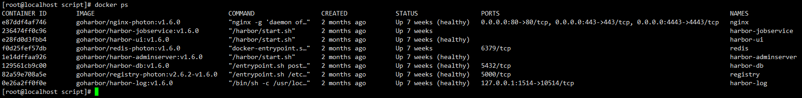
* 执行`cd /docker/script`进入目录后依次执行：
1. `./deploy.sh port` 开启端口
2. `./deploy.sh mount` 放置挂载文件
3. `./deploy.sh base` 启动基础模块（这时需要打开nacos进行配置文件的配置）

4. `./deploy.sh modules` 启动业务模块
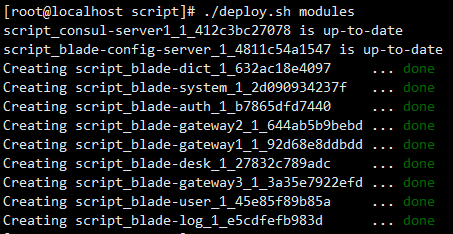
* 再次执行` docker ps` 查看已启动的docker服务，发现服务都已启动成功

* 若都成功则打开nacos界面查看对应部署的服务
* 打开聚合文档地址(http://宿主机ip:18000/doc.html)查看接口调用(**18000为独立swagger网关服务对应端口，现在已经从Gateway迁移出来**)，网关地址为之前配置好的nginx对网关的反向代理地址（http://宿主机ip:88）
* 发现调用都没有问题，基于docker的部署已经成功


## 梅开二度
* 关于Docker部署，在Prometheus监控体系章节又进行了一次实操演示
* 大家可以前往`6.3.6章节`再稳固一下部署细节，不要有遗漏哦


## 结尾语
* 学习了三种部署方式后，相信大家很快就能掌握，若在linux平台，非常推荐使用docker来部署。
* 等到后期服务器数量增加后，就需要使用`Kubernetes`（简称K8S），来管理docker集群。大家需要不断学习与实战操练，才能在开发与部署的时候得心应手。
* 服务部署完毕，一般需要有一个监控系统实时掌控，这对线上生产的产品非常重要。
* 具体介绍大家请看 `6.3 章节`，入门后如何对接BladeX请看 `6.3.6 章节`
