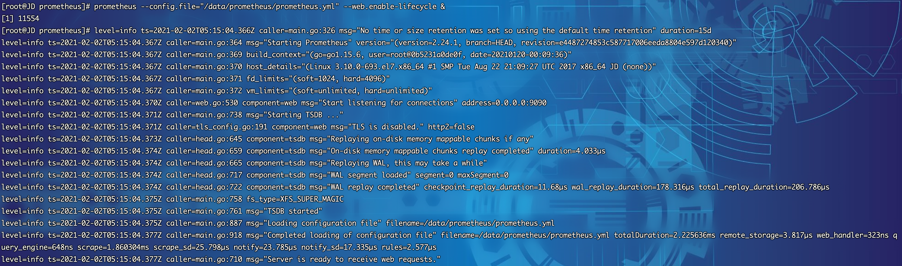

## 二进制部署

1. 部署前大家可以先前往github发行版地址看一下最新的部署包：https://github.com/prometheus/prometheus/releases
2. 截至目前最新版本为 `2.24.1` ，以后若有更新，大家根据版本修改下方的脚本即可

3. 登录Linux服务器（以Centos7.x为例），下载部署包，由于是github，网络会有些慢，大家若等不及可以开发机下载，然后再传至服务器也可。下载包为：`prometheus-2.24.1.linux-amd64.tar.gz`
~~~shell
[root@JD ~]# cd /usr/local/src/
[root@JD src]# wget https://github.com/prometheus/prometheus/releases/download/v2.24.1/prometheus-2.24.1.linux-amd64.tar.gz
~~~

4. 部署包下载完毕，开始安装
~~~shell
[root@JD src]# mkdir /data/ -p
[root@JD src]# tar xf prometheus-2.24.1.linux-amd64.tar.gz -C /data/
[root@JD src]# mv /data/prometheus-2.24.1.linux-amd64 /data/prometheus
~~~
~~~shell
[root@JD src]# cd /data/prometheus/
[root@JD prometheus]# ls
console_libraries  consoles  LICENSE  NOTICE  prometheus  prometheus.yml  promtool
~~~
5. 移动可执行程序，并查看版本
~~~shell
[root@JD prometheus]# cp prom* /usr/bin/
[root@JD prometheus]# prometheus --version
prometheus, version 2.24.1 (branch: HEAD, revision: e4487274853c587717006eeda8804e597d120340)
  build user:       root@0b5231a0de0f
  build date:       20210120-00:09:36
  go version:       go1.15.6
  platform:         linux/amd64
~~~
6. 完整流程如下

7. 启动prometheus，并进行相关配置

* 常用启动参数可参考如下
~~~
–config.file="/data/prometheus/prometheus.yml" //指定配置文件路径
–web.enable-lifecycle //开启web热加载配置
–storage.tsdb.path= //指定tsdb数据库路径，默认在/data
–storage.tsdb.retention.time= //指定tsdb保留数据的时长，默认15d
~~~
* 默认配置文件如下

* 指定默认配置文件并查看是否启动成功
~~~shell
[root@JD prometheus]# prometheus --config.file="/data/prometheus/prometheus.yml" --web.enable-lifecycle 
~~~

8. 启动无误，输入ctrl+c关闭服务，下一步我们进行系统service编写
* 创建 `prometheus.service` 配置文件
~~~shell
[root@JD system]# cd /usr/lib/systemd/system
[root@JD system]# vim prometheus.service
~~~
* prometheus.service 文件填入如下内容后保存 `:wq`

~~~shell
[Unit]
Description=https://prometheus.io

[Service]
Restart=on-failure
ExecStart=/data/prometheus/prometheus --config.file=/data/prometheus/prometheus.yml --web.enable-lifecycle --storage.tsdb.path=/data/prometheus/data

[Install]
WantedBy=multi-user.target
~~~
* 查看配置文件
~~~shell
[root@JD system]# cat prometheus.service
[Unit]
Description=https://prometheus.io

[Service]
Restart=on-failure
ExecStart=/data/prometheus/prometheus --config.file=/data/prometheus/prometheus.yml --web.enable-lifecycle --storage.tsdb.path=/data/prometheus/data

[Install]
WantedBy=multi-user.target
~~~
* 刷新服务配置并启动服务
~~~shell
[root@JD system]# systemctl daemon-reload
[root@JD system]# systemctl start prometheus.service
~~~
* 设置开机自启动
~~~shell
[root@JD system]# systemctl enable prometheus.service
Created symlink from /etc/systemd/system/multi-user.target.wants/prometheus.service to /usr/lib/systemd/system/prometheus.service.
~~~
* 查看运行进程
~~~shell
[root@JD system]# ps aux | grep prome
root     11554  0.0  0.2 770724 41964 pts/0    Sl   13:15   0:00 prometheus --config.file=/data/prometheus/prometheus.yml --web.enable-lifecycle
root     18347  0.0  0.0 112720   984 pts/0    D+   13:20   0:00 grep --color=auto prome
~~~
* 完整流程如下

9. 验证系统服务可以看到运行正常

## 访问系统
1. 执行`systemctl start prometheus.service`，访问系统 http://服务器ip:9090，注意防火墙或安全组开放端口

2. 查看主机信息

3. 默认为localhost，我们将其改为正确的服务器ip地址
~~~shell
[root@JD system]# vim /data/prometheus/prometheus.yml 
~~~

 4. 执行动态刷新API，post地址为服务器ip
~~~shell
[root@JD system]# curl -XPOST 11x.xx.xx.7:9090/-/reload
~~~
5. 稍等片刻刷新系统，就可以看到ip地址已经变更成功

6. 点击Endpoint地址，查看数据返回

## 后记
* 以上流程走完没有遇到问题则说明prometheus已经部署成功，后续就可以开始搭建监控系统了
* 若部署遇到问题，请仔细查看步骤，不要有遗漏，相信大家都可以一步搞定

