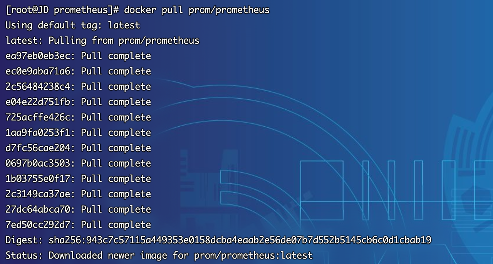
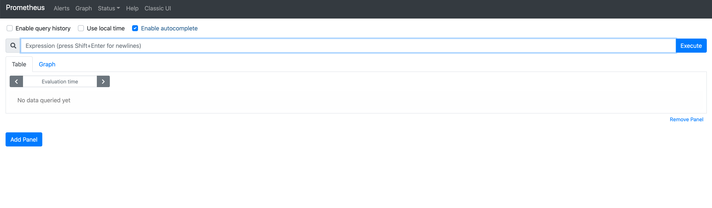
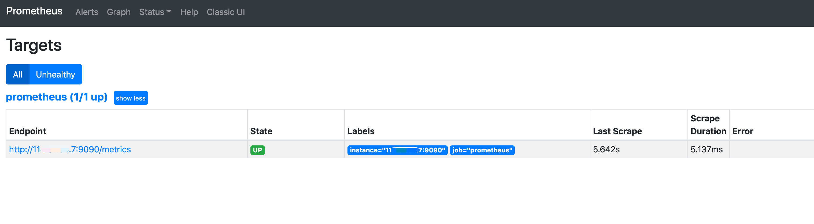
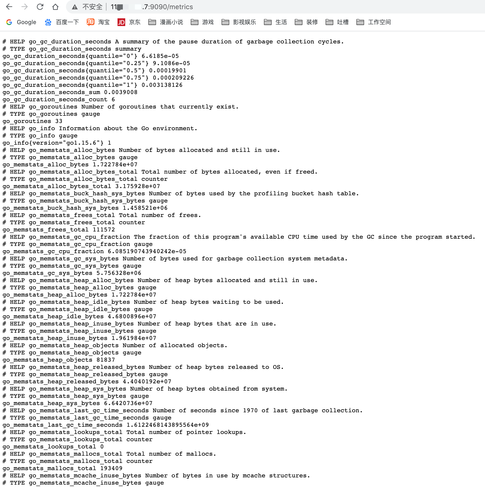

## Docker部署
1. 在Docker部署之前，首先要确保拥有Docker环境，具体安装可以参考文档`6.2.3.3章节`
2. 拉取prometheus最新镜像
~~~shell
[root@JD prometheus]# docker pull prom/prometheus
~~~

3. 启动docker容器并挂载配置文件，配置文件上一章节二进制部署正好有，可以直接使用
注意：⚠️ 若二进制章节部署后，需要执行`systemctl stop prometheus.service`关闭服务，否则会造成端口冲突，或者docker的端口映射改为 `-p 9091:9090` 也可
~~~shell
[root@JD prometheus]# docker run --name prometheus -d -p 9090:9090  -v /data/prometheus/prometheus.yml:/etc/prometheus/prometheus.yml -v /data/prometheus/rules:/etc/prometheus/rules prom/prometheus --config.file=/etc/prometheus/prometheus.yml  --web.enable-lifecycle
~~~
4. 访问系统 http://服务器ip:9090，注意防火墙或安全组开发端口。

5. 由于上一章节配置文件已经搞定，本章节无需再配置

6. 若没有操作过二进制部署，可以通过下面的文本手动创建配置文件 `prometheus.yml`
~~~yaml
# my global config
global:
  scrape_interval:     15s # Set the scrape interval to every 15 seconds. Default is every 1 minute.
  evaluation_interval: 15s # Evaluate rules every 15 seconds. The default is every 1 minute.
  # scrape_timeout is set to the global default (10s).

# Alertmanager configuration
alerting:
  alertmanagers:
  - static_configs:
    - targets:
      # - alertmanager:9093

# Load rules once and periodically evaluate them according to the global 'evaluation_interval'.
rule_files:
  # - "first_rules.yml"
  # - "second_rules.yml"

# A scrape configuration containing exactly one endpoint to scrape:
# Here it's Prometheus itself.
scrape_configs:
  # The job name is added as a label `job=<job_name>` to any timeseries scraped from this config.
  - job_name: 'prometheus'

    # metrics_path defaults to '/metrics'
    # scheme defaults to 'http'.

    static_configs:
    # 这里改为服务器ip以及分配的端口号
    - targets: ['11x.xx.xx.7:9090']

~~~
