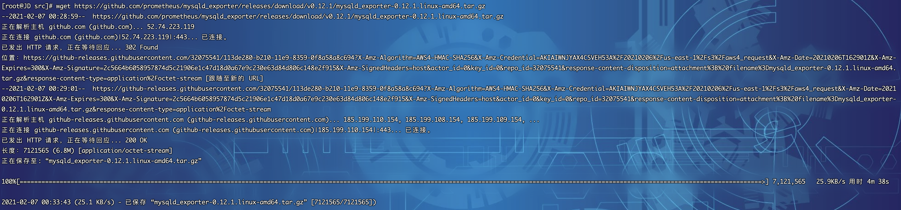
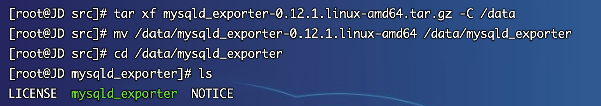
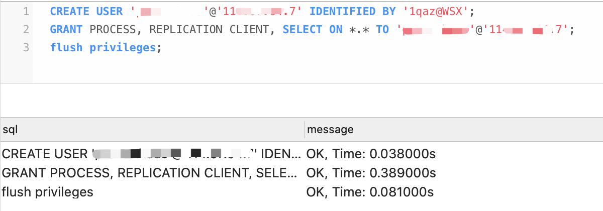
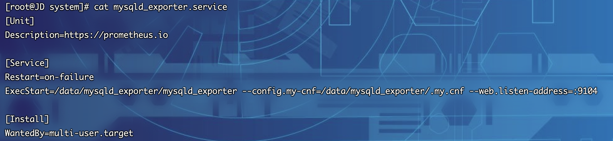
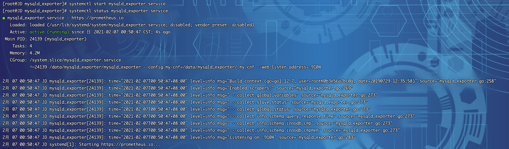
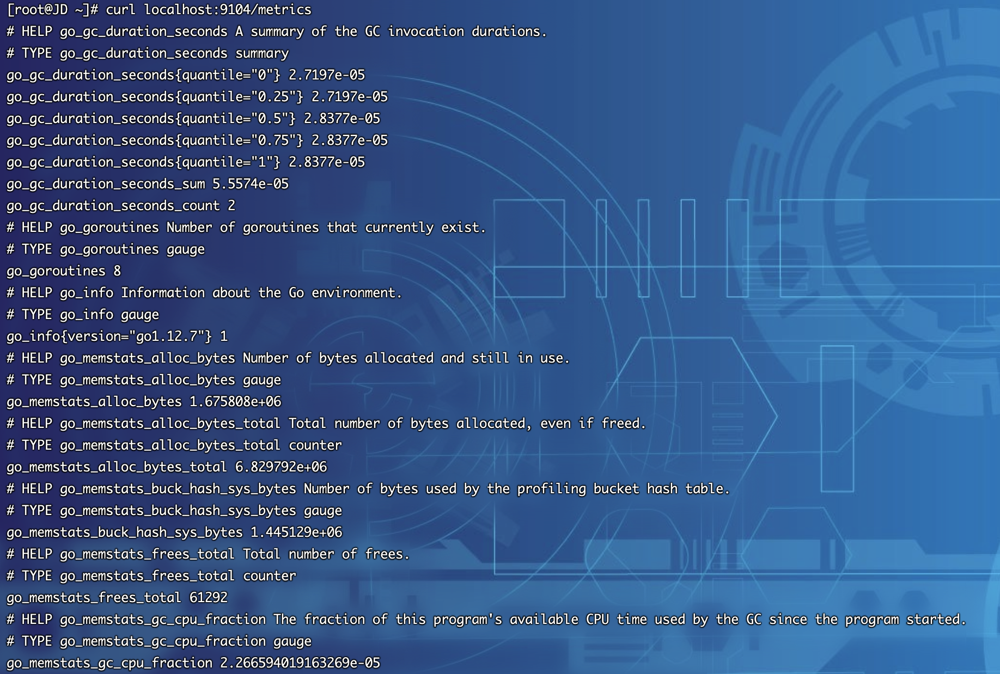
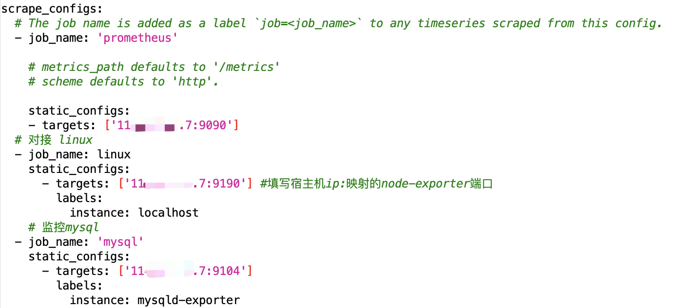
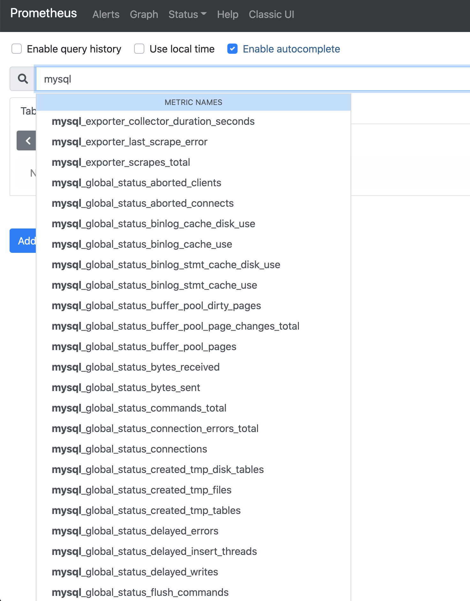
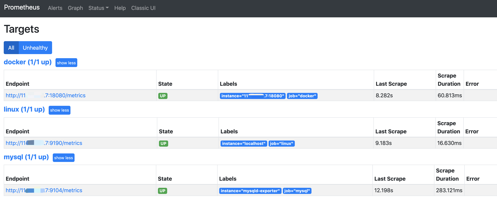

## 简介
>mysql_exporter是用来收集MysQL或者Mariadb数据库相关指标的，mysql_exporter需要连接到数据库并有相关权限。既可以用二进制安装部署，也可以通过容器形式部署

## 二进制部署
1.  部署前大家可以先前往github发行版地址看一下最新的部署包：https://github.com/prometheus/mysqld_exporter/releases
2.  截至目前最新版本为`0.12.1`，以后若有更新，大家根据版本修改下方的脚本即可
3.  登录Linux服务器（以Centos7.x为例），下载部署包，由于是github，网络会有些慢，大家若等不及可以开发机下载，然后再传至服务器也可。下载包为：`mysqld_exporter-0.12.1.linux-amd64.tar.gz`
~~~shell
[root@JD ~]# cd /usr/local/src/
[root@JD src]# wget https://github.com/prometheus/mysqld_exporter/releases/download/v0.12.1/mysqld_exporter-0.12.1.linux-amd64.tar.gz
~~~

4. 部署包下载完毕，开始安装
~~~shell
[root@JD src]# tar xf mysqld_exporter-0.12.1.linux-amd64.tar.gz -C /data
[root@JD src]# mv /data/mysqld_exporter-0.12.1.linux-amd64 /data/mysqld_exporter
~~~
~~~shell
[root@JD src]# cd /data/mysqld_exporter
[root@JD mysqld_exporter]# ls
LICENSE  mysqld_exporter  NOTICE
~~~

5. 创建配置文件`.my.cnf` ，填入如下内容后保存`:wq`
~~~shell
[client]
host=11x.xx.xx.7
user=exporter
password=1qaz@WSX
~~~
~~~shell
[root@JD mysqld_exporter]# vim .my.cnf
[root@JD mysqld_exporter]# cat .my.cnf 
[client]
host=11x.xx.xx.7
user=exporter
password=1qaz@WSX
~~~

6. mysql创建用户并授权，注意服务ip不要填错
~~~shell
CREATE USER 'exporter'@'11x.xx.xx.7' IDENTIFIED BY '1qaz@WSX';
GRANT PROCESS, REPLICATION CLIENT, SELECT ON *.* TO 'exporter'@'11x.xx.xx.7';
flush privileges;
~~~

7. 进行系统service编写
*   创建`mysqld_exporter.service`配置文件
~~~shell
[root@JD mysqld_exporter]# cd /usr/lib/systemd/system
[root@JD system]# vim mysqld_exporter.service
~~~
*   mysqld_exporter.service 文件填入如下内容后保存`:wq`
~~~shell
[Unit]
Description=https://prometheus.io

[Service]
Restart=on-failure
ExecStart=/data/mysqld_exporter/mysqld_exporter --config.my-cnf=/data/mysqld_exporter/.my.cnf --web.listen-address=:9104

[Install]
WantedBy=multi-user.target
~~~
*   查看配置文件
~~~shell
[root@JD system]# cat mysqld_exporter.service 
[Unit]
Description=https://prometheus.io

[Service]
Restart=on-failure
ExecStart=/data/mysqld_exporter/mysqld_exporter --config.my-cnf=/data/mysqld_exporter/.my.cnf --web.listen-address=:9104

[Install]
WantedBy=multi-user.target
~~~

*   刷新服务配置并启动服务
~~~shell
[root@JD system]# systemctl daemon-reload
[root@JD system]# systemctl start mysqld_exporter.service
~~~
*   查看服务运行状态
~~~shell
[root@JD system]# systemctl status mysqld_exporter.service
~~~

*   设置开机自启动
~~~shell
[root@JD mysqld_exporter]# systemctl enable mysqld_exporter.service
Created symlink from /etc/systemd/system/multi-user.target.wants/mysqld_exporter.service to /usr/lib/systemd/system/mysqld_exporter.service.
~~~

* 测试服务返回
~~~shell
[root@JD mysqld_exporter]# curl localhost:9104/metrics
~~~

## Docker部署
1.  在Docker部署之前，首先要确保拥有Docker环境，具体安装可以参考文档`6.2.3.3章节`
2.  拉取mysqld-exporter最新镜像
~~~shell
[root@JD ~]# docker pull prom/mysqld-exporter
~~~

3. 创建mysql监听用户并授权，注意服务ip不要填错
~~~
CREATE USER 'exporter'@'11x.xx.xx.7' IDENTIFIED BY '1qaz@WSX';
GRANT PROCESS, REPLICATION CLIENT, SELECT ON *.* TO 'exporter'@'11x.xx.xx.7';
flush privileges;
~~~

4. 启动容器
注意：⚠️ 若二进制章节部署后，需要执行`systemctl stop mysqld_exporter.service`关闭服务，否则会造成端口冲突，或者docker的端口映射改为`-p 9194:9104`也可。注意环境变量`DATA_SOURCE_NAME`的mysql帐号密码与地址无误
~~~shell
[root@JD ~]# docker run -d  --restart=always  --name mysqld-exporter -p 9104:9104   -e DATA_SOURCE_NAME="exporter:1qaz@WSX@(11x.xx.xx.7:3306)/"  prom/mysqld-exporter
~~~

5. 测试服务返回
~~~shell
[root@JD ~]# curl localhost:9104/metrics
~~~

## 对接prometheus
1. 打开prometheus.yml
~~~yaml
    # 监控mysql
  - job_name: 'mysql'  
    static_configs:
      - targets: ['11x.xx.xx.7:9104']
        labels:
          instance: mysqld-exporter
~~~

2. 执行prometheus配置刷新
~~~shell
[root@JD ~]# curl -XPOST localhost:9090/-/reload
~~~
3. 打开prometheus，搜索mysql，可以看到出现了很多的参数指标

4. 打开targets，可以看到节点状态已经UP

5. mysqld-exporter插件安装完毕，接下来就是对接监控大屏了，通过它我们可以很轻松地监控mysql服务的各项指标
6. 具体对接grafana导入监控大屏请看后续章节
