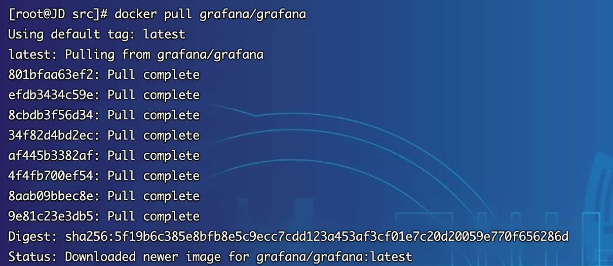
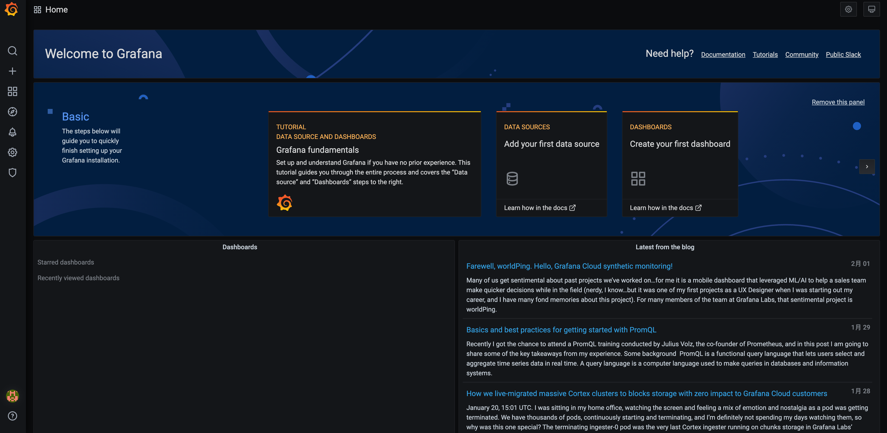

## Docker部署
1.  在Docker部署之前，首先要确保拥有Docker环境，具体安装可以参考文档`6.2.3.3章节`
2.  拉取grafana最新镜像 (更详细说明可以参考官方文档：https://grafana.com/docs/grafana/latest/installation/docker)
~~~shell
[root@JD prometheus]# docker pull grafana/grafana
~~~

3.  启动docker容器并提前创建好挂载目录  
    注意：⚠️ 若二进制章节部署后，需要执行`systemctl stop grafana-server`关闭服务，否则会造成端口冲突，或者docker的端口映射改为`-p 3001:3000`也可
~~~shell
[root@JD src]# mkdir /data/grafana -p
[root@JD src]# chmod 777 /data/grafana
~~~
~~~shell
[root@JD src]# docker run -d -p 3000:3000 --name grafana grafana/grafana
~~~
4. 从容器拷贝配置文件至对应目录
~~~shell
[root@JD src]# docker exec -it grafana cat /etc/grafana/grafana.ini > /data/grafana/grafana.ini
[root@JD src]# cat /data/grafana/grafana.ini
~~~

5. 删除临时docker容器
~~~shell
[root@JD src]# docker stop grafana
grafana
[root@JD src]# docker rm grafana
grafana
~~~

6. 启动正式docker容器
>*   设置服务的默认域名 ：`-e "GF_SERVER_ROOT_URL=https://grafana.bladex.vip"`
>*   设置admin的密码为`admin`：`-e "GF_SECURITY_ADMIN_PASSWORD=admin"`
>*   注意：密码若带特殊符号请加`\`转义
>*   `-v "/data/grafana/grafana.ini:/etc/grafana/grafana.ini"`将宿主机上grafana配置文件挂载至容器中，如果需要修改直接重启即可
>*   `-v "/data/grafana/:/var/lib/grafana"`将容器中的数据存储挂载至宿主机指定路径持久化
~~~shell
docker run --name grafana --restart=always \
-d  -p 3000:3000 \
-e "GF_SERVER_ROOT_URL=https://grafana.bladex.vip" \
-e "GF_SECURITY_ADMIN_PASSWORD=1qaz@WSX" \
-v "/data/grafana/grafana.ini:/etc/grafana/grafana.ini" \
-v "/data/grafana/:/var/lib/grafana" \
grafana/grafana 
~~~
~~~shell
[root@JD src]# docker run --name grafana --restart=always -d  -p 3000:3000 -e "GF_SERVER_ROOT_URL=https://grafana.bladex.vip" -e "GF_SECURITY_ADMIN_PASSWORD=1qaz@WSX" -v "/data/grafana/grafana.ini:/etc/grafana/grafana.ini" -v "/data/grafana/:/var/lib/grafana" grafana/grafana 
~~~

## 访问系统
1. 访问系统 http://服务器ip:3000，注意防火墙或安全组开放端口。

2. 因为已经在启动时指定了密码，所以无需二次修改，可以直接登录成功

