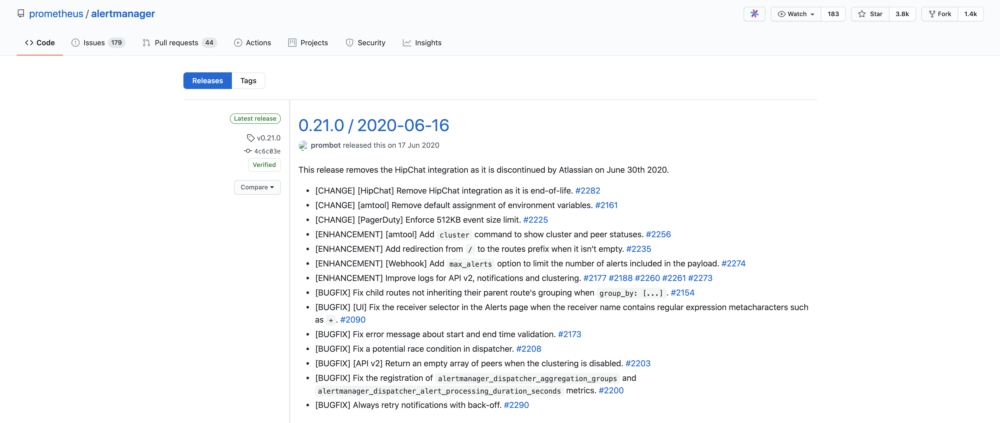
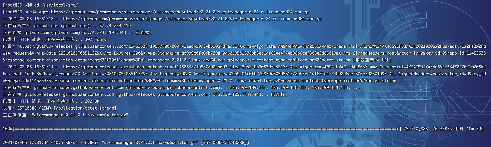
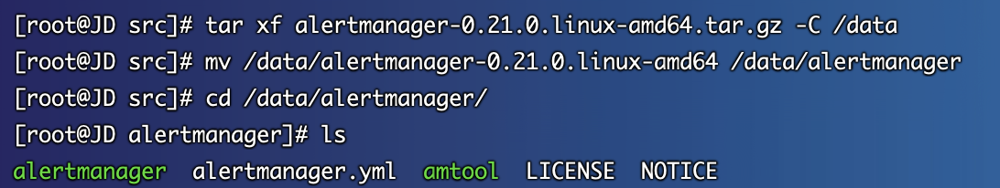
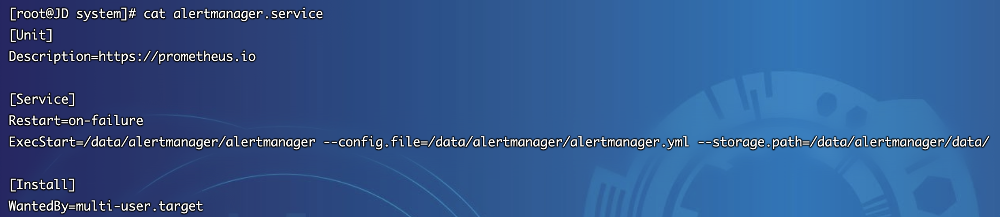
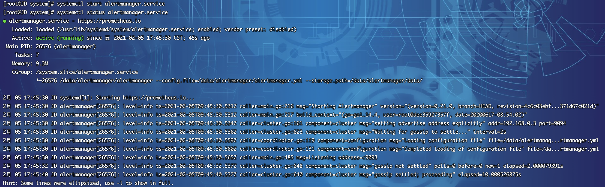
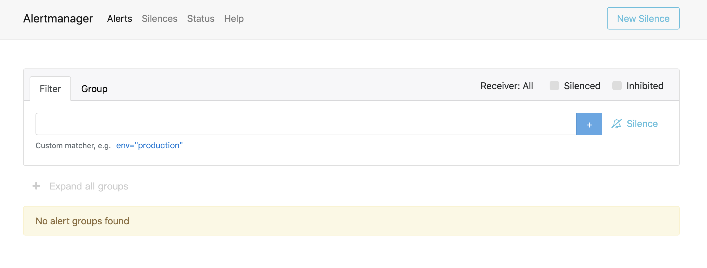

## 二进制部署 
1.  部署前大家可以先前往github发行版地址看一下最新的部署包：https://github.com/prometheus/alertmanager/releases
2.  截至目前最新版本为`0.21.0`，以后若有更新，大家根据版本修改下方的脚本即可

3. 登录Linux服务器（以Centos7.x为例），下载部署包，由于是github，网络会有些慢，大家若等不及可以开发机下载，然后再传至服务器也可。下载包为：`alertmanager-0.21.0.linux-amd64.tar.gz`
~~~shell
[root@JD ~]# cd /usr/local/src/
[root@JD src]# wget https://github.com/prometheus/alertmanager/releases/download/v0.21.0/alertmanager-0.21.0.linux-amd64.tar.gz
~~~

4. 部署包下载完毕，开始安装
~~~shell
[root@JD src]# tar xf alertmanager-0.21.0.linux-amd64.tar.gz -C /data
[root@JD src]# mv /data/alertmanager-0.21.0.linux-amd64 /data/alertmanager
~~~
~~~shell
[root@JD src]# cd /data/alertmanager/
[root@JD alertmanager]# ls
alertmanager  alertmanager.yml  amtool  LICENSE  NOTICE
~~~

5. 进行系统service编写
*   创建`alertmanager.service`配置文件
~~~shell
[root@JD alertmanager]# cd /usr/lib/systemd/system
[root@JD system]# vim alertmanager.service
~~~
*   alertmanager.service 文件填入如下内容后保存`:wq`
~~~shell
[Unit]
Description=https://prometheus.io

[Service]
Restart=on-failure
ExecStart=/data/alertmanager/alertmanager --config.file=/data/alertmanager/alertmanager.yml --storage.path=/data/alertmanager/data/

[Install]
WantedBy=multi-user.target
~~~
*   查看配置文件
~~~shell
[root@JD system]# cat alertmanager.service 
[Unit]
Description=https://prometheus.io

[Service]
Restart=on-failure
ExecStart=/data/alertmanager/alertmanager --config.file=/data/alertmanager/alertmanager.yml --storage.path=/data/alertmanager/data/

[Install]
WantedBy=multi-user.target
~~~

*   刷新服务配置并启动服务
~~~shell
[root@JD system]# systemctl daemon-reload
[root@JD system]# systemctl start alertmanager.service
~~~
* 查看服务运行状态
~~~shell
[root@JD system]# systemctl status alertmanager.service
~~~

*   设置开机自启动
~~~shell
[root@JD system]# systemctl enable alertmanager.service
~~~

## 访问系统
1. 执行`systemctl start alertmanager.service`，访问系统 http://服务器ip:9093，注意防火墙或安全组开放端口

2. 若看到如上界面则说明alertmanager部署成功，后续章节将会讲述如何进行告警配置
