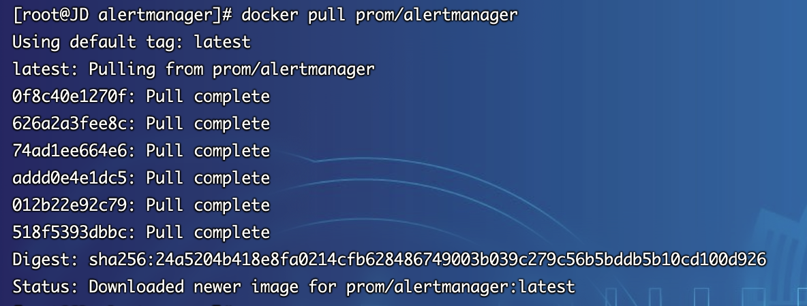
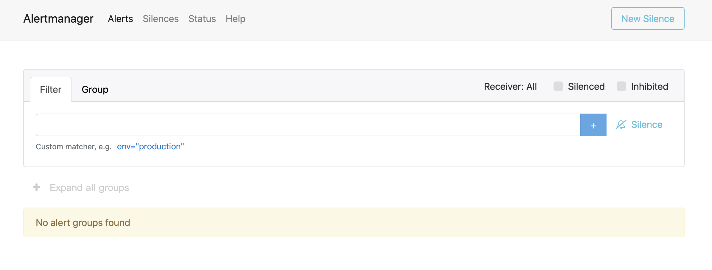

## Docker部署

1.  在Docker部署之前，首先要确保拥有Docker环境，具体安装可以参考文档`6.2.3.3章节`
2.  拉取alertmanager最新镜像
~~~shell
[root@JD alertmanager]# docker pull prom/alertmanager
~~~

3.  启动docker容器并挂载配置文件，配置文件上一章节二进制部署正好有，可以直接使用  
   注意：⚠️ 若二进制章节部署后，需要执行`systemctl stop alertmanager.service`关闭服务，否则会造成端口冲突，或者docker的端口映射改为`-p 9193:9093`也可
~~~shell
[root@JD data]# docker run --name alertmanager -d -p 9093:9093 -v /data/alertmanager/alertmanager.yml:/etc/alertmanager/alertmanager.yml -v /data/alertmanager/data:/etc/alertmanager/data -v /data/alertmanager/templates:/etc/alertmanager/templates prom/alertmanager --config.file=/etc/alertmanager/alertmanager.yml --storage.path=/etc/alertmanager/data
~~~
4. 访问系统 http://服务器ip:9093，注意防火墙或安全组开放端口

5. 若看到如上界面则说明alertmanager部署成功，后续章节将会讲述如何进行告警配置
