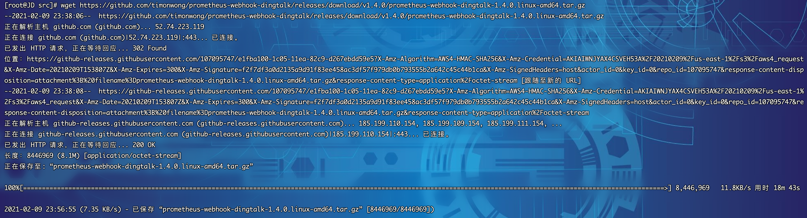
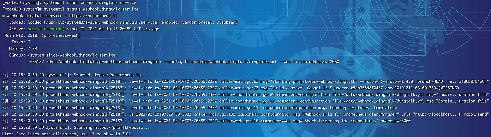
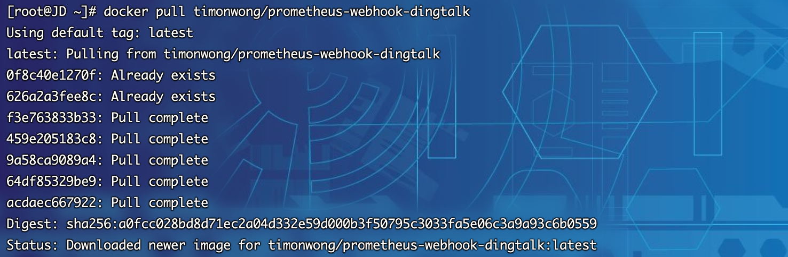
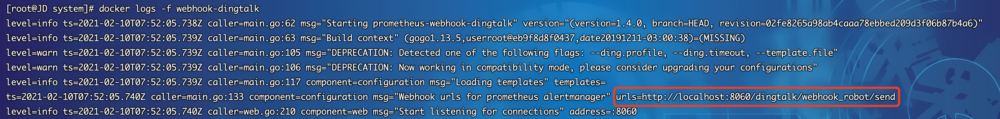
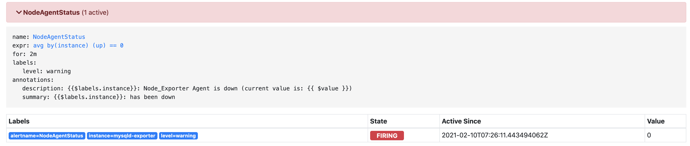
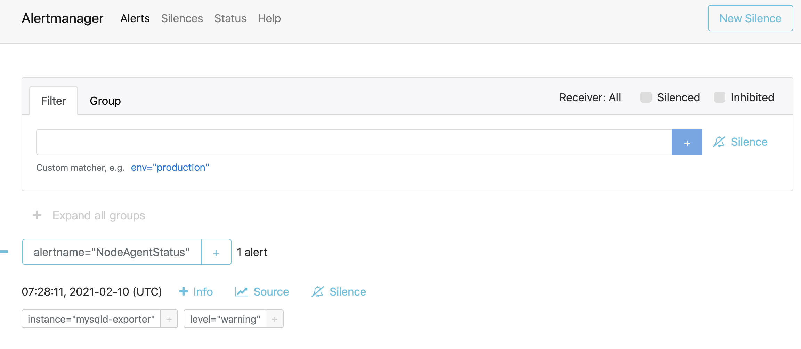
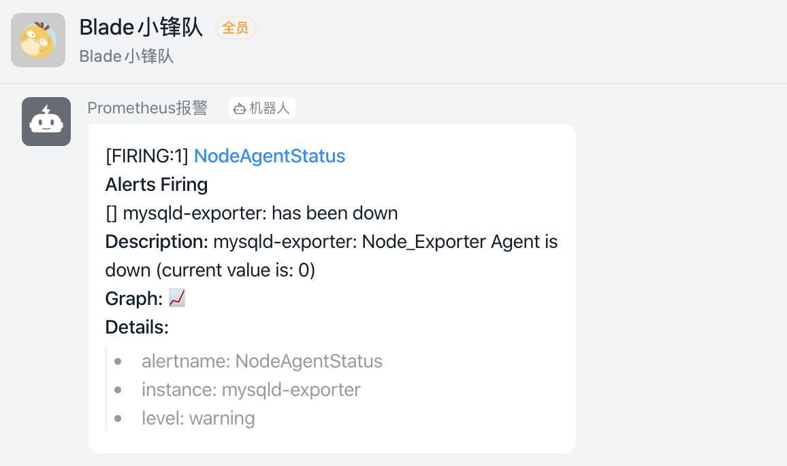
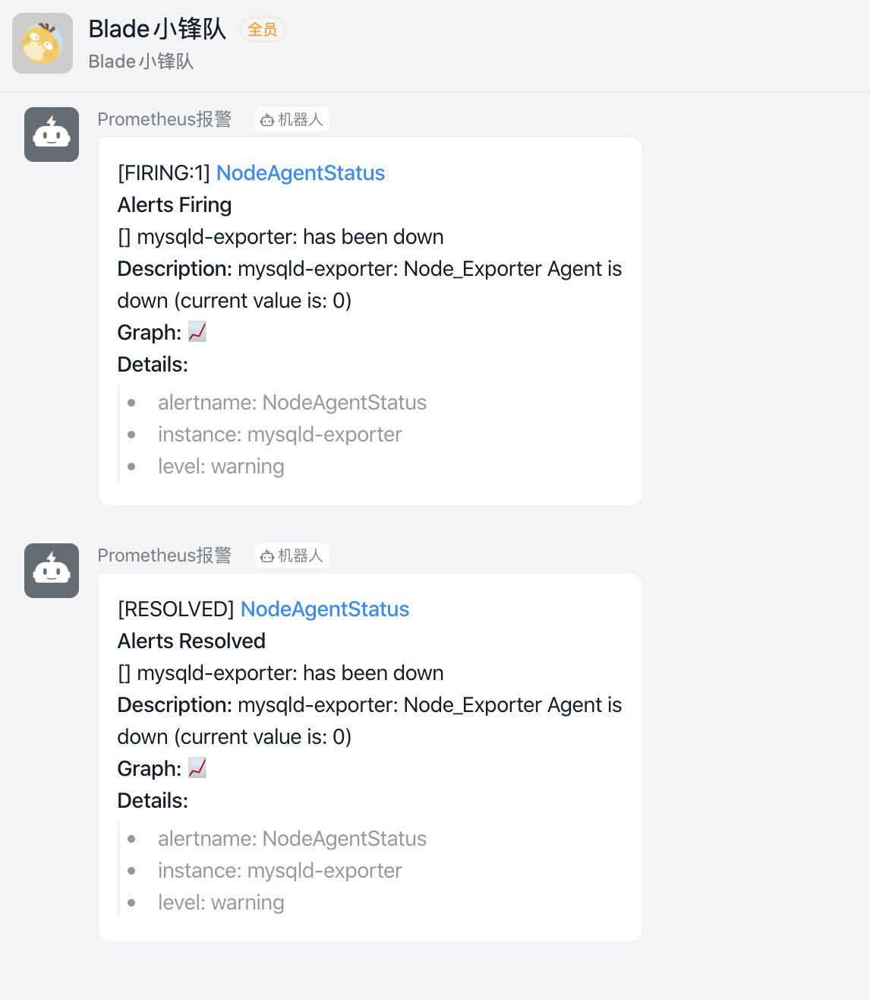
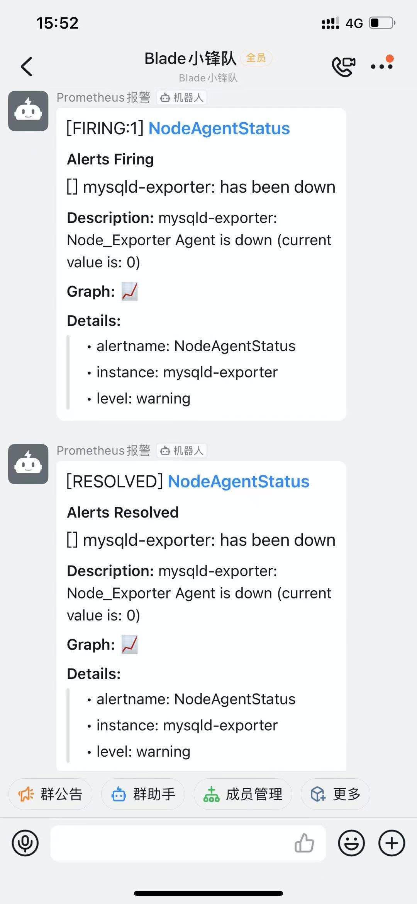

## 配置钉钉机器人

1. 打开钉钉的智能群助手，点击添加机器人

   

2. 选择自定义机器人

   

   

3. 复制webhook地址后点击保存

   

   

   

## 安装钉钉服务

### 二进制安装

1.  部署前大家可以先前往github发行版地址看一下最新的部署包：https://github.com/timonwong/prometheus-webhook-dingtalk/releases
2.  截至目前最新版本为`1.4.0`，以后若有更新，大家根据版本修改下方的脚本即可
3.  登录Linux服务器（以Centos7.x为例），下载部署包，由于是github，网络会有些慢，大家若等不及可以开发机下载，然后再传至服务器也可。下载包为：`prometheus-webhook-dingtalk-1.4.0.linux-amd64.tar.gz`

~~~shell
[root@JD ~]# cd /usr/local/src/
[root@JD src]# wget https://github.com/timonwong/prometheus-webhook-dingtalk/releases/download/v1.4.0/prometheus-webhook-dingtalk-1.4.0.linux-amd64.tar.gz
~~~

4. 部署包下载完毕，开始安装

~~~shell
[root@JD src]# tar xf prometheus-webhook-dingtalk-1.4.0.linux-amd64.tar.gz -C /data
[root@JD src]# mv /data/prometheus-webhook-dingtalk-1.4.0.linux-amd64 /data/webhook_dingtalk
~~~

~~~shell
[root@JD src]# cd /data/webhook_dingtalk
[root@JD webhook_dingtalk]# ls
config.example.yml  contrib  LICENSE  prometheus-webhook-dingtalk
~~~

5. 编写配置文件，将上述获取的钉钉webhook地址填写到如下文件

~~~shell
[root@JD webhook_dingtalk]# vim dingtalk.yml
~~~

~~~shell
timeout: 5s

targets:
  webhook_robot:
  	# 钉钉机器人创建后的webhook地址
    url: https://oapi.dingtalk.com/robot/send?access_token=xxxxxxxxxxxx
  webhook_mention_all:
  	# 钉钉机器人创建后的webhook地址
    url: https://oapi.dingtalk.com/robot/send?access_token=xxxxxxxxxxxx
    # 提醒全员
    mention:
      all: true
~~~

5. 进行系统service编写

*   创建`webhook_dingtalk`配置文件

~~~shell
[root@JD alertmanager]# cd /usr/lib/systemd/system
[root@JD system]# vim webhook_dingtalk.service
~~~

*   webhook_dingtalk.service 文件填入如下内容后保存`:wq`

~~~shell
[Unit]
Description=https://prometheus.io

[Service]
Restart=on-failure
ExecStart=/data/webhook_dingtalk/prometheus-webhook-dingtalk --config.file=/data/webhook_dingtalk/dingtalk.yml --web.listen-address=:8060

[Install]
WantedBy=multi-user.target
~~~

*   查看配置文件

~~~shell
[root@JD system]# cat webhook_dingtalk.service 
[Unit]
Description=https://prometheus.io

[Service]
Restart=on-failure
ExecStart=/data/webhook_dingtalk/prometheus-webhook-dingtalk --config.file=/data/webhook_dingtalk/dingtalk.yml --web.listen-address=:8060

[Install]
WantedBy=multi-user.target
~~~

*   刷新服务配置并启动服务

~~~shell
[root@JD system]# systemctl daemon-reload
[root@JD system]# systemctl start webhook_dingtalk.service
~~~

* 查看服务运行状态

~~~shell
[root@JD system]# systemctl status webhook_dingtalk.service
~~~

* 设置开机自启动

~~~shell
[root@JD system]# systemctl enable webhook_dingtalk.service
Created symlink from /etc/systemd/system/multi-user.target.wants/webhook_dingtalk.service to /usr/lib/systemd/system/webhook_dingtalk.service.
~~~

### Docker安装

1. 在Docker部署之前，首先要确保拥有Docker环境，具体安装可以参考文档`6.2.3.3章节`
2. 拉取prometheus-webhook最新镜像

~~~shell
docker pull timonwong/prometheus-webhook-dingtalk
~~~

3. 启动docker容器并挂载配置文件，配置文件上一小节二进制部署正好有，可以直接使用  

   注意：⚠️ 若二进制章节部署后，需要执行`systemctl stop webhook_dingtalk.service`关闭服务，否则会造成端口冲突，或者docker的端口映射改为`-p 8160:8060`也可。另外下面命令的`xxxxx`需要填写为自己申请钉钉机器人的`access_token`

~~~shell
[root@JD data]# docker run --name webhook-dingtalk -d -p 8060:8060 timonwong/prometheus-webhook-dingtalk --ding.profile="webhook_robot=https://oapi.dingtalk.com/robot/send?access_token=xxxxx"
~~~

4. 查看日志，若自定义api地址生效则说明启动成功

5. 我们记下 `urls=http://localhost:8060/dingtalk/webhook_robot/send` 这一段值，接下来的配置会用上

## 配置Alertmanager

1. 打开 `/data/alertmanager/alertmanager.yaml`，修改为如下内容

   ~~~yaml
   global:
     # 在没有报警的情况下声明为已解决的时间
     resolve_timeout: 5m
   
   route:
     # 接收到告警后到自定义分组
     group_by: ["alertname"]
     # 分组创建后初始化等待时长
     group_wait: 10s
     # 告警信息发送之前的等待时长
     group_interval: 30s
     # 重复报警的间隔时长
     repeat_interval: 5m
     # 默认消息接收
     receiver: "dingtalk"
   
   receivers:
     # 钉钉
     - name: 'dingtalk'
       webhook_configs:
       	# prometheus-webhook-dingtalk服务的地址
         - url: http://1xx.xx.xx.7:8060/dingtalk/webhook_robot/send
           send_resolved: true
   ~~~

2. 在prometheus文件夹根目录增加`alert_rules.yaml`配置文件，内容如下

   ~~~yaml
   groups:
     - name: alert_rules
       rules:
         - alert: CpuUsageAlertWarning
           expr: sum(avg(irate(node_cpu_seconds_total{mode!='idle'}[5m])) without (cpu)) by (instance) > 0.60
           for: 2m
           labels:
             level: warning
           annotations:
             summary: "Instance {{ $labels.instance }} CPU usage high"
             description: "{{ $labels.instance }} CPU usage above 60% (current value: {{ $value }})"
         - alert: CpuUsageAlertSerious
           #expr: sum(avg(irate(node_cpu_seconds_total{mode!='idle'}[5m])) without (cpu)) by (instance) > 0.85
           expr: (100 - (avg by (instance) (irate(node_cpu_seconds_total{job=~".*",mode="idle"}[5m])) * 100)) > 85
           for: 3m
           labels:
             level: serious
           annotations:
             summary: "Instance {{ $labels.instance }} CPU usage high"
             description: "{{ $labels.instance }} CPU usage above 85% (current value: {{ $value }})"
         - alert: MemUsageAlertWarning
           expr: avg by(instance) ((1 - (node_memory_MemFree_bytes + node_memory_Buffers_bytes + node_memory_Cached_bytes) / node_memory_MemTotal_bytes) * 100) > 70
           for: 2m
           labels:
             level: warning
           annotations:
             summary: "Instance {{ $labels.instance }} MEM usage high"
             description: "{{$labels.instance}}: MEM usage is above 70% (current value is: {{ $value }})"
         - alert: MemUsageAlertSerious
           expr: (node_memory_MemTotal_bytes - node_memory_MemAvailable_bytes)/node_memory_MemTotal_bytes > 0.90
           for: 3m
           labels:
             level: serious
           annotations:
             summary: "Instance {{ $labels.instance }} MEM usage high"
             description: "{{ $labels.instance }} MEM usage above 90% (current value: {{ $value }})"
         - alert: DiskUsageAlertWarning
           expr: (1 - node_filesystem_free_bytes{fstype!="rootfs",mountpoint!="",mountpoint!~"/(run|var|sys|dev).*"} / node_filesystem_size_bytes) * 100 > 80
           for: 2m
           labels:
             level: warning
           annotations:
             summary: "Instance {{ $labels.instance }} Disk usage high"
             description: "{{$labels.instance}}: Disk usage is above 80% (current value is: {{ $value }})"
         - alert: DiskUsageAlertSerious
           expr: (1 - node_filesystem_free_bytes{fstype!="rootfs",mountpoint!="",mountpoint!~"/(run|var|sys|dev).*"} / node_filesystem_size_bytes) * 100 > 90
           for: 3m
           labels:
             level: serious
           annotations:
             summary: "Instance {{ $labels.instance }} Disk usage high"
             description: "{{$labels.instance}}: Disk usage is above 90% (current value is: {{ $value }})"
         - alert: NodeFileDescriptorUsage
           expr: avg by (instance) (node_filefd_allocated{} / node_filefd_maximum{}) * 100 > 60
           for: 2m
           labels:
             level: warning
           annotations:
             summary: "Instance {{ $labels.instance }} File Descriptor usage high"
             description: "{{$labels.instance}}: File Descriptor usage is above 60% (current value is: {{ $value }})"
         - alert: NodeLoad15
           expr: avg by (instance) (node_load15{}) > 80
           for: 2m
           labels:
             level: warning
           annotations:
             summary: "Instance {{ $labels.instance }} Load15 usage high"
             description: "{{$labels.instance}}: Load15 is above 80 (current value is: {{ $value }})"
         - alert: NodeAgentStatus
           expr: avg by (instance) (up{}) == 0
           for: 2m
           labels:
             level: warning
           annotations:
             summary: "{{$labels.instance}}: has been down"
             description: "{{$labels.instance}}: Node_Exporter Agent is down (current value is: {{ $value }})"
         - alert: NodeProcsBlocked
           expr: avg by (instance) (node_procs_blocked{}) > 10
           for: 2m
           labels:
             level: warning
           annotations:
             summary: "Instance {{ $labels.instance }}  Process Blocked usage high"
             description: "{{$labels.instance}}: Node Blocked Procs detected! above 10 (current value is: {{ $value }})"
         - alert: NetworkTransmitRate
           #expr:  avg by (instance) (floor(irate(node_network_transmit_bytes_total{device="ens192"}[2m]) / 1024 / 1024)) > 50
           expr:  avg by (instance) (floor(irate(node_network_transmit_bytes_total{}[2m]) / 1024 / 1024 * 8 )) > 40
           for: 1m
           labels:
             level: warning
           annotations:
             summary: "Instance {{ $labels.instance }} Network Transmit Rate usage high"
             description: "{{$labels.instance}}: Node Transmit Rate (Upload) is above 40Mbps/s (current value is: {{ $value }}Mbps/s)"
         - alert: NetworkReceiveRate
           #expr:  avg by (instance) (floor(irate(node_network_receive_bytes_total{device="ens192"}[2m]) / 1024 / 1024)) > 50
           expr:  avg by (instance) (floor(irate(node_network_receive_bytes_total{}[2m]) / 1024 / 1024 * 8 )) > 40
           for: 1m
           labels:
             level: warning
           annotations:
             summary: "Instance {{ $labels.instance }} Network Receive Rate usage high"
             description: "{{$labels.instance}}: Node Receive Rate (Download) is above 40Mbps/s (current value is: {{ $value }}Mbps/s)"
         - alert: DiskReadRate
           expr: avg by (instance) (floor(irate(node_disk_read_bytes_total{}[2m]) / 1024 )) > 200
           for: 2m
           labels:
             level: warning
           annotations:
             summary: "Instance {{ $labels.instance }} Disk Read Rate usage high"
             description: "{{$labels.instance}}: Node Disk Read Rate is above 200KB/s (current value is: {{ $value }}KB/s)"
         - alert: DiskWriteRate
           expr: avg by (instance) (floor(irate(node_disk_written_bytes_total{}[2m]) / 1024 / 1024 )) > 20
           for: 2m
           labels:
             level: warning
           annotations:
             summary: "Instance {{ $labels.instance }} Disk Write Rate usage high"
             description: "{{$labels.instance}}: Node Disk Write Rate is above 20MB/s (current value is: {{ $value }}MB/s)"
   ~~~

3. 修改`prometheys.yaml`,最上方三个节点改为如下配置

   **注意⚠️：若prometheus为docker部署的服务，则需要关闭后重新启动，同时使用 -v 挂载目录才会读取到rules文件**

   ~~~yaml
   global:
     scrape_interval:     15s 
     evaluation_interval: 15s 
   
   alerting:
     alertmanagers:
     - static_configs:
       # alertmanager服务地址
       - targets: ['11x.xx.x.7:9093']
   
   rule_files:
     - "alert_rules.yml"
   ~~~

4. 执行`curl -XPOST localhost:9090/-/reload`刷新prometheus配置

5. 执行`systemctl restart alertmanger.service`或`docker restart alertmanager`刷新alertmanger服务

## 验证配置

1. 打开prometheus服务，可以看到alerts栏出现了很多规则

   

2. 此时我们手动关闭一个节点

   ~~~shell
   [root@JD ~]# docker stop  mysqld-exporter
   ~~~

3. 刷新prometheus，可以看到有一个节点颜色改变，进入了pending状态

   

4. 稍等片刻，alertmanager.yaml 配置为等待5m，颜色变为红色，进入了firing状态

   

5. 查看alertmanager服务，也出现了相关告警节点

   

6. 此时如果配置无误，会收到钉钉机器人的一条信息

   

7. 这时我们重启mysqld-exporter服务

   ~~~shell
   [root@JD ~]# docker start mysqld-exporter
   ~~~

8. 过了配置的等待时长，若服务没有在期间断开，钉钉机器人会发送一条恢复状态的信息

   

9. 手机端效果如下

   

## 后记

* 钉钉告警配置相对复杂，需要单独启动一个服务并配置，配置较多容易出错，稍有门槛
* 钉钉告警仅为参考，企业微信告警才是我们推荐的方案，下一节我们来看一下企业微信的具体配置