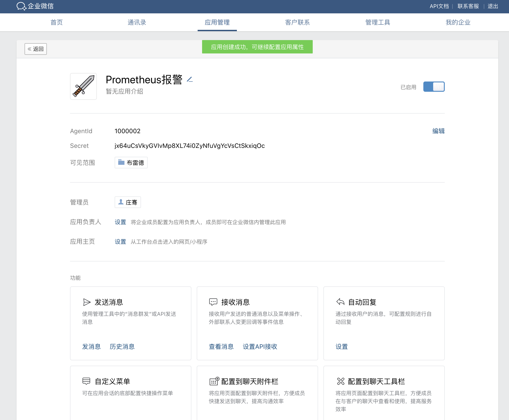
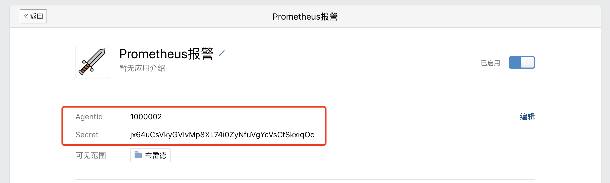
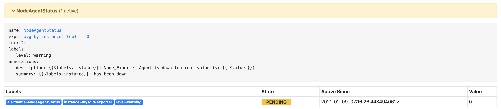
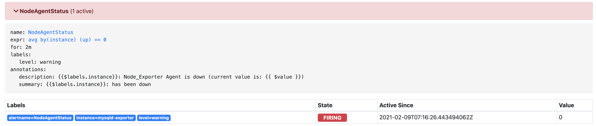
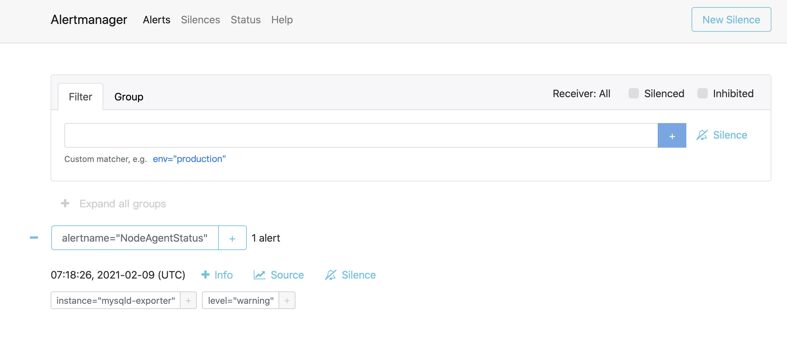
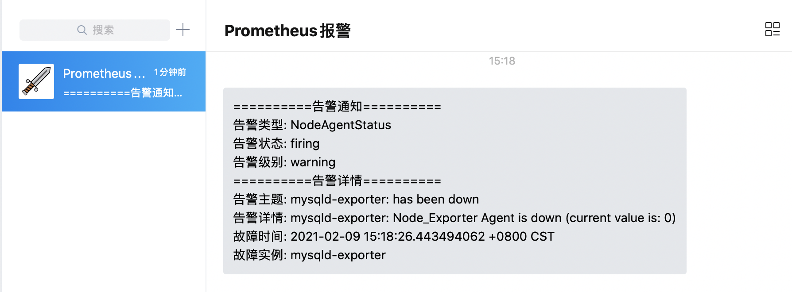
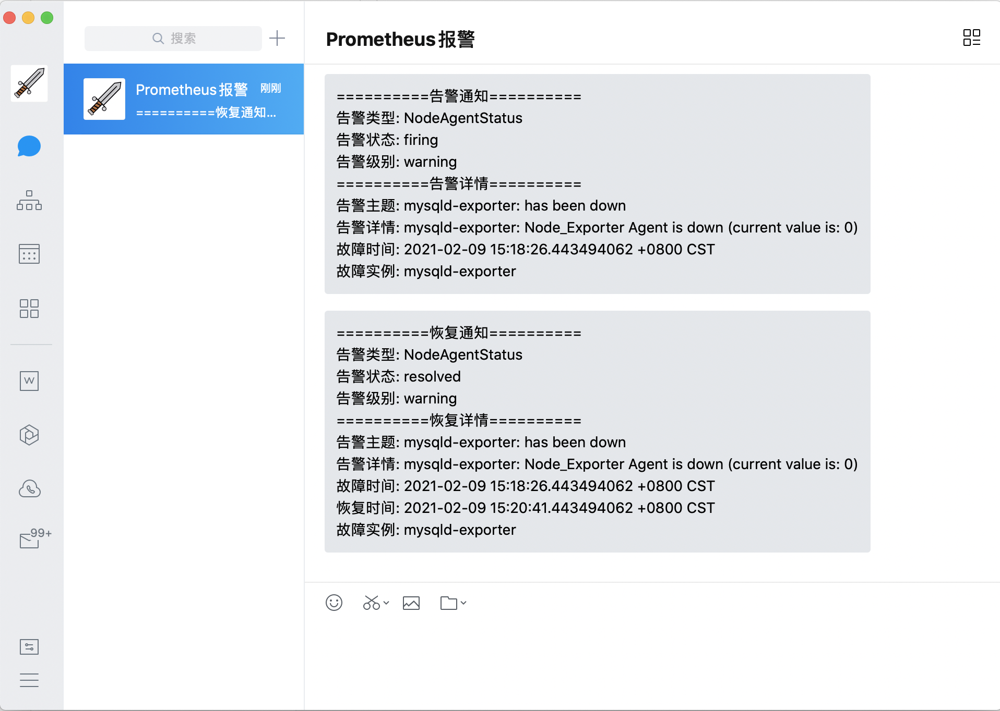
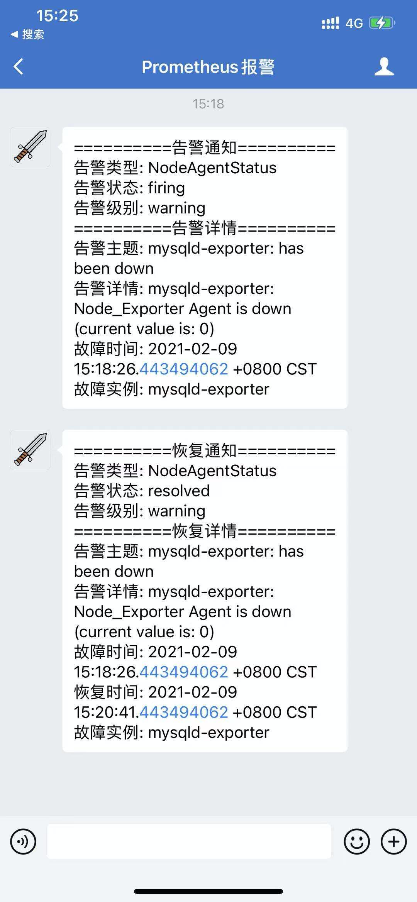

## 配置企业微信

1. 先前往官网注册企业微信，跟着流程来就可以，这里不再赘述：https://work.weixin.qq.com
2. 创建应用

3. 拷贝`AgentId`与`Secret`

4. 拷贝管理人员帐号

5. 拷贝企业ID

## 配置Alertmanager

1. 打开 `/data/alertmanager/alertmanager.yaml`，修改为如下内容

   **注意⚠️：若是docker启动alertmanager，需要对templates目录进行 -v 挂载**

   **同时将`/data/alertmanager/templates/wechat.tmpl`修改为docker内部的`/etc/alertmanager/templates/wechat.tmpl`**

   ~~~yaml
   global:
     # 在没有报警的情况下声明为已解决的时间
     resolve_timeout: 5m
   
   templates:
     # 告警模板文件
     - "/data/alertmanager/templates/wechat.tmpl"
   
   route:
     # 接收到告警后到自定义分组
     group_by: ["alertname"]
     # 分组创建后初始化等待时长
     group_wait: 10s
     # 告警信息发送之前的等待时长
     group_interval: 30s
     # 重复报警的间隔时长
     repeat_interval: 5m
     # 默认消息接收
     receiver: "wechat"
   
   receivers:
     # 微信
     - name: "wechat"
       wechat_configs:
         # 是否发送恢复信息
         - send_resolved: true
           # 填写应用 AgentId
           agent_id: "1000002"
           # 填写应用 Secret
           api_secret: "jxxxxxxxxxxxxxxxxxxxc"
           # 填写企业 ID
           corp_id: "wwxxxxxxxxxxx01d"
           # 填写接收消息的群体，可以写@all，也可以写具体帐号名
           to_user: "@all"
   ~~~

2. 在`/data/alertmanager/templates`目录下创建`wechat.tmpl`，内容如下

   ~~~shell
   {{ define "wechat.default.message" }}
   {{- if gt (len .Alerts.Firing) 0 -}}
   {{- range $index, $alert := .Alerts -}}
   {{- if eq $index 0 -}}
   ==========告警通知==========
   告警类型: {{ $alert.Labels.alertname }}
   告警状态: {{ $alert.Status }}
   告警级别: {{ $alert.Labels.level }}
   {{- end }}
   ==========告警详情==========
   告警主题: {{ $alert.Annotations.summary }}
   告警详情: {{ $alert.Annotations.description }}
   故障时间: {{ $alert.StartsAt.Local }}
   {{ if gt (len $alert.Labels.instance) 0 -}}故障实例: {{ $alert.Labels.instance }}{{- end -}}
   {{- end }}
   {{- end }}
   
   {{- if gt (len .Alerts.Resolved) 0 -}}
   {{- range $index, $alert := .Alerts -}}
   {{- if eq $index 0 -}}
   ==========恢复通知==========
   告警类型: {{ $alert.Labels.alertname }}
   告警状态: {{ $alert.Status }}
   告警级别: {{ $alert.Labels.level }}
   {{- end }}
   ==========恢复详情==========
   告警主题: {{ $alert.Annotations.summary }}
   告警详情: {{ $alert.Annotations.description }}
   故障时间: {{ $alert.StartsAt.Local }}
   恢复时间: {{ $alert.EndsAt.Local }}
   {{ if gt (len $alert.Labels.instance) 0 -}}故障实例: {{ $alert.Labels.instance }}{{- end -}}
   {{- end }}
   {{- end }}
   {{- end }}
   ~~~

3. 在prometheus文件夹根目录增加`alert_rules.yaml`配置文件，内容如下

   ~~~yaml
   groups:
     - name: alert_rules
       rules:
         - alert: CpuUsageAlertWarning
           expr: sum(avg(irate(node_cpu_seconds_total{mode!='idle'}[5m])) without (cpu)) by (instance) > 0.60
           for: 2m
           labels:
             level: warning
           annotations:
             summary: "Instance {{ $labels.instance }} CPU usage high"
             description: "{{ $labels.instance }} CPU usage above 60% (current value: {{ $value }})"
         - alert: CpuUsageAlertSerious
           #expr: sum(avg(irate(node_cpu_seconds_total{mode!='idle'}[5m])) without (cpu)) by (instance) > 0.85
           expr: (100 - (avg by (instance) (irate(node_cpu_seconds_total{job=~".*",mode="idle"}[5m])) * 100)) > 85
           for: 3m
           labels:
             level: serious
           annotations:
             summary: "Instance {{ $labels.instance }} CPU usage high"
             description: "{{ $labels.instance }} CPU usage above 85% (current value: {{ $value }})"
         - alert: MemUsageAlertWarning
           expr: avg by(instance) ((1 - (node_memory_MemFree_bytes + node_memory_Buffers_bytes + node_memory_Cached_bytes) / node_memory_MemTotal_bytes) * 100) > 70
           for: 2m
           labels:
             level: warning
           annotations:
             summary: "Instance {{ $labels.instance }} MEM usage high"
             description: "{{$labels.instance}}: MEM usage is above 70% (current value is: {{ $value }})"
         - alert: MemUsageAlertSerious
           expr: (node_memory_MemTotal_bytes - node_memory_MemAvailable_bytes)/node_memory_MemTotal_bytes > 0.90
           for: 3m
           labels:
             level: serious
           annotations:
             summary: "Instance {{ $labels.instance }} MEM usage high"
             description: "{{ $labels.instance }} MEM usage above 90% (current value: {{ $value }})"
         - alert: DiskUsageAlertWarning
           expr: (1 - node_filesystem_free_bytes{fstype!="rootfs",mountpoint!="",mountpoint!~"/(run|var|sys|dev).*"} / node_filesystem_size_bytes) * 100 > 80
           for: 2m
           labels:
             level: warning
           annotations:
             summary: "Instance {{ $labels.instance }} Disk usage high"
             description: "{{$labels.instance}}: Disk usage is above 80% (current value is: {{ $value }})"
         - alert: DiskUsageAlertSerious
           expr: (1 - node_filesystem_free_bytes{fstype!="rootfs",mountpoint!="",mountpoint!~"/(run|var|sys|dev).*"} / node_filesystem_size_bytes) * 100 > 90
           for: 3m
           labels:
             level: serious
           annotations:
             summary: "Instance {{ $labels.instance }} Disk usage high"
             description: "{{$labels.instance}}: Disk usage is above 90% (current value is: {{ $value }})"
         - alert: NodeFileDescriptorUsage
           expr: avg by (instance) (node_filefd_allocated{} / node_filefd_maximum{}) * 100 > 60
           for: 2m
           labels:
             level: warning
           annotations:
             summary: "Instance {{ $labels.instance }} File Descriptor usage high"
             description: "{{$labels.instance}}: File Descriptor usage is above 60% (current value is: {{ $value }})"
         - alert: NodeLoad15
           expr: avg by (instance) (node_load15{}) > 80
           for: 2m
           labels:
             level: warning
           annotations:
             summary: "Instance {{ $labels.instance }} Load15 usage high"
             description: "{{$labels.instance}}: Load15 is above 80 (current value is: {{ $value }})"
         - alert: NodeAgentStatus
           expr: avg by (instance) (up{}) == 0
           for: 2m
           labels:
             level: warning
           annotations:
             summary: "{{$labels.instance}}: has been down"
             description: "{{$labels.instance}}: Node_Exporter Agent is down (current value is: {{ $value }})"
         - alert: NodeProcsBlocked
           expr: avg by (instance) (node_procs_blocked{}) > 10
           for: 2m
           labels:
             level: warning
           annotations:
             summary: "Instance {{ $labels.instance }}  Process Blocked usage high"
             description: "{{$labels.instance}}: Node Blocked Procs detected! above 10 (current value is: {{ $value }})"
         - alert: NetworkTransmitRate
           #expr:  avg by (instance) (floor(irate(node_network_transmit_bytes_total{device="ens192"}[2m]) / 1024 / 1024)) > 50
           expr:  avg by (instance) (floor(irate(node_network_transmit_bytes_total{}[2m]) / 1024 / 1024 * 8 )) > 40
           for: 1m
           labels:
             level: warning
           annotations:
             summary: "Instance {{ $labels.instance }} Network Transmit Rate usage high"
             description: "{{$labels.instance}}: Node Transmit Rate (Upload) is above 40Mbps/s (current value is: {{ $value }}Mbps/s)"
         - alert: NetworkReceiveRate
           #expr:  avg by (instance) (floor(irate(node_network_receive_bytes_total{device="ens192"}[2m]) / 1024 / 1024)) > 50
           expr:  avg by (instance) (floor(irate(node_network_receive_bytes_total{}[2m]) / 1024 / 1024 * 8 )) > 40
           for: 1m
           labels:
             level: warning
           annotations:
             summary: "Instance {{ $labels.instance }} Network Receive Rate usage high"
             description: "{{$labels.instance}}: Node Receive Rate (Download) is above 40Mbps/s (current value is: {{ $value }}Mbps/s)"
         - alert: DiskReadRate
           expr: avg by (instance) (floor(irate(node_disk_read_bytes_total{}[2m]) / 1024 )) > 200
           for: 2m
           labels:
             level: warning
           annotations:
             summary: "Instance {{ $labels.instance }} Disk Read Rate usage high"
             description: "{{$labels.instance}}: Node Disk Read Rate is above 200KB/s (current value is: {{ $value }}KB/s)"
         - alert: DiskWriteRate
           expr: avg by (instance) (floor(irate(node_disk_written_bytes_total{}[2m]) / 1024 / 1024 )) > 20
           for: 2m
           labels:
             level: warning
           annotations:
             summary: "Instance {{ $labels.instance }} Disk Write Rate usage high"
             description: "{{$labels.instance}}: Node Disk Write Rate is above 20MB/s (current value is: {{ $value }}MB/s)"
   
   ~~~

4. 修改`prometheys.yaml`,最上方三个节点改为如下配置

   **注意⚠️：若prometheus为docker部署的服务，则需要关闭后重新启动，同时使用 -v 挂载目录才会读取到rules文件**

   ~~~yaml
   global:
     scrape_interval:     15s 
     evaluation_interval: 15s 
   
   alerting:
     alertmanagers:
     - static_configs:
       # alertmanager服务地址
       - targets: ['11x.xx.x.7:9093']
   
   rule_files:
     - "alert_rules.yml"
   ~~~

5. 执行`curl -XPOST localhost:9090/-/reload`刷新prometheus配置

6. 执行`systemctl restart alertmanger.service`或`docker restart alertmanager`刷新alertmanger服务

## 验证配置

1. 打开prometheus服务，可以看到alerts栏出现了很多规则

   

2. 此时我们手动关闭一个节点

   ~~~shell
   [root@JD ~]# docker stop mysqld-exporter
   ~~~

3. 刷新prometheus，可以看到有一个节点颜色改变，进入了pending状态

   

4. 稍等片刻，alertmanager.yaml 配置为等待5m，颜色变为红色，进入了firing状态

   

5. 查看alertmanager服务，也出现了相关告警节点

   

6. 此时如果配置无误，会收到企业微信的一条信息

   

7. 这时我们重启mysqld-exporter服务

   ~~~shell
   [root@JD ~]# docker start mysqld-exporter
   ~~~

8. 过了配置的等待时长，若服务没有在期间断开，企业微信会收到一条恢复状态的信息

   

9. 手机端效果如下

   

## 后记

* 至此微信告警配置完成，我们就可以通过手机app实时接收alertmanager发送的告警信息了
* 本章节为配置基础入门，其实还有非常多的进阶配置等待大家挖掘
* prometheus体系知识非常庞大，希望大家有时间可以好好研究一下，相信大家都可以搭建出符合自己项目特色的监控系统