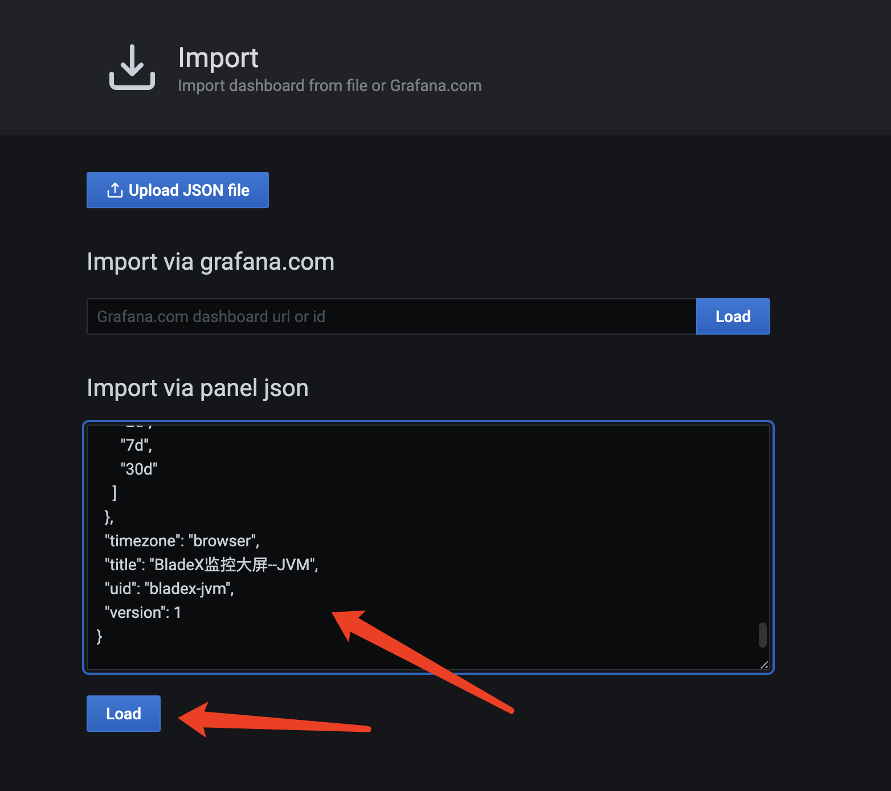

## Jar模式对接
1. 对于一些相对简单的项目，大家会采用Jar的模式直接部署
2. 执行`mvn clean package`，前往`BladeX`根目录的`target`文件夹获取部署包集合

3. 选择部分Jar，上传至服务器并启动。如何启动本章不再赘述，相信大家能很轻松地实现。
4. 由于微服务使用jar部署，大多数情况大家不会选择再用docker部署prometheus和grafana。相关二进制部署，请参考`6.3.1`与`6.3.3`章节。
4. 从scripts文件夹找到prometheus.yml配置文件，拷贝红框内的配置到服务器
**注意⚠️：其中server节点填写的是blade-admin服务的ip和端口，需要一定注意的是，这个服务地址必须能够被prometheus本身调用，若无法调用，则不会显示在targets页面。**
~~~yaml
 #监控 bladex
- job_name: "bladex"
  metrics_path: "/actuator/prometheus"
  scrape_interval: 5s
  consul_sd_configs:
    #必须保证prometheus能调用否则不会显示
    #若是docker部署必须保证网络与各服务调通
    - server: '172.30.0.72:7002' #填写实现consul-api的blade-admin服务ip:端口
      #匹配所有service
      services: []
  relabel_configs:
    #service 源标签
    - source_labels: [__meta_consul_service]
      #匹配 "blade" 开头的service
      regex: "blade*"
      #执行的动作
      action: drop
      #将service的label重写为application
    - source_labels: [__meta_consul_service]
      target_label: application
    - source_labels: [__meta_consul_service_address]
      target_label: instance
    - source_labels: [__meta_consul_tags]
      target_label:  job
~~~

5. 刷新prometheus配置
~~~shell
[root@JD system]# curl -XPOST 11x.xx.xx.7:9090/-/reload
~~~
6. 访问prometheus的targets页面

## 数据对接grafana展示
1. 访问grafana，配置好prometheus数据源

2. 从scripts文件夹找到`bladex-jvm.json`文件，拷贝内容导入到grafana

3. 点击左上角查看服务名，可以看到我们部署的服务，通过切换就可以监控不同微服务的jvm

