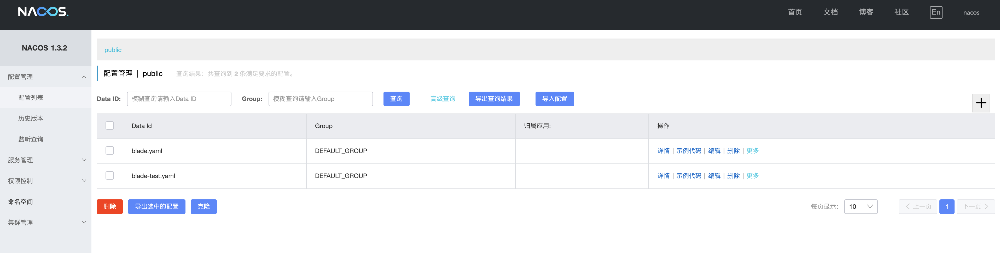
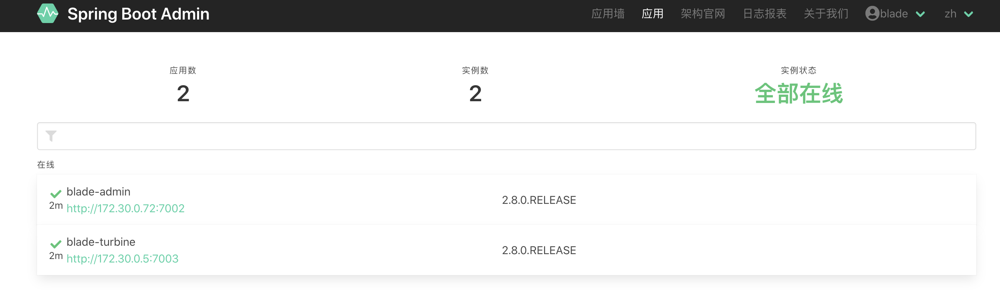
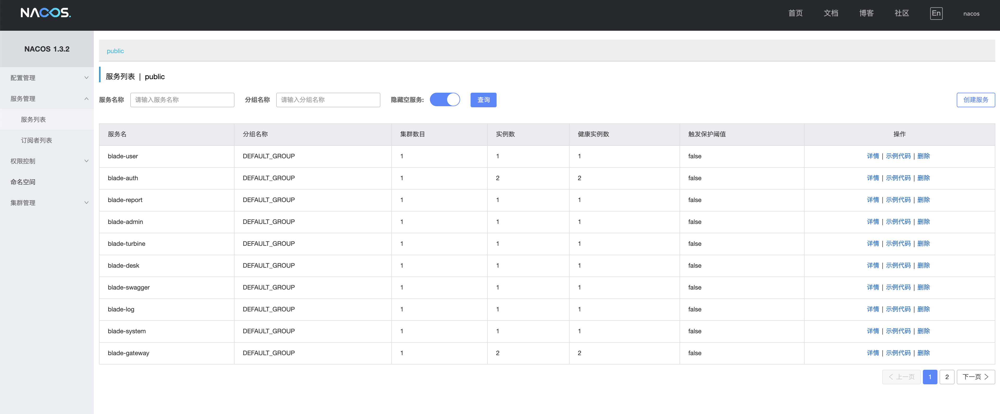
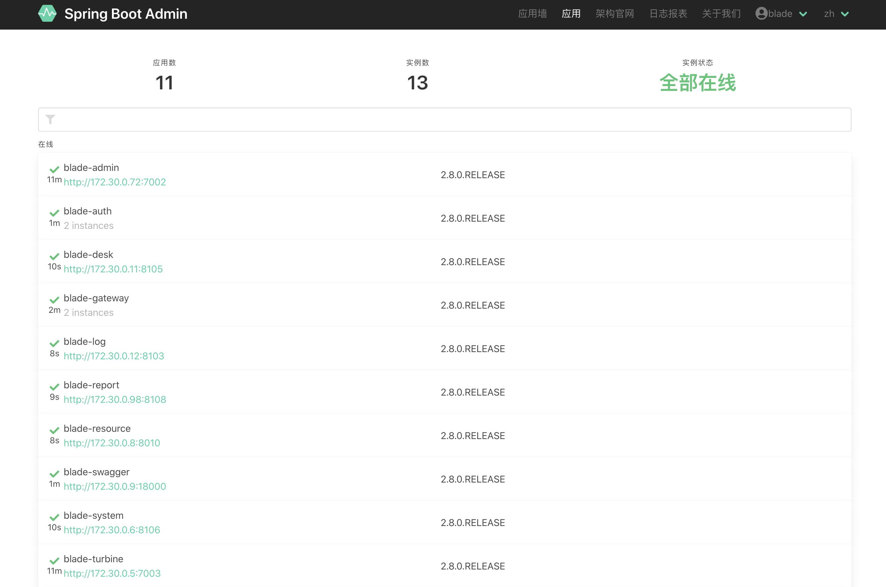
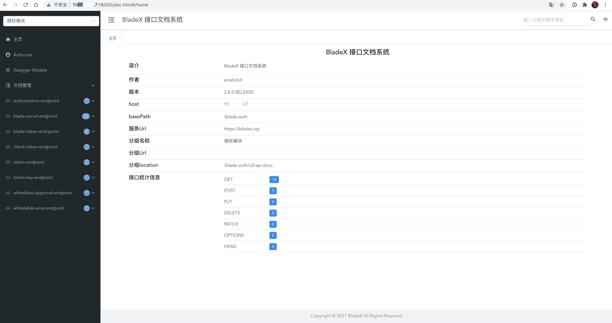
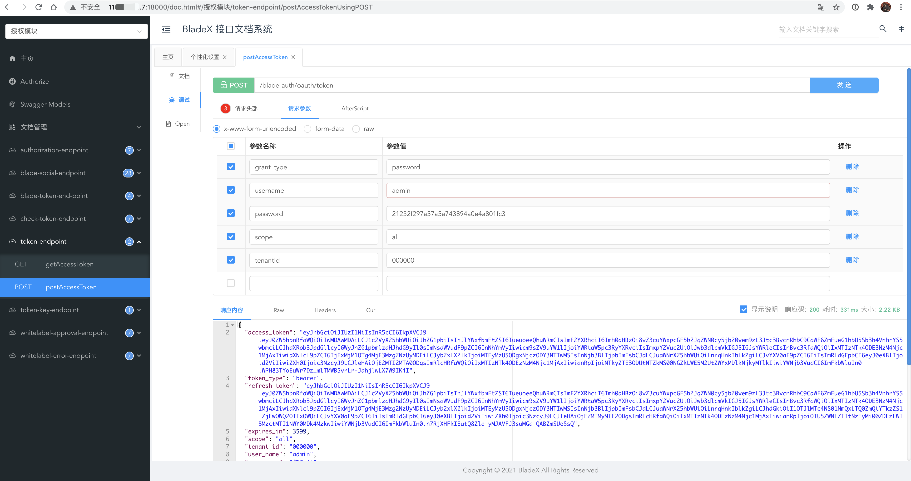
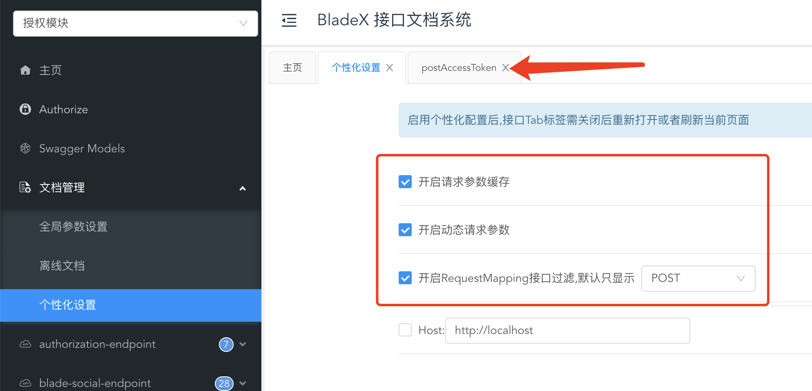
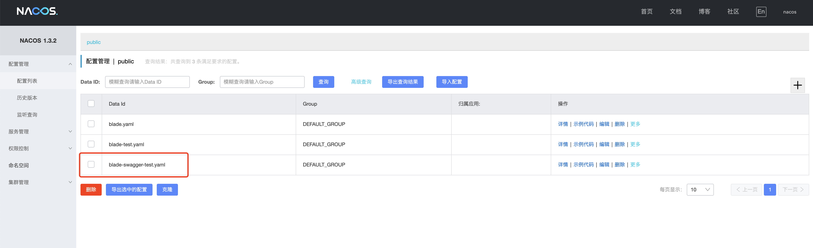
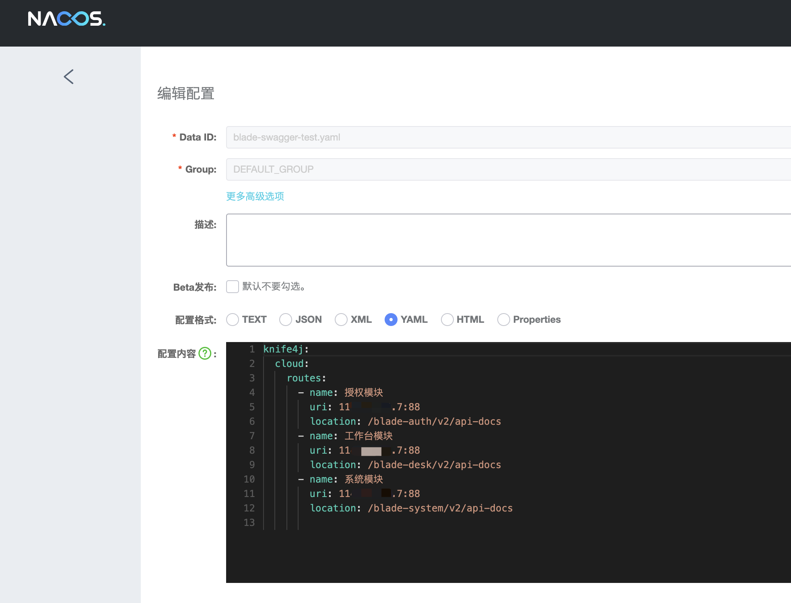
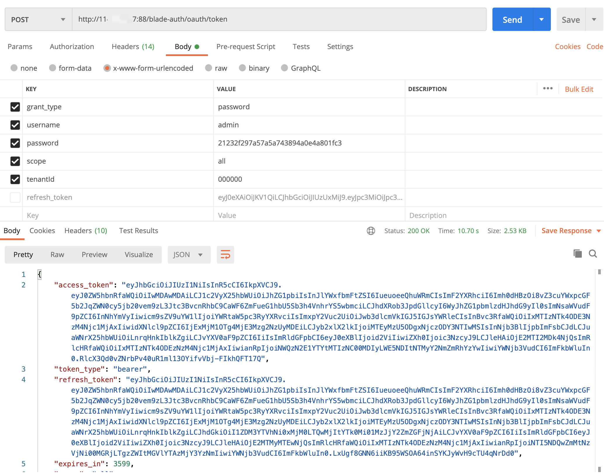

## 后端系统部署
1. 开启端口并挂载配置文件，配置文件默认被挂载至宿主机的 `/docker` 目录下，如需自定义则修改deploy.sh的mount方法便可
~~~shell
[root@JD app]# ./deploy.sh port
[root@JD app]# ./deploy.sh mount
~~~
2. 执行base服务安装
~~~shell
[root@JD app]# ./deploy.sh base
~~~
~~~shell
Creating network "app_blade_net" with driver "bridge"
Pulling sentinel (bladex/sentinel-dashboard:1.8.0)...
1.8.0: Pulling from bladex/sentinel-dashboard
169185f82c45: Already exists
4346af5b5a4f: Pull complete
071ce1b99999: Pull complete
feb8a653dea6: Pull complete
Digest: sha256:feaae3ddd2c68c4b36164b2b7d7de553198390a9710b9de99737bb238be18ad8
Status: Downloaded newer image for bladex/sentinel-dashboard:1.8.0
Pulling seata-server (seataio/seata-server:1.4.1)...
1.4.1: Pulling from seataio/seata-server
e7c96db7181b: Pull complete
f910a506b6cb: Pull complete
b6abafe80f63: Pull complete
b4664656b0bb: Pull complete
faea7c07e119: Pull complete
005f0d715b5e: Pull complete
51c7d5252d45: Pull complete
Digest: sha256:77abcdb2e814f2e9f5b576f13cd729eba9d5b61fb0e85db384756aeb69d97794
Status: Downloaded newer image for seataio/seata-server:1.4.1
Pulling blade-nginx (nginx:stable-alpine-perl)...
stable-alpine-perl: Pulling from library/nginx
0a6724ff3fcd: Pull complete
c789c7b72770: Pull complete
5f28d3d7e606: Pull complete
74bdfc2a110e: Pull complete
72e20a6e5d0a: Pull complete
Digest: sha256:08105e46bc51abf63e9374ac362211733ec5eb19f42288d80427bb144f1918b8
Status: Downloaded newer image for nginx:stable-alpine-perl
Pulling blade-redis (redis:5.0.8-alpine)...
5.0.8-alpine: Pulling from library/redis
aad63a933944: Pull complete
541cb024bf66: Pull complete
270420c343f3: Pull complete
8dd6c66eb1b0: Pull complete
782d2f0df1b3: Pull complete
b0648f46f4c9: Pull complete
Digest: sha256:511275ddf4c4582e296f6fca803df853a8ab2b733a704c44c498f0a6a90e5ba0
Status: Downloaded newer image for redis:5.0.8-alpine
Creating app_nacos_1        ... done
Creating app_sentinel_1     ... done
Creating app_seata-server_1 ... done
Creating app_blade-nginx_1  ... done
Creating app_web-nginx_1    ... done
Creating app_blade-redis_1  ... done
[root@JD app]# docker ps
CONTAINER ID        IMAGE                                                  COMMAND                  CREATED             STATUS              PORTS                               NAMES
b538c9d68b0c        seataio/seata-server:1.4.1                             "java -Djava.securit…"   47 seconds ago      Up 44 seconds       0.0.0.0:8091->8091/tcp              app_seata-server_1
d86a0d879d6c        bladex/sentinel-dashboard:1.8.0                        "java -Djava.securit…"   47 seconds ago      Up 44 seconds       8719/tcp, 0.0.0.0:8858->8858/tcp    app_sentinel_1
5517acf3afec        redis:5.0.8-alpine                                     "docker-entrypoint.s…"   47 seconds ago      Up 45 seconds       0.0.0.0:3379->6379/tcp              app_blade-redis_1
b0612d1beaf7        nacos/nacos-server:1.3.2                               "bin/docker-startup.…"   47 seconds ago      Up 44 seconds       0.0.0.0:8848->8848/tcp              app_nacos_1
bb0546ab889a        nginx:stable-alpine-perl                               "/docker-entrypoint.…"   47 seconds ago      Up 45 seconds       80/tcp, 0.0.0.0:8000->8000/tcp      app_web-nginx_1
3ba578afa2d4        nginx:stable-alpine-perl                               "/docker-entrypoint.…"   47 seconds ago      Up 45 seconds       80/tcp, 0.0.0.0:88->88/tcp          app_blade-nginx_1
~~~
3. 登录nacos，增加test环境配置文件。注意配置文件的服务ip地址不要填错，常见错误请看：https://sns.bladex.vip/q-41.html
因为Dockerfile默认配置的是test环境，若需要其他环境，build前自行修改便可

4. 启动admin模块，并访问验证，若成功显示则说明nacos等配置成功，若访问失败可以执行`docker logs -f xxx`命令来查看具体日志来排查是否配置有误
~~~shell
[root@JD app]# ./deploy.sh monitor
~~~
~~~shell
Creating app_blade-admin_1   ... done
Creating app_blade-turbine_1 ... done
[root@JD app]# docker ps
CONTAINER ID        IMAGE                                                  COMMAND                  CREATED              STATUS              PORTS                               NAMES
61de67ea71b1        11x.xx.xx.7/blade/blade-turbine:2.8.0.RELEASE          "java -Djava.securit…"   3 seconds ago        Up 2 seconds        0.0.0.0:7003->7003/tcp              app_blade-turbine_1
1ef6ac9e2917        11x.xx.xx.7/blade/blade-admin:2.8.0.RELEASE            "java -Djava.securit…"   3 seconds ago        Up 2 seconds        0.0.0.0:7002->7002/tcp              app_blade-admin_1
1331e65157d8        bladex/sentinel-dashboard:1.8.0                        "java -Djava.securit…"   About a minute ago   Up About a minute   8719/tcp, 0.0.0.0:8858->8858/tcp    app_sentinel_1
78a184428baa        seataio/seata-server:1.4.1                             "java -Djava.securit…"   About a minute ago   Up About a minute   0.0.0.0:8091->8091/tcp              app_seata-server_1
740d5daf1065        redis:5.0.8-alpine                                     "docker-entrypoint.s…"   About a minute ago   Up About a minute   0.0.0.0:3379->6379/tcp              app_blade-redis_1
00cacf9338a6        nginx:stable-alpine-perl                               "/docker-entrypoint.…"   About a minute ago   Up About a minute   80/tcp, 0.0.0.0:8000->8000/tcp      app_web-nginx_1
32c2744a362f        nacos/nacos-server:1.3.2                               "bin/docker-startup.…"   About a minute ago   Up About a minute   0.0.0.0:8848->8848/tcp              app_nacos_1
72266ba3fd31        nginx:stable-alpine-perl                               "/docker-entrypoint.…"   About a minute ago   Up About a minute   80/tcp, 0.0.0.0:88->88/tcp          app_blade-nginx_1
~~~

5. 启动服务模块，由于服务众多，启动完毕时间由不同服务器配置决定，大家可以通过 `docker logs -f xxx` 命令实时查看不同服务的启动进度，等待全部启动完毕
~~~shell
[root@JD app]# ./deploy.sh modules
~~~
~~~shell
Creating app_blade-swagger_1     ... done
Creating app_blade-gateway1_1    ... done
Creating app_blade-gateway2_1    ... done
Creating app_blade-auth1_1       ... done
Creating app_blade-auth2_1       ... done
Creating app_blade-report_1      ... done
Creating app_blade-log_1         ... done
Creating app_blade-desk_1        ... done
Creating app_blade-user_1        ... done
Creating app_blade-system_1      ... done
Creating app_blade-flow_1        ... done
Creating app_blade-flow-design_1 ... done
Creating app_blade-resource_1    ... done
[root@JD app]# docker ps
CONTAINER ID        IMAGE                                                  COMMAND                  CREATED             STATUS              PORTS                               NAMES
ef8f01bb842c        11x.xx.xx.7/blade/blade-auth:2.8.0.RELEASE             "java -Djava.securit…"   7 seconds ago       Up 3 seconds        8100/tcp                            app_blade-auth2_1
a6507da78736        11x.xx.xx.7/blade/blade-flow-design:2.8.0.RELEASE      "java -Djava.securit…"   7 seconds ago       Up 2 seconds        0.0.0.0:9999->9999/tcp              app_blade-flow-design_1
817ec769c370        11x.xx.xx.7/blade/blade-user:2.8.0.RELEASE             "java -Djava.securit…"   7 seconds ago       Up 2 seconds        8102/tcp                            app_blade-user_1
5c1ec1bf6531        11x.xx.xx.7/blade/blade-gateway:2.8.0.RELEASE          "java -Djava.securit…"   7 seconds ago       Up 2 seconds        80/tcp                              app_blade-gateway1_1
df137b63923b        11x.xx.xx.7/blade/blade-log:2.8.0.RELEASE              "java -Djava.securit…"   7 seconds ago       Up 2 seconds        8103/tcp                            app_blade-log_1
3c79f961269a        11x.xx.xx.7/blade/blade-swagger:2.8.0.RELEASE          "java -Djava.securit…"   7 seconds ago       Up 2 seconds        0.0.0.0:18000->18000/tcp            app_blade-swagger_1
d492fb8767df        11x.xx.xx.7/blade/blade-gateway:2.8.0.RELEASE          "java -Djava.securit…"   7 seconds ago       Up 3 seconds        80/tcp                              app_blade-gateway2_1
fe2589c8416a        11x.xx.xx.7/blade/blade-resource:2.8.0.RELEASE         "java -Djava.securit…"   7 seconds ago       Up 3 seconds        8010/tcp                            app_blade-resource_1
ab478d01690e        11x.xx.xx.7/blade/blade-system:2.8.0.RELEASE           "java -Djava.securit…"   7 seconds ago       Up 3 seconds        8106/tcp                            app_blade-system_1
6dad9fa38ac4        11x.xx.xx.7/blade/blade-desk:2.8.0.RELEASE             "java -Djava.securit…"   7 seconds ago       Up 3 seconds        8105/tcp                            app_blade-desk_1
1a919cb9962a        11x.xx.xx.7/blade/blade-report:2.8.0.RELEASE           "java -Djava.securit…"   7 seconds ago       Up 4 seconds        7003/tcp                            app_blade-report_1
6cbc3698ad40        11x.xx.xx.7/blade/blade-auth:2.8.0.RELEASE             "java -Djava.securit…"   7 seconds ago       Up 4 seconds        8100/tcp                            app_blade-auth1_1
2c579802671c        11x.xx.xx.7/blade/blade-flow:2.8.0.RELEASE             "java -Djava.securit…"   7 seconds ago       Up 5 seconds        8008/tcp                            app_blade-flow_1
61de67ea71b1        11x.xx.xx.7/blade/blade-turbine:2.8.0.RELEASE          "java -Djava.securit…"   4 minutes ago       Up 4 minutes        0.0.0.0:7003->7003/tcp              app_blade-turbine_1
1ef6ac9e2917        11x.xx.xx.7/blade/blade-admin:2.8.0.RELEASE            "java -Djava.securit…"   4 minutes ago       Up 4 minutes        0.0.0.0:7002->7002/tcp              app_blade-admin_1
1331e65157d8        bladex/sentinel-dashboard:1.8.0                        "java -Djava.securit…"   6 minutes ago       Up 6 minutes        8719/tcp, 0.0.0.0:8858->8858/tcp    app_sentinel_1
78a184428baa        seataio/seata-server:1.4.1                             "java -Djava.securit…"   6 minutes ago       Up 6 minutes        0.0.0.0:8091->8091/tcp              app_seata-server_1
740d5daf1065        redis:5.0.8-alpine                                     "docker-entrypoint.s…"   6 minutes ago       Up 6 minutes        0.0.0.0:3379->6379/tcp              app_blade-redis_1
00cacf9338a6        nginx:stable-alpine-perl                               "/docker-entrypoint.…"   6 minutes ago       Up 6 minutes        80/tcp, 0.0.0.0:8000->8000/tcp      app_web-nginx_1
32c2744a362f        nacos/nacos-server:1.3.2                               "bin/docker-startup.…"   6 minutes ago       Up 6 minutes        0.0.0.0:8848->8848/tcp              app_nacos_1
72266ba3fd31        nginx:stable-alpine-perl                               "/docker-entrypoint.…"   6 minutes ago       Up 6 minutes        80/tcp, 0.0.0.0:88->88/tcp          app_blade-nginx_1
~~~
6. 打开nacos与admin，可以看到服务均已注册成功

7. 访问swagger进行调用 http://服务器ip:18000 ，具体调用方式以及注意点请看 `5.1.3章节`

8. 由于knife4j新版本有bug，钩上个性化配置后刷新页面会丢失配置，目前需要关闭标签再打开才会开启增强配置

9. blade-swagger服务已经独立，需要有单独的配置，若需要自定义配置，可以到nacos新建独立的blade-swagger-xx.yaml配置文件并加上自定义配置 。
**注意⚠️：通过docker部署，bladex脚本会使用nginx对Gateway进行反向代理, 端口号为 88**

10. 使用postman进行调用，结果正确无误，具体调用注意点请看：https://sns.bladex.vip/article-14982.html
**注意⚠️：通过docker部署，bladex脚本会使用nginx对Gateway进行反向代理, 端口号为 88，调用地址会变成 http://服务器ip:88/blade-auth/oauth/token**

11. swagger与postman调用均成功，则说明后端部署完毕，下面我们来看前端部署
