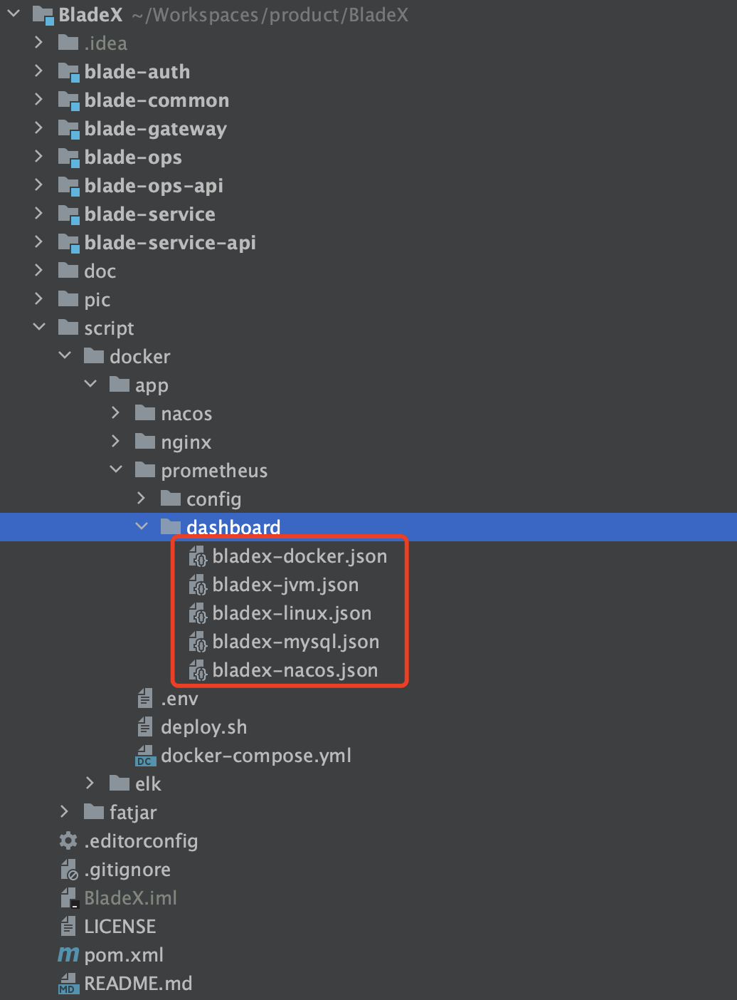
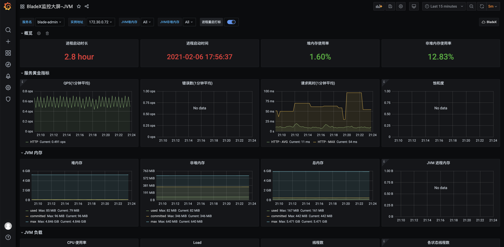

## 监控体系部署
1. 若使用的是mysql数据库，需要对mysql监控，则需要为mysqld-exporter插件创建一个帐号，并给docker-compose.yml填上正确的配置。若不需要删掉相关节点即可
  

2. 一切准备完毕，执行部署命令

   ~~~shell
   [root@JD app]# ./deploy.sh prometheus
   ~~~

   ~~~shell
   Creating app_prometheus_1      ... done
   Creating app_node-exporter_1   ... done
   Creating app_mysqld-exporter_1 ... done
   Creating app_cadvisor_1        ... done
   Creating app_grafana_1         ... done
   [root@JD app]# docker ps
   CONTAINER ID        IMAGE                                                  COMMAND                  CREATED             STATUS                           PORTS                               NAMES
   d7433709b967        prom/prometheus:v2.24.1                                "/bin/prometheus --c…"   3 seconds ago       Up 1 second                      0.0.0.0:9090->9090/tcp              app_prometheus_1
   7dad90319017        grafana/grafana:7.3.7                                  "/run.sh"                3 seconds ago       Up 1 second                      0.0.0.0:3000->3000/tcp              app_grafana_1
   da06d177013c        prom/mysqld-exporter:v0.12.1                           "/bin/mysqld_exporter"   3 seconds ago       Up 1 second                      0.0.0.0:9104->9104/tcp              app_mysqld-exporter_1
   f1a05c71c69d        prom/node-exporter:v1.0.1                              "/bin/node_exporter"     3 seconds ago       Up 1 second                      0.0.0.0:9190->9100/tcp              app_node-exporter_1
   69f12bfdee8c        google/cadvisor:v0.33.0                                "/usr/bin/cadvisor -…"   3 seconds ago       Up 1 second (health: starting)   0.0.0.0:18080->8080/tcp             app_cadvisor_1
   ~~~
3. 访问 http://服务器ip:9090/targets ，可以看到prometheus已经把所有数据收集完毕。每个节点对应的意义，详情请看前面几章节，这里不再赘述。

4. 访问 http://服务器ip:3000 , 配置grafana，密码自行设置，登录后创建数据源。

**注意⚠️：若prometheus和grafana都是以docker部署，prometheus的url必须保证是宿主机ip，或者docker子网ip。不可以是localhost或者127.0.0.1，因为对于在容器内的grafana来说，localhost指向的是这个容器内部的地址，grafana容器是不存在prometheus的。所以一句话来说就是这里需要填上能被grafana容器ping通的url。**

5. 前往Granafa新增监控大屏，将 BladeX 目录下对应的json文本拷贝并导入，整个流程就全部完毕了。

## 最终效果
### BladeX监控大屏--Docker

### BladeX监控大屏--Jvm

### BladeX监控大屏--Linux

### BladeX监控大屏--MySql

### BladeX监控大屏--Nacos

