## 告警体系部署

1. 先再阅读一遍`6.3.5章节`，将部署脚本内相关配置全都改成部署服务器的相关信息

2. 一切准备完毕，执行告警模块的部署

   注意⚠️：若告警不需要钉钉，可以把`docker-compose.yml`和`deploy.sh`内`webhook-dingtalk`配置删除

   ~~~shell
   [root@JD app]# ./deploy.sh alertmanager
   ~~~

   ~~~shell
   Pulling alertmanager (prom/alertmanager:v0.21.0)...
   v0.21.0: Pulling from prom/alertmanager
   Digest: sha256:24a5204b418e8fa0214cfb628486749003b039c279c56b5bddb5b10cd100d926
   Status: Downloaded newer image for prom/alertmanager:v0.21.0
   Pulling webhook-dingtalk (timonwong/prometheus-webhook-dingtalk:v1.4.0)...
   v1.4.0: Pulling from timonwong/prometheus-webhook-dingtalk
   Digest: sha256:a0fcc028bd8d71ec2a04d332e59d000b3f50795c3033fa5e06c3a9a93c6b0559
   Status: Downloaded newer image for timonwong/prometheus-webhook-dingtalk:v1.4.0
   Creating app_alertmanager_1     ... done
   Creating app_webhook-dingtalk_1 ... done
   [root@JD app]# docker ps
   CONTAINER ID        IMAGE                                                  COMMAND                  CREATED              STATUS                          PORTS                               NAMES
   0687ad2bfb40        timonwong/prometheus-webhook-dingtalk:v1.4.0           "/bin/prometheus-web…"   33 seconds ago       Restarting (1) 2 seconds ago                                        app_webhook-dingtalk_1
   07c39cc89434        prom/alertmanager:v0.21.0                              "/bin/alertmanager -…"   33 seconds ago       Up 32 seconds                   0.0.0.0:9093->9093/tcp              app_alertmanager_1
   ~~~

3. 访问  http://服务器ip:9090/alerts 以及 http://服务器ip:9093 ，页面成功显示则说明部署成功

   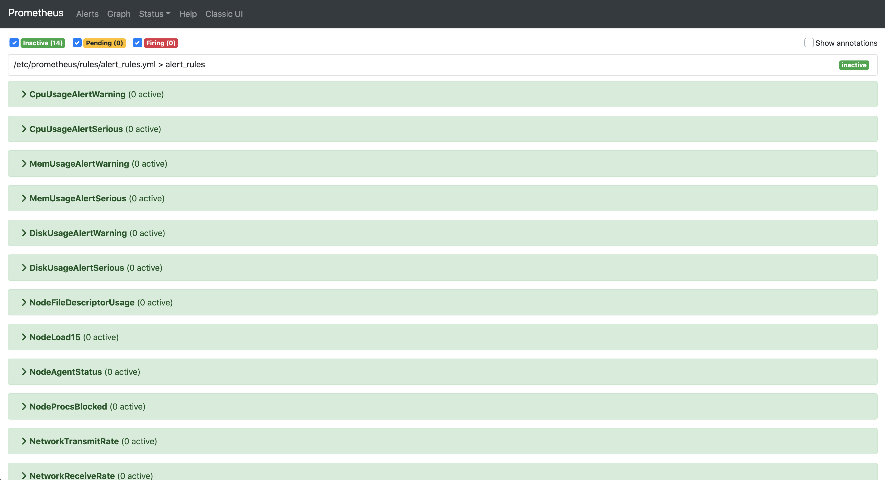

   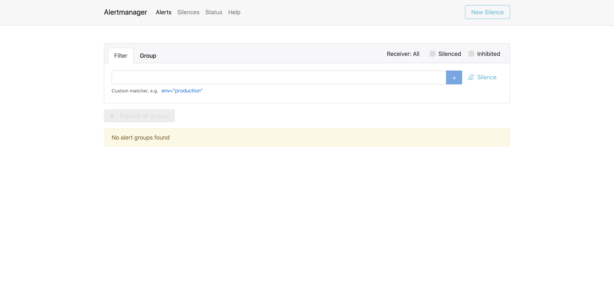

4. 这里要注意 `prometheus.yml` 与 `alertmanager.yaml` 两个配置文件内的配置是否都正确，否则将无法生效，具体配置含义以及使用流程请再阅读一遍文档 `6.3.5章节`，这里将不再赘述，直接看成果

5. 这里我们以企业微信告警为例，手动关闭`mysqld-exporter`服务，模拟故障发生

   ~~~shell
   [root@JD app]# docker stop app_mysqld-exporter_1
   ~~~

6. 刷新prometheus页面，可以看到targets节点变红，alerts节点变黄，5m后变红

   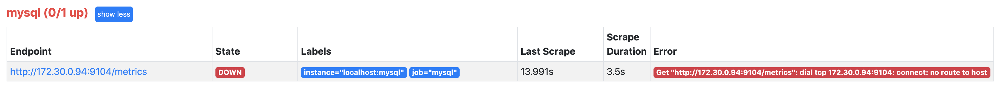

   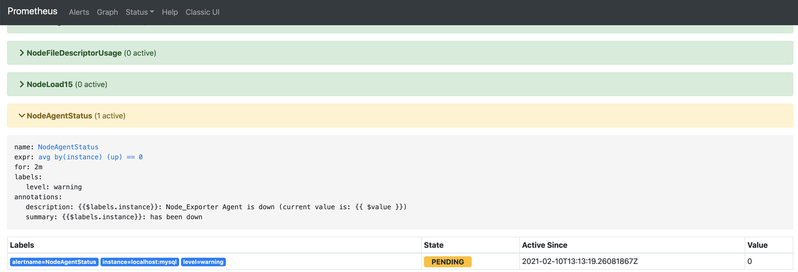

   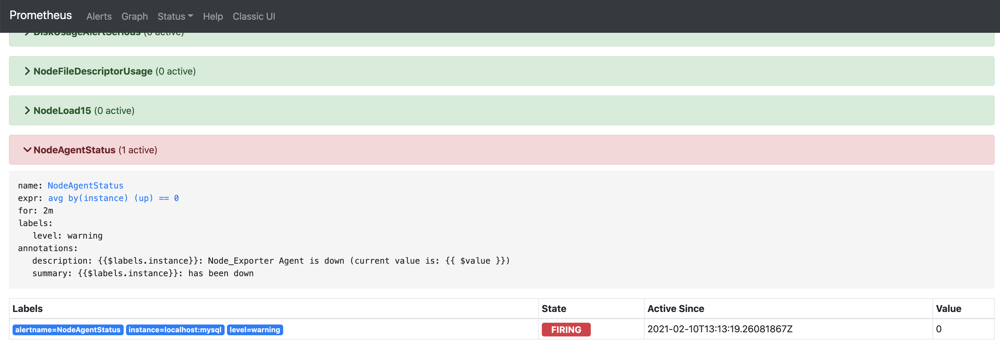

7. 刷新alertmanager页面，可以看到告警信息也同步到了主界面

   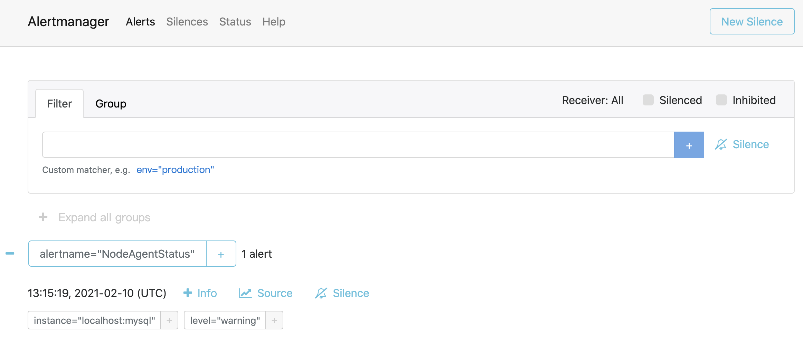

8. 这时若配置信息无误，则会收到企业微信的告警信息

   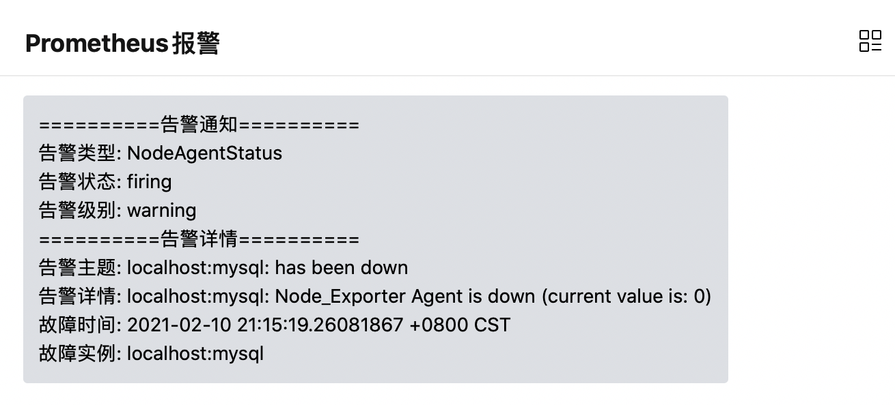

9. 这时再次开启`mysqld-exporter`服务，模拟故障恢复

   ~~~shell
   [root@JD app]# docker start app_mysqld-exporter_1
   ~~~

10. 稍等片刻，会收到企业微信的告警恢复信息

    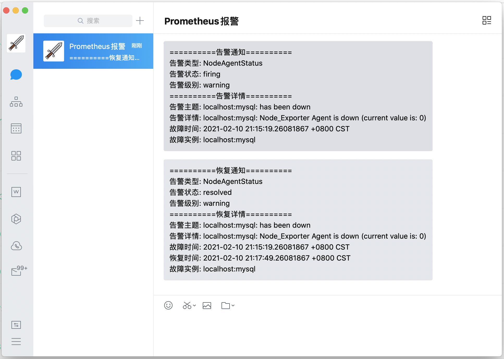

11. 移动端效果

    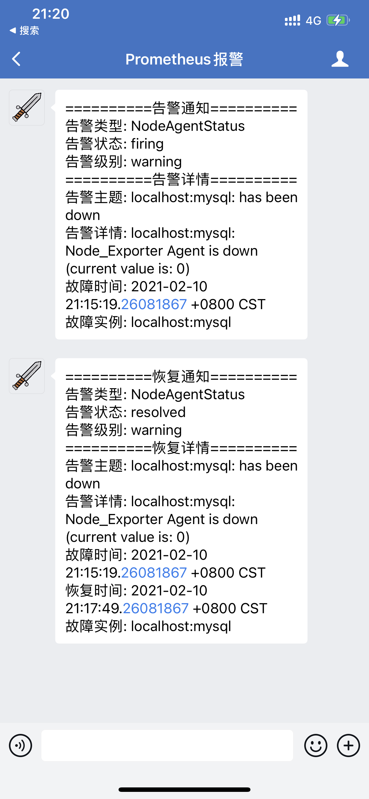

12. 此时再刷新prometheus和alertmanager服务，会发现告警信息已经消失

    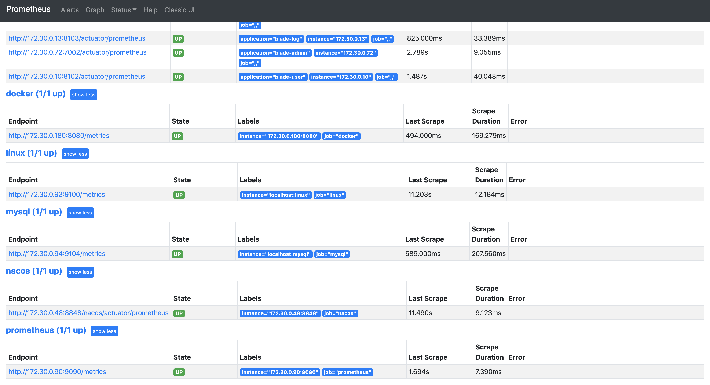

    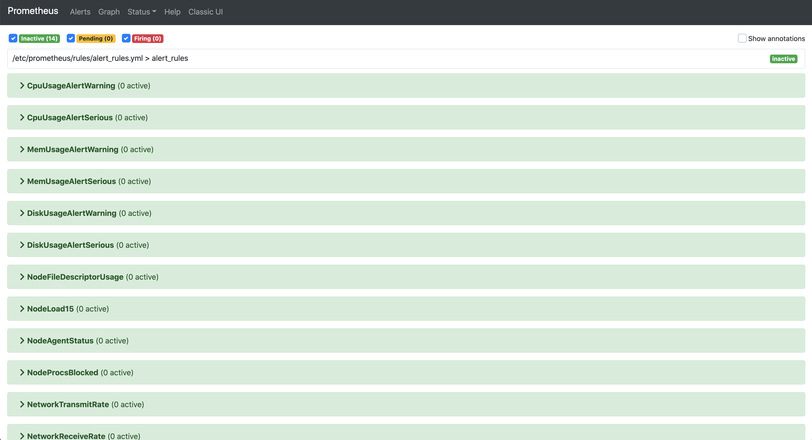

    

    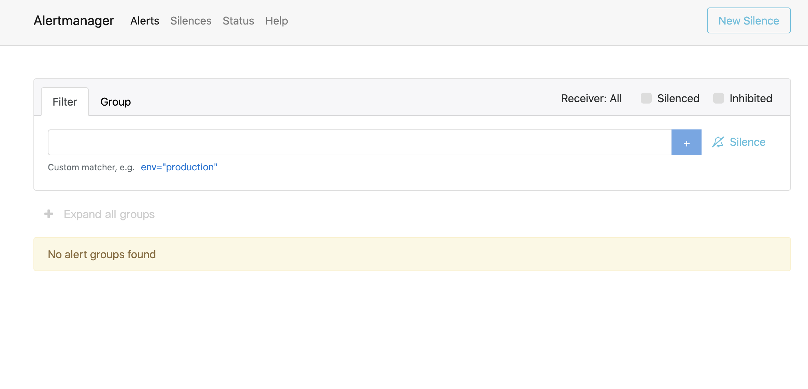

