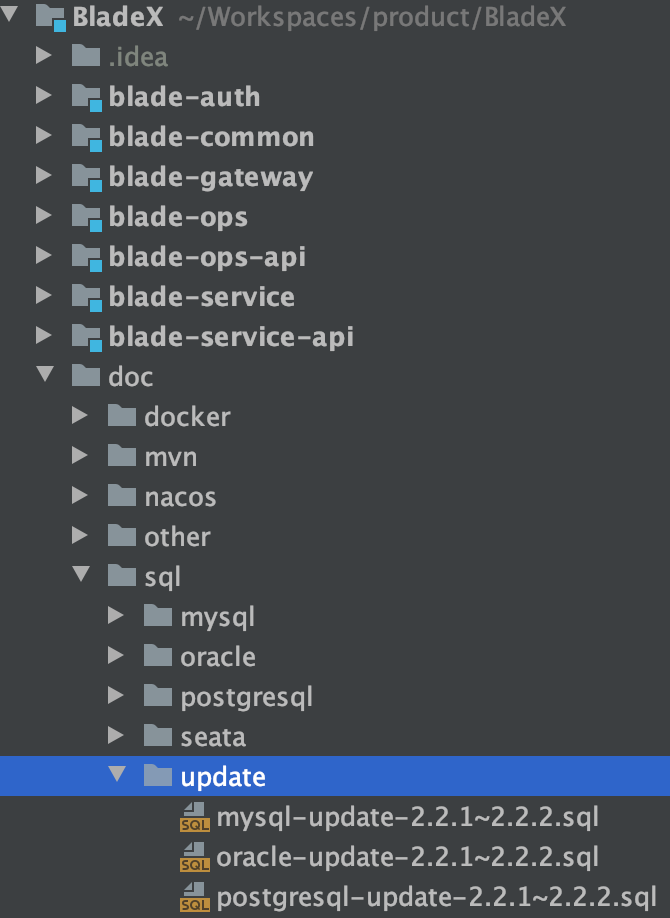
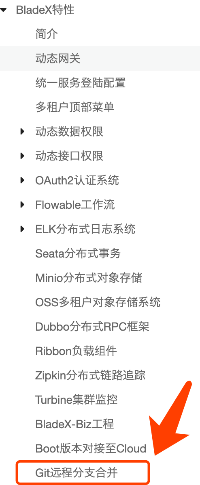
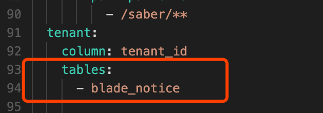
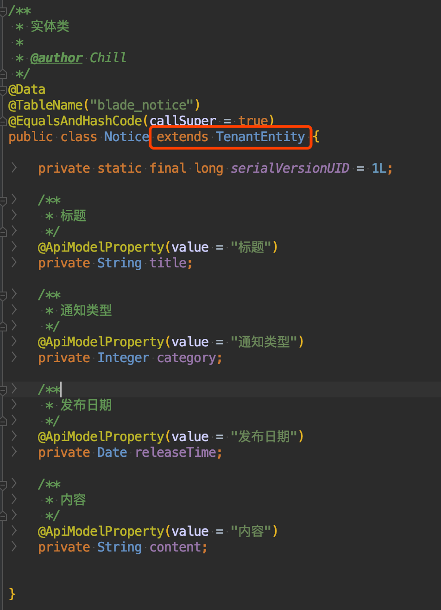
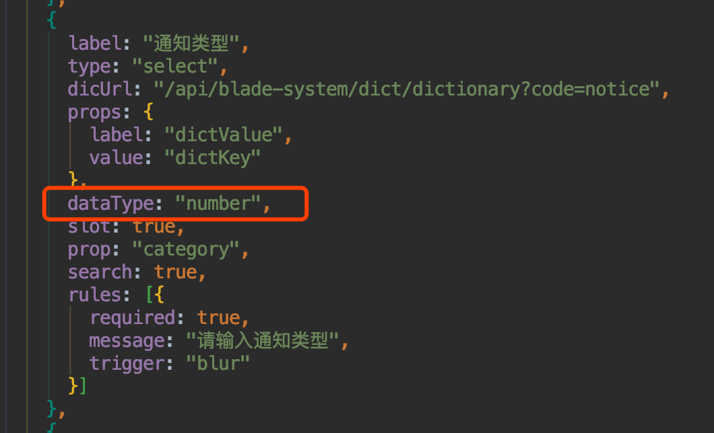

## 升级步骤
1. 升级数据库
* 执行对应文件夹下的sql更新脚本

2. 下载最新版本，将自己写的业务代码覆盖

3. 若变更了包名、结构，则更新的时候需要针对git提交记录进行逐条比对、更新

4. 推荐使用git远程分支合并，若有冲突可手动进行合并（推荐大家业务模块开发在bladex-biz，这样bladex只需跟随主分支更新即可）

5. 更新完毕后，记得将redis执行flushdb命令

## 升级注意点，请务必确认
1. 重构了租户插件逻辑，由之前使用配置表名来生效租户过滤改为自动读取模型判断是否有租户id来自行进行过滤
所以之前关于租户表的配置可以直接删掉，但同时需要给租户表继承TenantEntity

之前是手动指定需要进行租户过滤的表，2.2.2版本改为自动读取继承TenantEntity或者带tenantId字段的类，并加入租户插件。若有些表不需要进行租户过滤，可以通过如下配置进行排除，自行定义
~~~yaml
blade:
    tenant:
        exclude-tables:
            - blade_test
            - blade_demo
~~~

2. 字典表的dictKey字段由int类型改为了string类型，以支持更多类型的字典键值。但由此带来的是一个数据类型转换的问题，若使用的是saber，需要给字典下拉框控件加上统一的转换配置 
~~~javascript
dataType: "number",
~~~

简单的做法就是统一将
~~~javascript
props: {
  label: "dictValue",
  value: "dictKey"
},
~~~
替换为
~~~javascript
props: {
  label: "dictValue",
  value: "dictKey"
},
dataType: "number",
~~~
即可
