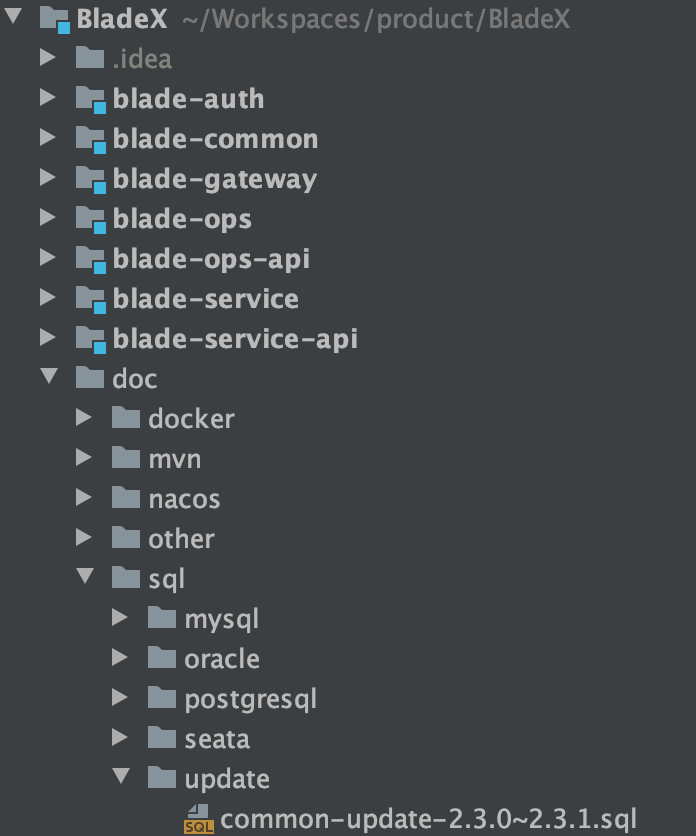
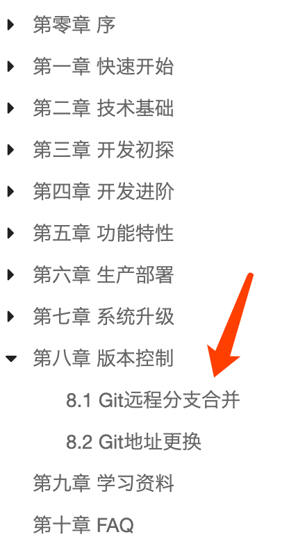

## 升级步骤
1. 升级数据库
* 执行对应文件夹下的sql更新脚本

2. 下载最新版本，将自己写的业务代码覆盖

3. 若变更了包名、结构，则更新的时候需要针对git提交记录进行逐条比对、更新

4. 推荐使用git远程分支合并，若有冲突可手动进行合并（推荐大家业务模块开发在bladex-biz，这样bladex只需跟随主分支更新即可）

5. 更新完毕后，记得将redis执行flushdb命令

