## 升级步骤
 1. 升级数据库，执行对应文件夹下的sql更新脚本
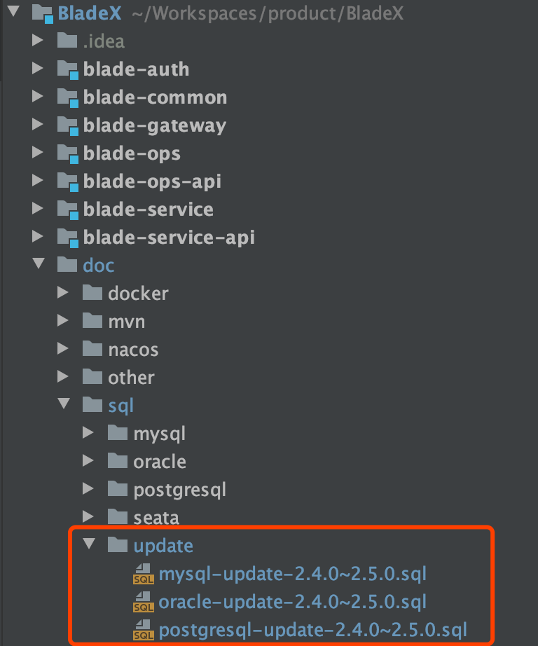

2. 下载最新版本，将自己写的业务代码覆盖

3. 若变更了包名、结构，则更新的时候需要针对git提交记录进行逐条比对、更新

4. 推荐使用git远程分支合并，若有冲突可手动进行合并（推荐大家业务模块开发在bladex-biz，这样bladex只需跟随主分支更新即可）

5. 更新完毕后，记得将redis执行flushdb命令

6. 若修改包名或工程结构，导致无法直接通过git merge合并的同学，请看下方的注意点，不要遗漏～ 否则更新容易出错

## 升级注意点，请务必确认
**1. 新版本对密码进行了`二次加密`，由前端调用传参需要现将原密码进行`md5`加密后再进行传递，原密码是admin，所以md5加密后是`21232f297a57a5a743894a0e4a801fc3`, 所以用接口的时候，原先的密码也需要更改为md5后的字符串**
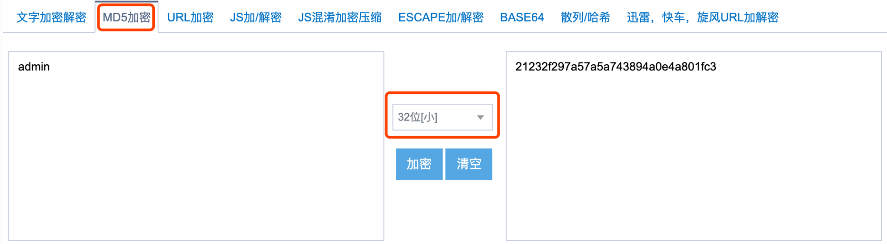
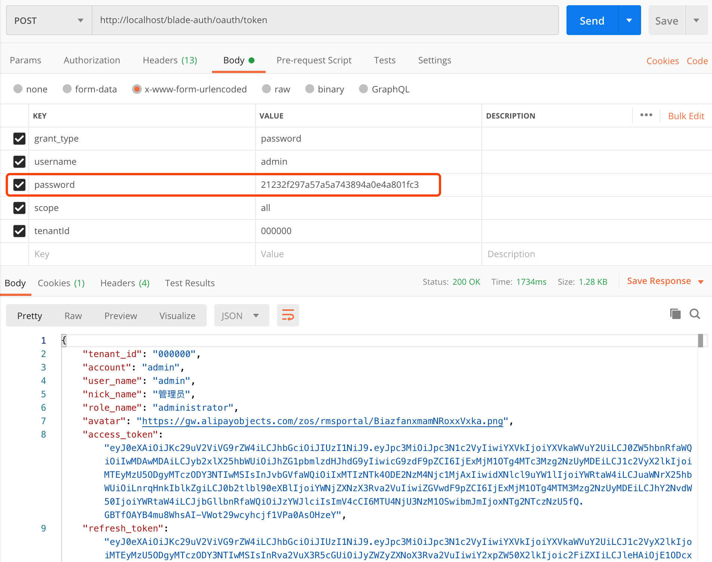

**2. 新版本用到了租户增强功能，请把blade.tenant.enhance=true的配置加上，cloud版修改nacos内blade.yaml内的配置，boot版修改application.yml内的配置**
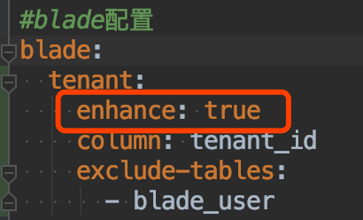

**3. CacheUtil加上了租户缓存隔离，会每次自动给设置的cacheName加上租户id的前缀，所以@CacheEvict注解就没法移除使用CacheUtil生成的缓存了。相对应的需要用到CacheUtil.clear(cacheName)方法来替换@CacheEvict注解进行租户缓存清除，需要大家花20分钟仔细替换下工程内相关方法。**
* 举个栗子：
~~~java
/**
 * 修改基本信息
 */
@PostMapping("/update-info")
@CacheEvict(cacheNames = {USER_CACHE}, allEntries = true)
public R updateInfo(@Valid @RequestBody User user) {
   return R.status(userService.updateUserInfo(user));
}
~~~
**⬇️改为⬇️**
~~~java
/**
 * 修改基本信息
 */
@PostMapping("/update-info")
public R updateInfo(@Valid @RequestBody User user) {
   CacheUtil.clear(USER_CACHE);
   return R.status(userService.updateUserInfo(user));
}
~~~

* 具体可参考如下commit
* BladeX：[https://git.bladex.vip/blade/BladeX/commit/b6eee6d2a9c935e91e5ca5ff0bed24425020798a](https://git.bladex.vip/blade/BladeX/commit/b6eee6d2a9c935e91e5ca5ff0bed24425020798a)
* BladeX-Boot: [https://git.bladex.vip/blade/BladeX-Boot/commit/ab63186c5624beb90b7dc4f354729a32e0144dbe](https://git.bladex.vip/blade/BladeX-Boot/commit/ab63186c5624beb90b7dc4f354729a32e0144dbe)

**4. Saber核心将avue升级到了2.5.0，有几点需要注意**
* 下拉框自定义dictData的写法有变动，删除了原先的`this.$refs.crud.findColumnIndex`方法，增加来全局的`this.findObject`方法，大家需要进行全体替换，具体如下：
~~~javascript
const index = this.$refs.crud.findColumnIndex("parentId");
this.option.column[index].dicData = data;
~~~
**⬇️改为⬇️**
~~~javascript
let column = this.findObject(this.option.column, "parentId");
column.dicData = data;
~~~
* 由于新版本的方法，会因为初次加载延迟导致组件渲染失败，所以dictData字段的赋值需要从created生命周期放至mounted生命周期
~~~javascript
created() {
  this.initData();
},
~~~
**⬇️改为⬇️**
~~~javascript
mounted() {
  this.initData();
},
~~~

**5.新版本修复了懒加载树无法实时更新的问题，有几点需要注意，以dept模块为例**
* 后端方法增加返回字段
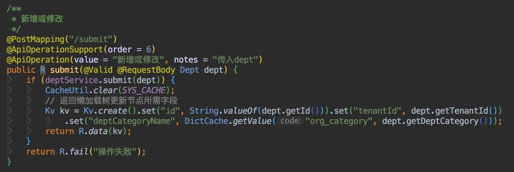
* 单独封装一个用于刷新部门下拉框的接口
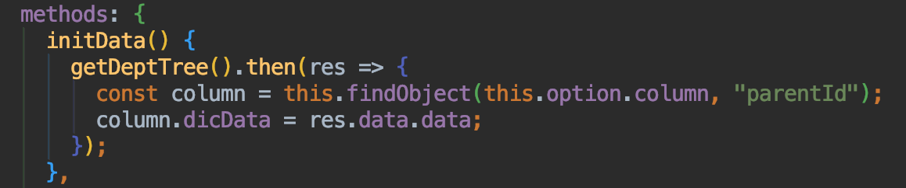
* 新增方法如下注释
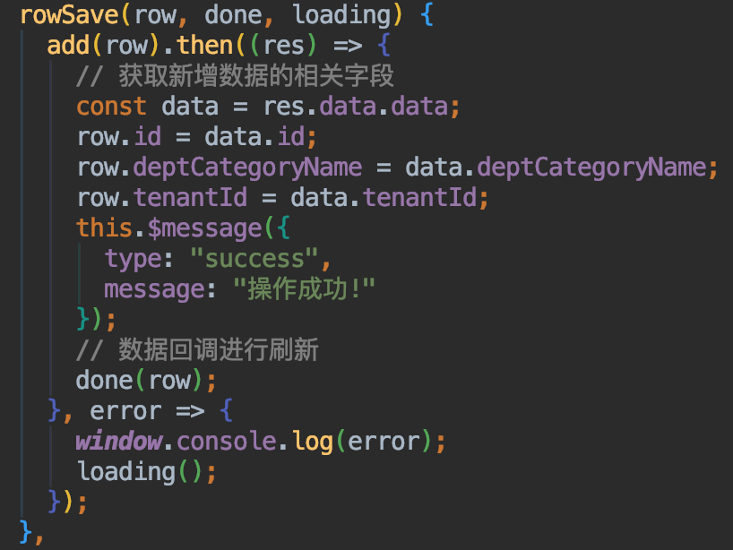
* 修改方法如下注释
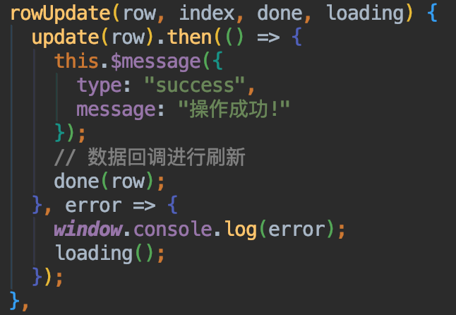
* 删除方法如下注释
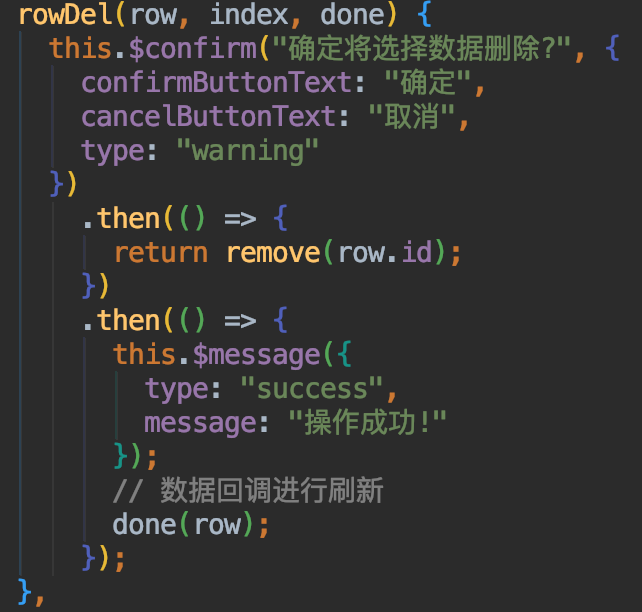
* 批量删除方法如下注释
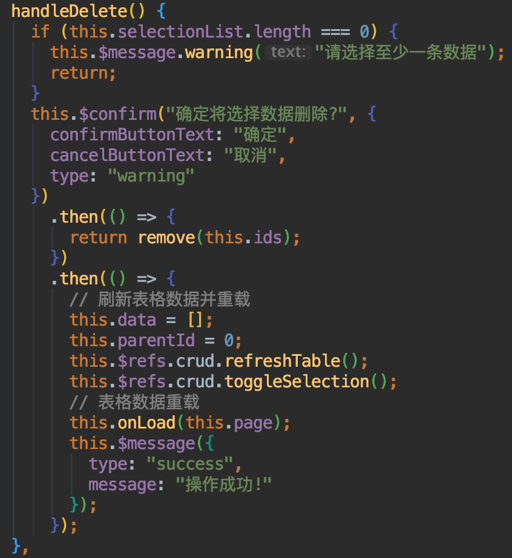

**6.新版本调整了loading与done的顺序，非强迫症可以无视**
* 调整对比如下：
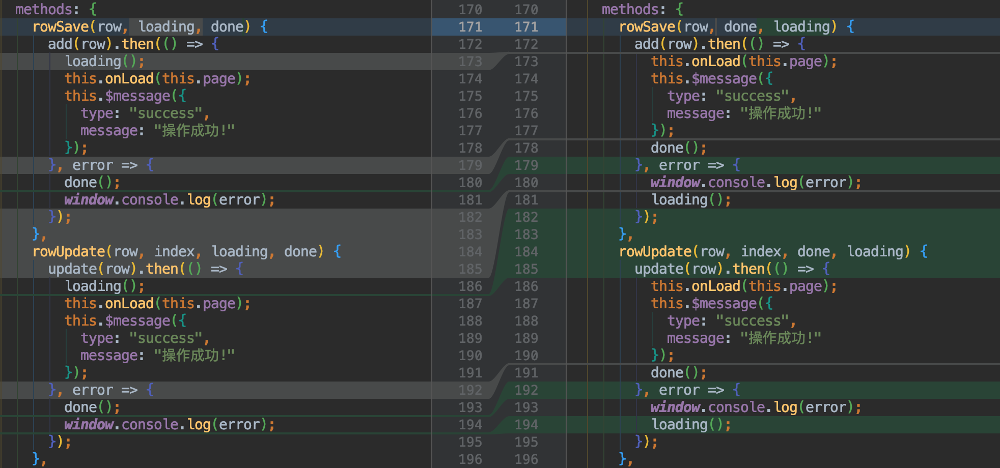
* 具体commit可以参考：[https://git.bladex.vip/blade/Saber/commit/9a33c4f0c961d80ee928fac2ee6360db7f24343b](https://git.bladex.vip/blade/Saber/commit/9a33c4f0c961d80ee928fac2ee6360db7f24343b)

**7.后端配置开启字段由以前部分的enable统一改为enabled**
* 具体提交可以参考如下commit
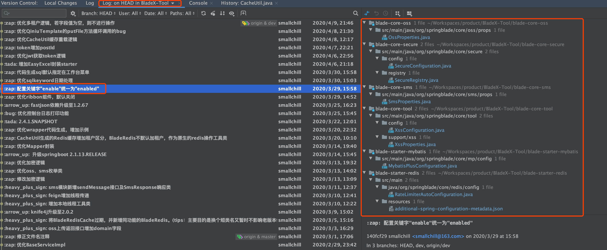
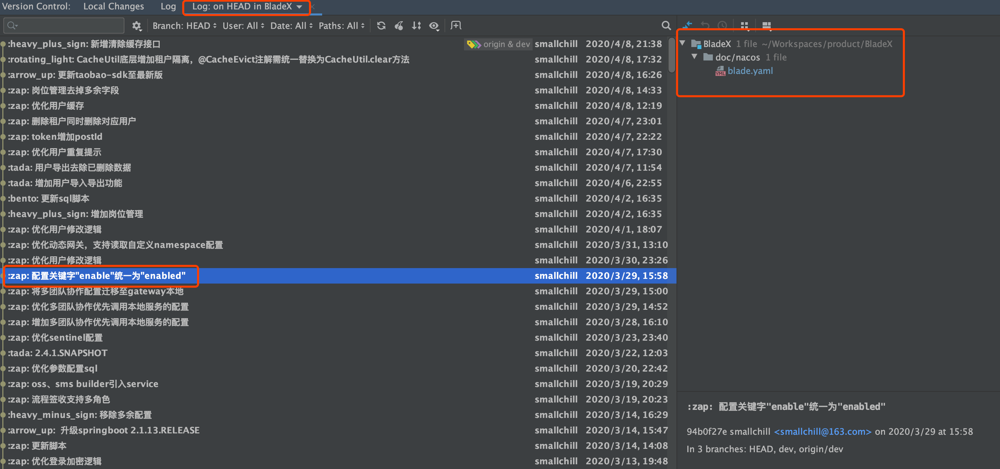
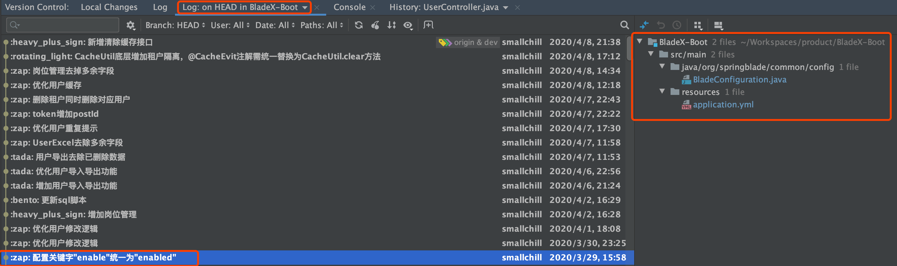
* 举个栗子：需要将`blade.xss.enable=true` 修改为 `blade.xss.enabled=true` 否则xss将不会生效

**8.新版本删除了两个过时的配置**
* xss过滤配置，删除了老版本的`blade.xss.url.exclude-patterns`，请使用 `blade.xss.skip-url`代替
* secure过滤配置，删除了老版本的`blade.secure.url.exclude-patterns`，请使用 `blade.secure.skip-url`代替

**9.新版本删除了过时的RedisUtil**
* `RedisUtil`已经过期，存在了很多个版本
* `2.5.0.RELEASE`将其删除，使用`BladeRedis`代替
* `BladeRedisCache`也设置为过期，将在未来`2.6.0.RELEASE`版本进行删除

**10.新版本将docker-maven-plugin 升级为 dockerfile-maven-plugin，有较多变动**
* 详细提交请看如下commit：[https://git.bladex.vip/blade/BladeX/commit/b610399038bf77ab068d0bda98a29f01956ec9bb](https://git.bladex.vip/blade/BladeX/commit/b610399038bf77ab068d0bda98a29f01956ec9bb)
* 新的插件推送docker镜像的命令也有变化，从`mvn clean package docker:build`改为了`mvn clean package dockerfile:build dockerfile:push`
* 更多说明请看手册6.2.3.5与6.2.3.6两章节，已经更新为最新版本讲解，请仔细阅读 
