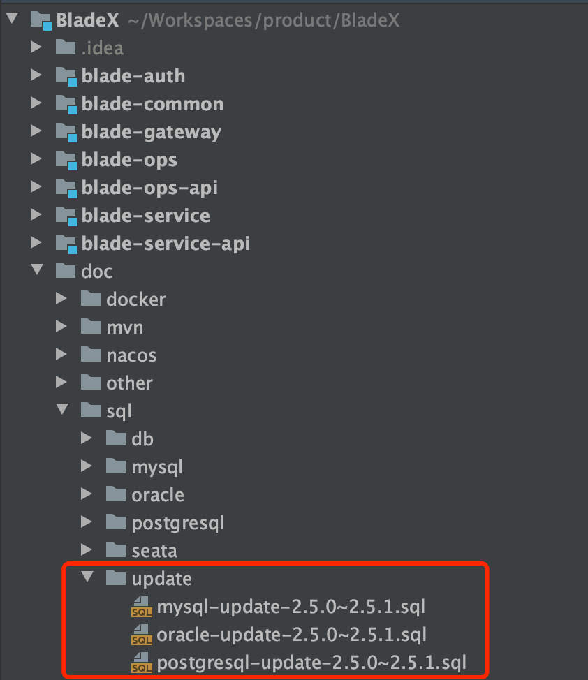
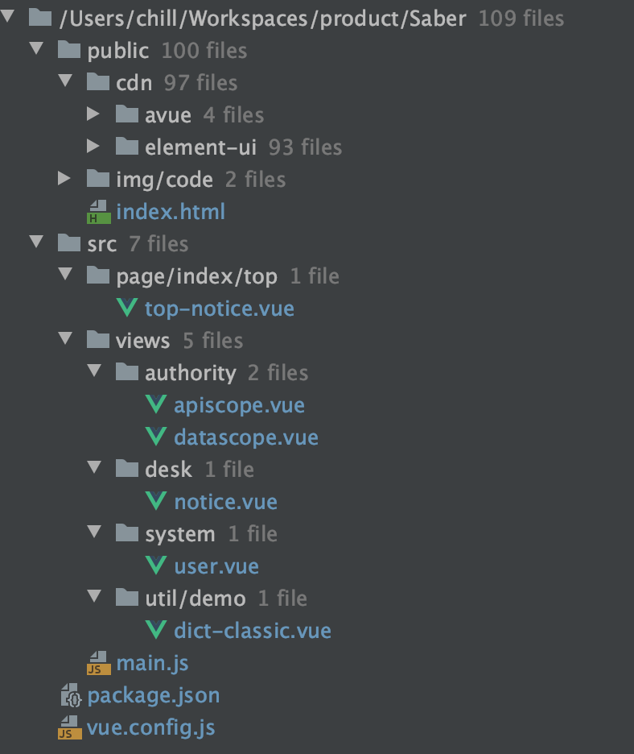
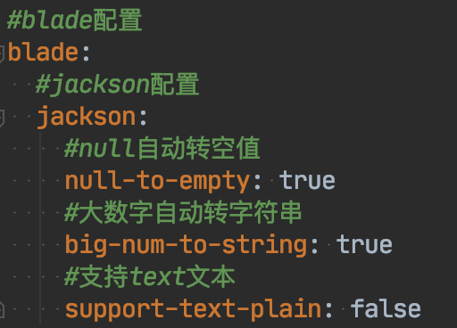

## 升级步骤
 1. 升级数据库，执行对应文件夹下的sql更新脚本

2. 下载最新版本，将自己写的业务代码覆盖

3. 若变更了包名、结构，则更新的时候需要针对git提交记录进行逐条比对、更新

4. 推荐使用git远程分支合并，若有冲突可手动进行合并（推荐大家业务模块开发在bladex-biz，这样bladex只需跟随主分支更新即可）

5. 更新完毕后，记得将redis执行flushdb命令

6. 若修改包名或工程结构，导致无法直接通过git merge合并的同学，请看下方的注意点，不要遗漏～ 否则更新容易出错

## 升级注意点，请务必确认
1. Saber核心升级至Avue2.6.1，和Avue作者沟通对接兼容性，最后仅有小部分需要改动，具体请看：[https://git.bladex.vip/blade/Saber/commit/e47dd24a538ef96cf7230d0a6965fdbbd7fb4bc0](https://git.bladex.vip/blade/Saber/commit/e47dd24a538ef96cf7230d0a6965fdbbd7fb4bc0)

2. 新增第三方系统登录功能，具体请看`5.1.7章节`
3. 新增Token保存至redis实现有状态认证，具体请看`5.3.2章节`
4. 增强Secure安全框架，并完善了文档，具体请看`5.3章节`
5. 新增租户授权保护功能，具体请看`5.2.2章节`
6. 新增API报文加密功能，具体请看`5.9章节`
7. 增强Jackson配置，后续的Long主键无需再使用注解配置了，具体请看：

8. 为进一步统一代码规范，为bean加上final关键字，非强迫症可无视，若需要更新请参考：[https://git.bladex.vip/blade/BladeX/commit/048320e3db7bc5aaf40fca3d7745d4da71a6a2b0](https://git.bladex.vip/blade/BladeX/commit/048320e3db7bc5aaf40fca3d7745d4da71a6a2b0)
[https://git.bladex.vip/blade/BladeX-Boot/commit/c6f92fba72016737b258fb256c58fd33347ea2c3](https://git.bladex.vip/blade/BladeX-Boot/commit/c6f92fba72016737b258fb256c58fd33347ea2c3)
[https://git.bladex.vip/blade/BladeX-Tool/commit/a44fef9ad4a94f3461df1dd9d9192bc145d0056f](https://git.bladex.vip/blade/BladeX-Tool/commit/a44fef9ad4a94f3461df1dd9d9192bc145d0056f)

