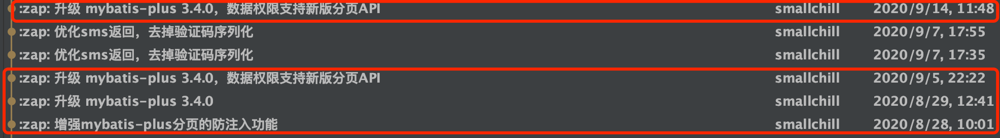

## 升级步骤
 1. 升级数据库，执行对应文件夹下的sql更新脚本

2. 下载最新版本，将自己写的业务代码覆盖

3. 若变更了包名、结构，则更新的时候需要针对git提交记录进行逐条比对、更新

4. 推荐使用git远程分支合并，若有冲突可手动进行合并（推荐大家业务模块开发在bladex-biz，这样bladex只需跟随主分支更新即可）

5. 更新完毕后，记得将redis执行flushdb命令

6. 若修改包名或工程结构，导致无法直接通过git merge合并的同学，请看下方的注意点，不要遗漏～ 否则更新容易出错

## 升级注意点，请务必确认
1. mybatis-plus升级至3.4.0后，底层api有较大的变动。原先的租户插件、数据权限插件所使用的api均已过期。虽然过期，api还是生效的，不过为了后续升级，强烈建议大家跟着commit将api升级至最新版，具体可以参考如下commit记录

2. 拓展了用户平台，增加了用户平台类型至token生成，作为可拓展的一个模块，具体请看 `5.3.2.4 章节`
3. 拓展了Secure认证模块，增加了Basic认证，具体请看 ` 5.3.4 章节`
