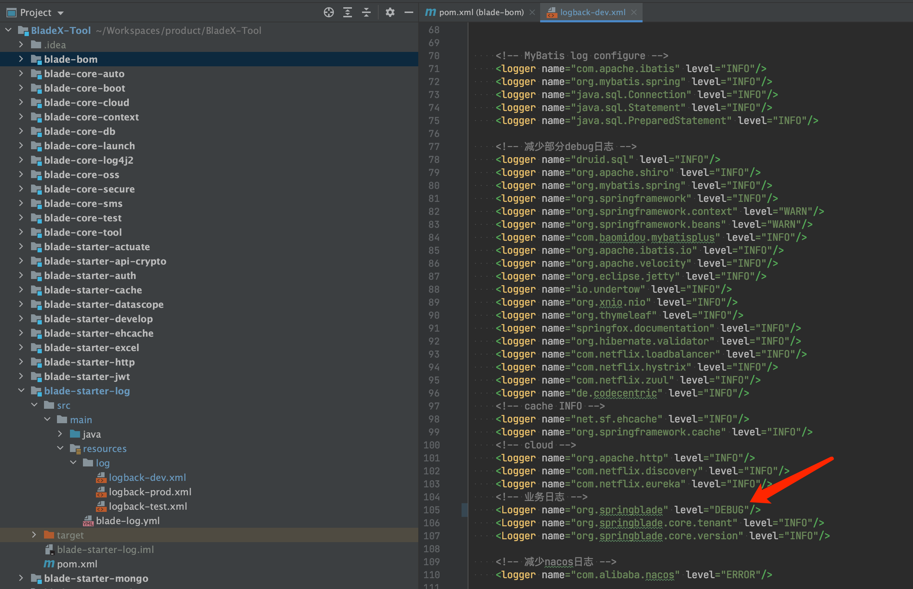
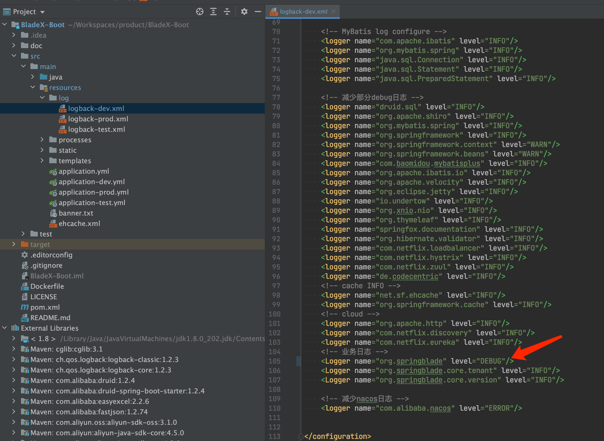
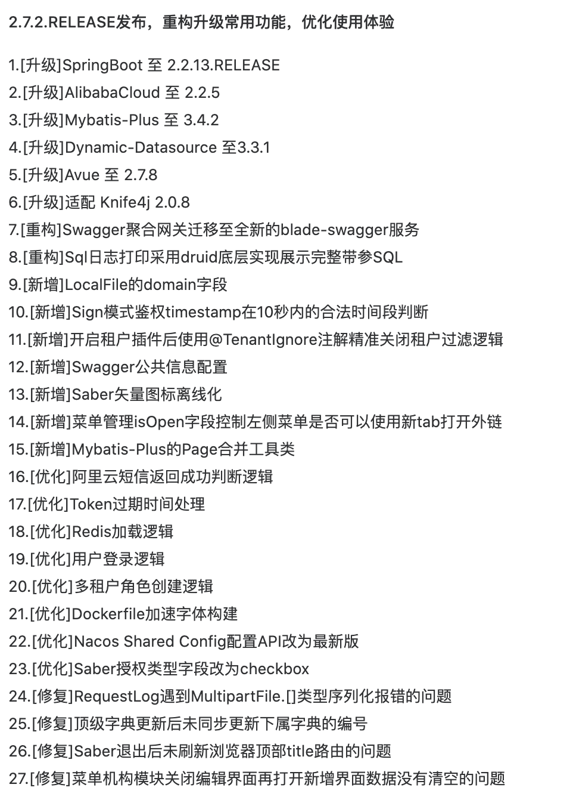

## 升级注意点，请务必确认
1. 本次主要为架构底层升级以及功能优化，数据库更新仅有一句，若使用Saber则执行，若使用Sword则可无视。 执行sql如下：`UPDATE blade_menu SET is_open = 1 WHERE is_deleted = 0;` Saber新增了菜单配置isOpen字段来指定点击后是否会新增浏览器tab框而不是在本系统的tab，为了保持系统原状，推荐执行sql，若有需要弹出新tab的菜单再单独配置即可。

2. 将swagger网关从Gateway迁移至了新的服务 `blade-swagger`，大家针对升级后请单独启动`blade-swagger`服务并访问如下地址查看文档：http://localhost:18000/doc.html 

3. 新增了`@TenantIgnore注解`，可以在开启了租户过滤的业务模块加上此注解来精准关闭租户过滤从而支持自定义sql逻辑。具体请看文档 `5.2.5 章节`

4. 重构了`blade-starter-mybatis`内的`SqlLogInterceptor`插件，底层改为druid api 实现，已经支持打印完整的执行sql不再带`?`号，大家可以直接拷贝sql进行执行调试。除此以外，关闭了mybatis自带的DEBUG日志以精简控制台打印日志，若仍然需要，请修改日志文件等级为`DEBUG` 便可重新开启。
  
  
  另外新版的日志打印工具可以排除不需要的sql显示，只需要配置上关键字就行，若sql匹配到关键字则会忽略不会打印，具体可以通过如下配置实现

  ~~~yaml
  blade:
    mybatis-plus:
      sql-log: true
      sql-log-exclude:
        - ACT_RU_JOB
        - ACT_RU_TIMER_JOB
        - test_log
        - blade_log_api
        - blade_log_error
  ~~~
5. Saber将矢量图标离线化了，内网部署不再需要额外配置，具体commit请看（注意不要有遗漏）：https://git.bladex.vip/blade/Saber/commit/0d3fac9ee65bbb1b5788c9790692a38b73f20a50。
关于自行配置图标并离线化可以参考：https://sns.bladex.vip/q-1768.html
6. 2.7.2更新日志如下

