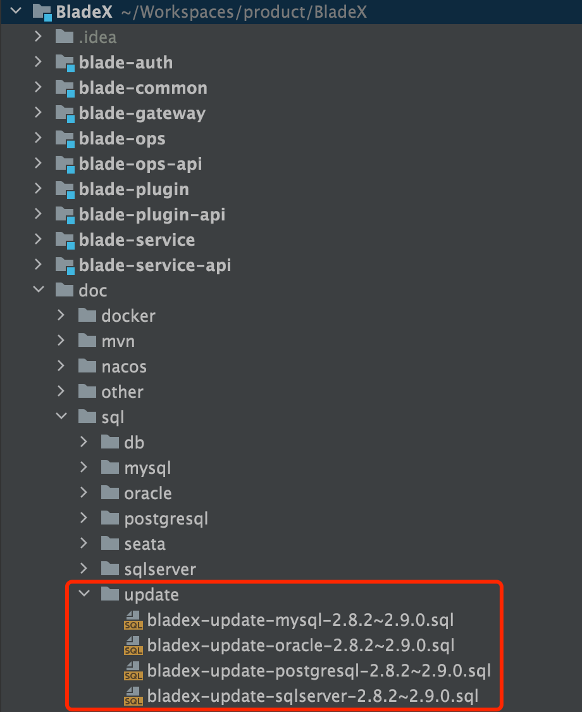
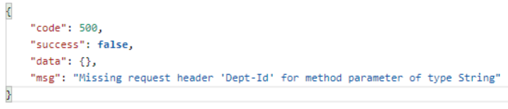
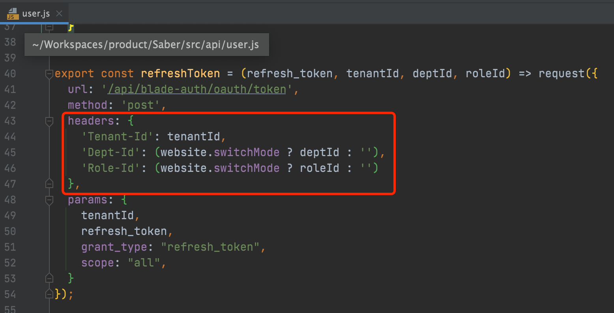
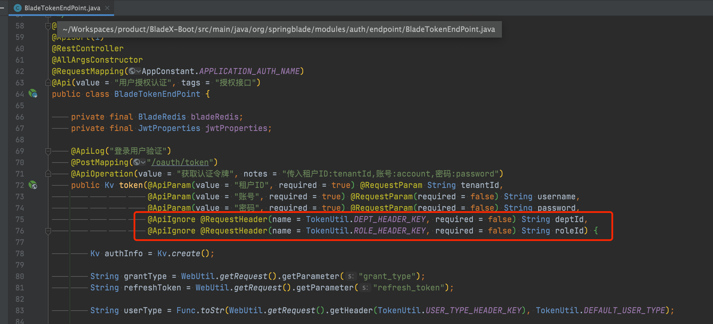

## 数据库结构升级

1. 升级数据库，执行对应文件夹下的sql更新脚本

   

2. 下载最新版本，将自己写的业务代码覆盖

3. 若变更了包名、结构，则更新的时候需要针对git提交记录进行逐条比对、更新

4. 推荐使用git远程分支合并，若有冲突可手动进行合并（推荐大家业务模块开发在bladex-biz，这样bladex只需跟随主分支更新即可）
   

5. 更新完毕后，记得将redis执行flushdb命令

6. 若修改包名或工程结构，导致无法直接通过git merge合并的同学，请看下方的注意点，不要遗漏～ 否则更新容易出错

## 升级注意点，请务必确认

1. 新增了租户产品包配置功能，具体请见文档 `5.2.6章节`

2. 新增了部门切换功能，具体可到前端配置`switchMode: true`来开启

3. 新增了用户登录错误锁定次数读取，具体可到`参数管理`配置参数键值` account.failCount`来生效

4. 增加切换部门功能的同时，需要在前后端token接口添加对应的`Dept-Id`与`Role-Id`请求头，若有如下错误提示，到对应接口增加定义即可(Cloud版后端无需修改)

   

   

   

5. 大家因为log4j2漏洞风波'谈虎色变'，其实不用担心，BladeX使用的是logback实现，没有用到log4j2，不受漏洞影响

6. 如果不放心的话，大家可以在BladeX-Tool配置log4j2的统一版本以此解决依赖问题，具体请看：https://git.bladex.vip/blade/BladeX-Tool/src/master/blade-bom/pom.xml#L37