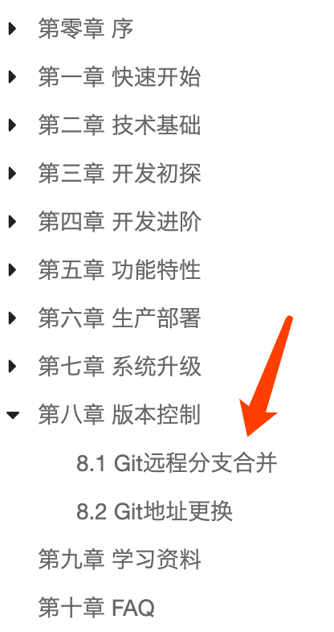
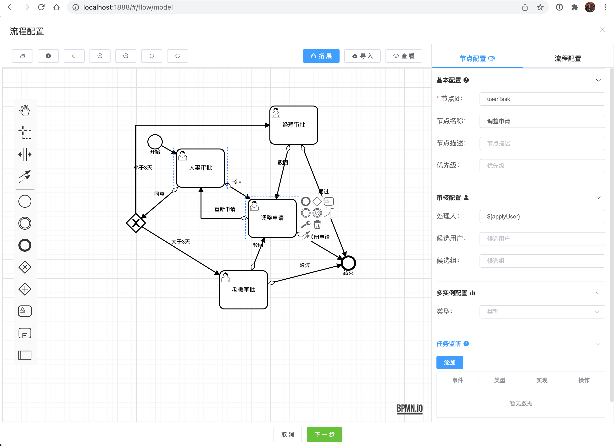
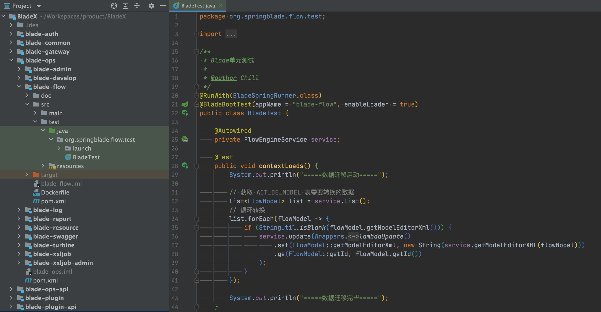
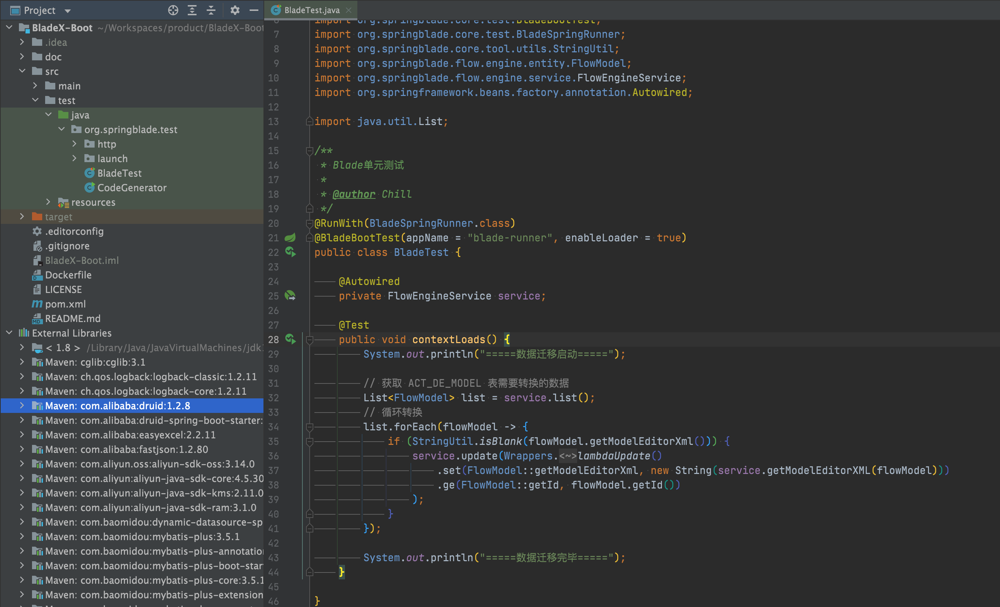
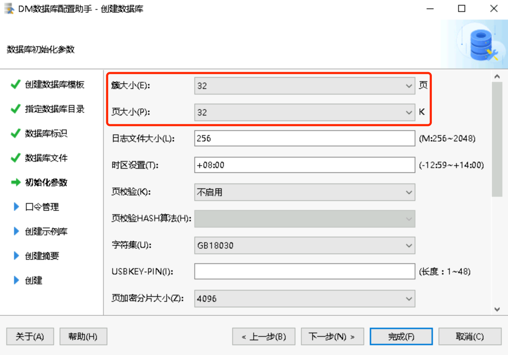
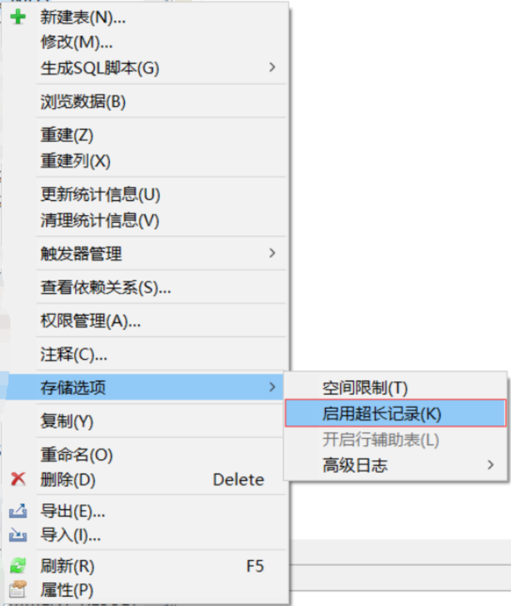

## 数据库结构升级

⚠️**本次升级涉及多处数据库字段改动，请大家升级之前务必将原有库备份几份以防万一，生产库必须多次确认才可操作！**


1. 升级数据库，执行/doc/sql文件夹下的sql更新脚本
2. 下载最新版本，将自己写的业务代码覆盖
3. 若变更了包名、结构，则更新的时候需要针对git提交记录进行逐条比对、更新
4. 推荐使用git远程分支合并，若有冲突可手动进行合并（推荐大家业务模块开发在bladex-biz，这样bladex只需跟随主分支更新即可）
   
5. 更新完毕后，记得将redis执行flushdb命令
6. 若修改包名或工程结构，导致无法直接通过git merge合并的同学，请看下方的注意点，不要遗漏～ 否则更新容易出错


## 升级注意点，请务必确认

1. 升级mybatis-plus至3.5.1，相关API有变动，原先的`selectCount`返回由`Integer`变为`Long`，具体修改如下

   ```java
   Integer cnt = baseMapper.selectCount(queryWrapper);
   if (cnt > 0) {
     throw new ServiceException("当前字典键值已存在!");
   }
   ```

   改为

   ```java
   Long cnt = baseMapper.selectCount(queryWrapper);
   if (cnt > 0L) {
     throw new ServiceException("当前字典键值已存在!");
   }
   ```

2. 升级mybatis-plus至3.5.1，相关API有变动, BladeX-Tool内的 `BladeTenantInterceptor.java`做了部分重构，若之前有改动请参考commit来进行增量升级

3. 升级mybatis-plus-generator至3.5.2，代码生成部分已经完全重构，具体请看BladeX-Tool内的`BladeCodeGenerator.java`

4. 业务代码兼容了达梦数据库，由于`domain`字段为达梦关键词，故将`blade_attach`表与`blade_tenant`表内的`domain`字段改成了`domain_url`，具体请看相关commit进行增量升级

5. 经过与工作流插件作者的沟通，我们决定免费赠送BladeX用户一份价值¥299的极简流程设计器编译版，集成之后Saber的工作流将更加美观，更加易用，与之前业务可无缝衔接。

   

6. 若后续业务对工作流功能要求增加，现有功能不再满足业务场景，推荐购买BladeX工作流插件：https://bladex.vip/#/market/flow

7. 新版本采用极简流程设计器，需要对flowable流程表对应的`act_de_model`新增`model_editor_xml`字段，请执行对应的更新sql

8. 新版流程需要对模型提交的接口添加xss放行，具体配置如下：

   ```yaml
   blade:
   	xss:
       enabled: true
       skip-url:
       	# BladeX 配置
         - /model/submit
         # BladeX-Boot 配置
         - /blade-flow/model/submit
   ```

9. 若之前旧版本工作流已有模型数据业务数据，则需要做一次简单的迁移，根据原有的`model_editor_json`字段转换成xml格式并且赋值到`model_editor_xml`字段。具体请看单元测试，指定好数据库执行一下便可

   

   

10. 达梦数据库关于大字段的问题，坑较多，大家安装的时候需要注意以下两点

    1) 初始化数据库的时候，将`簇`和`页`设置成最大，若设置小了，一些大容量的数据读取都会出现问题，且无法再次配置需要重装

    

    2) 对具有大字段的表执行`启用超长记录`

    

11. 关于最近SpringCloudGateway的漏洞问题，具体解决办法请见：https://sns.bladex.vip/article-15004.html

12. 升级avue至2.9.x后，级联下拉框API有变动，以前写法不再兼容，具体请看：https://avuejs.com/form/form-select.html#%E5%A4%9A%E7%BA%A7%E8%81%94%E5%8A%A8

13. BladeX项目目录`/doc/sql/seata` 迁移至 BladeX-Biz项目目录`/doc/sql/seata`

