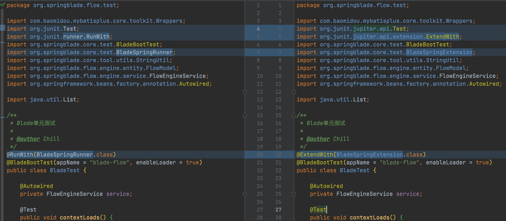
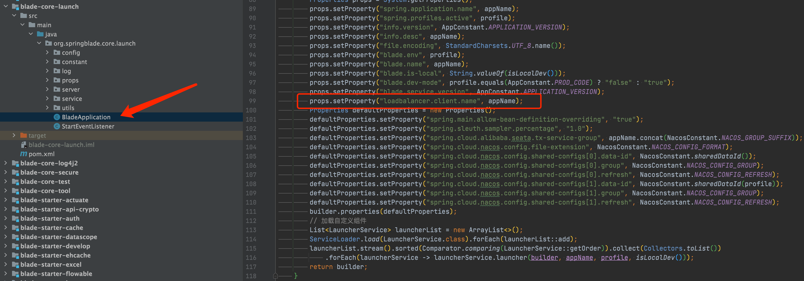
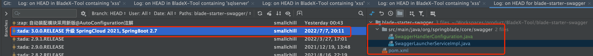
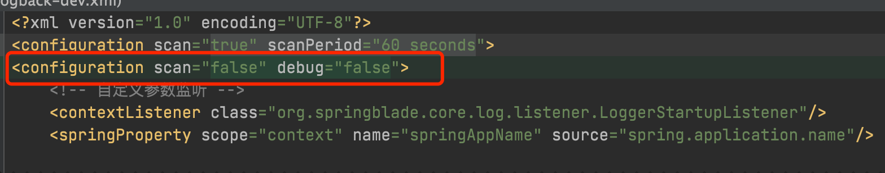
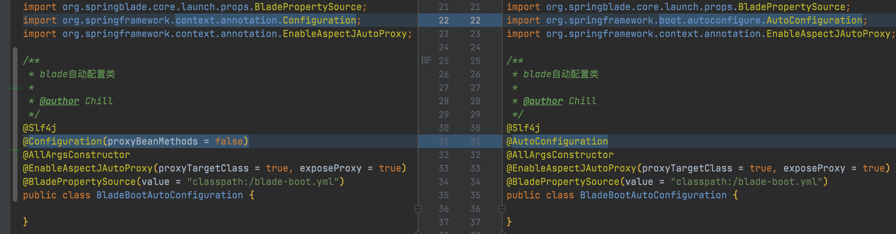
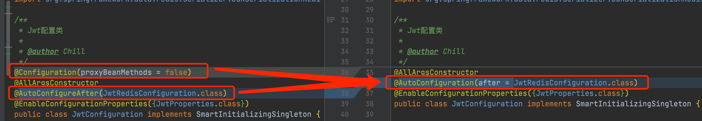
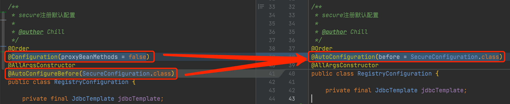

## 数据库结构升级

⚠️**本次升级涉及数据库字段改动，blade_code添加了两个字段，blade_client修改了saber的回调地址字段值，请大家升级之前务必将原有库备份几份以防万一，生产库必须多次确认才可操作！**


1. 升级数据库，执行/doc/sql文件夹下的sql更新脚本
2. 下载最新版本，将自己写的业务代码覆盖
3. 若变更了包名、结构，则更新的时候需要针对git提交记录进行逐条比对、更新
4. 推荐使用git远程分支合并，若有冲突可手动进行合并（推荐大家业务模块开发在bladex-biz，这样bladex只需跟随主分支更新即可）
   
5. 更新完毕后，记得将redis执行flushdb命令
6. 若修改包名或工程结构，导致无法直接通过git merge合并的同学，请看下方的注意点，不要遗漏～ 否则更新容易出错


## 升级注意点，请务必确认

1. SpringCloud从Hoxton升级到了2021，跨了两个大版本，当中有很多需要注意的地方，请大家务必根据commit来比对

   BladeX-Tool:https://git.bladex.vip/blade/BladeX-Tool/commit/eb5df0e0bc7e0de309ad16a48886cbbf097ddb7f

   BladeX:https://git.bladex.vip/blade/BladeX/commit/14764cbb78214d62ccb474baed56ccf975bad1c1

2. 3.0.0版本删除了Hystrix（Sentinel代替）、Ribbon（LoadBalancer代替）、Zipkin/Turbin（后续版本用Skywalking代替）

3. @SpringCloudApplication已过期，请采用@BladeCloudApplication

4. JUnit4升级成JUnit5，API有所变动，变更对比如下

   

5. 新版需要有配置`loadbalancer.client.name`，否则无法正常启动，底层已默认设置好，注意更新

   

6. SpringBoot2.7与swagger本身有冲突，需要加入对应代码兼容

   

7. logback配置文件需要改成红框内配置，否则无法正常启动

   

8. blade-core-cloud改动最大，请务必仔细对比commit

9. blade-starter-ribbon删除以blade-starter-loadbalancer代替

10. blade-starter-develop新增了elementui的原生代码生成模版

11. BladeX-Tool内的自动装配注解由`@Configuration`改成了SpringBoot2.7最新的`@AutoConfiguration`，对比如下

    注意⚠️：**仅推荐BladeX-Tool的自动装配采用，BladeX和BladeX-Biz这一类业务工程依旧推荐采用`@Configuration(proxyBeanMethods = false)`，因为如果对整个注册链不熟悉，控制不好容易出问题**

    

    

    

12. 为了给工程瘦身，blade-core-db默认只引入了mysql的驱动，oracle、sqlserver、postgresql、dameng的驱动改成了显示引入，如果各位用到了mysql以外的数据库，请在bladex的根目录引入这些驱动包

    ```xml
    <!-- Oracle -->
    <dependency>
      <groupId>com.oracle</groupId>
      <artifactId>ojdbc7</artifactId>
    </dependency>
    <!-- PostgreSql -->
    <dependency>
      <groupId>org.postgresql</groupId>
      <artifactId>postgresql</artifactId>
    </dependency>
    <!-- SqlServer -->
    <dependency>
      <groupId>com.microsoft.sqlserver</groupId>
      <artifactId>mssql-jdbc</artifactId>
    </dependency>
    <!-- DaMeng -->
    <dependency>
      <groupId>com.dameng</groupId>
      <artifactId>DmJdbcDriver18</artifactId>
    </dependency>
    ```

    

