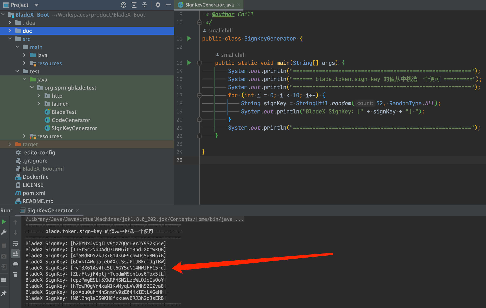
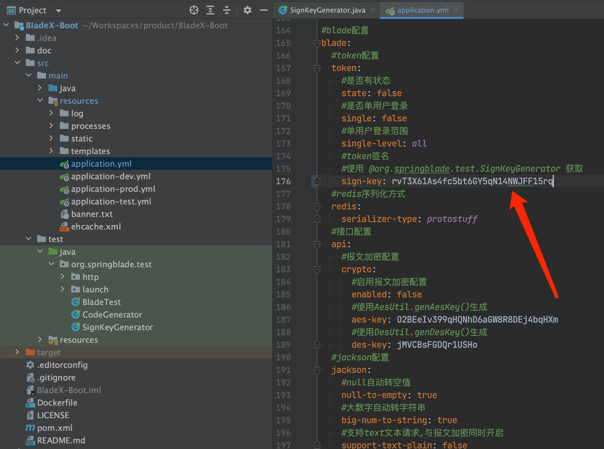
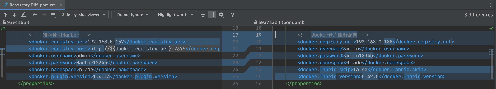
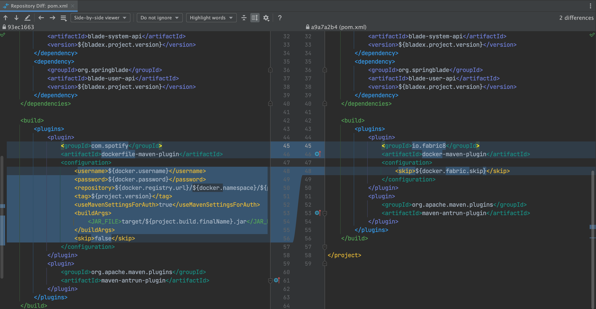
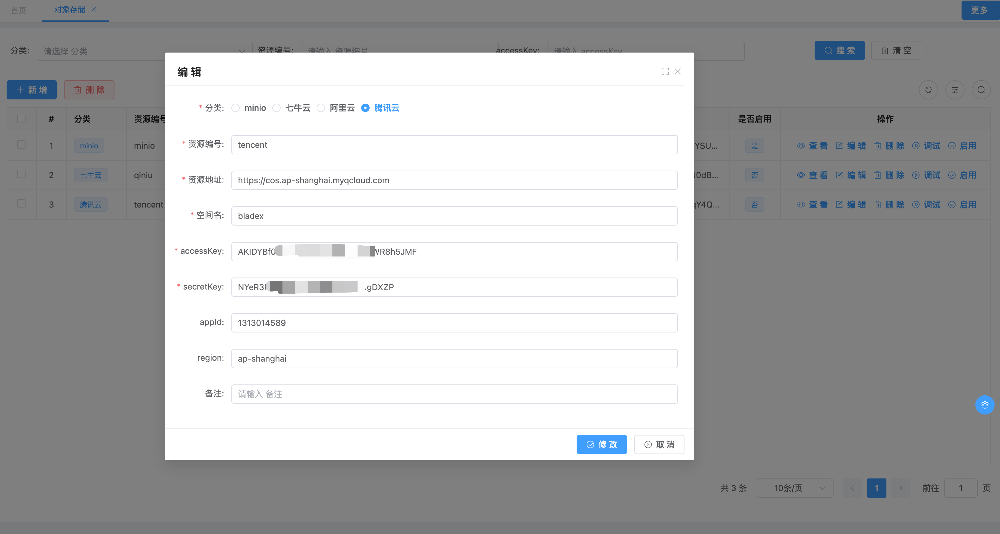
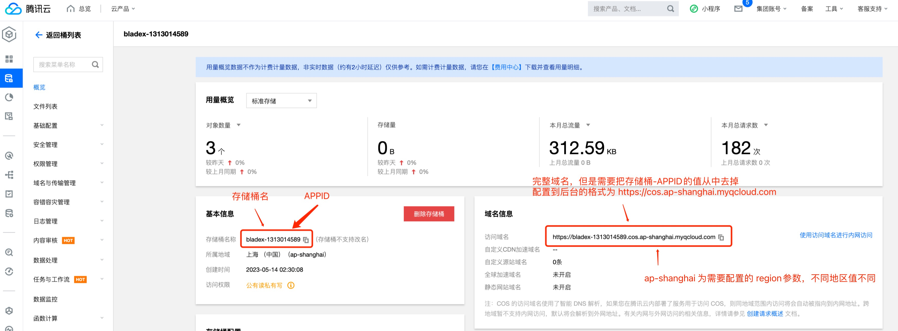
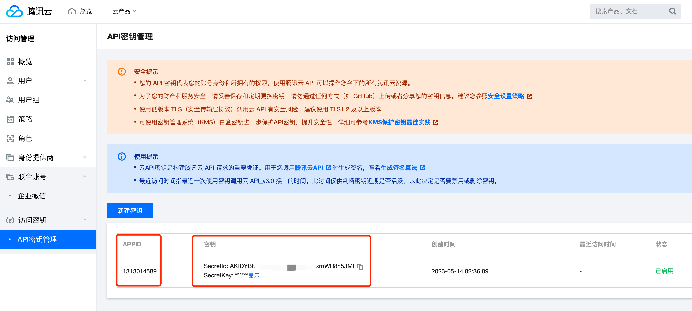
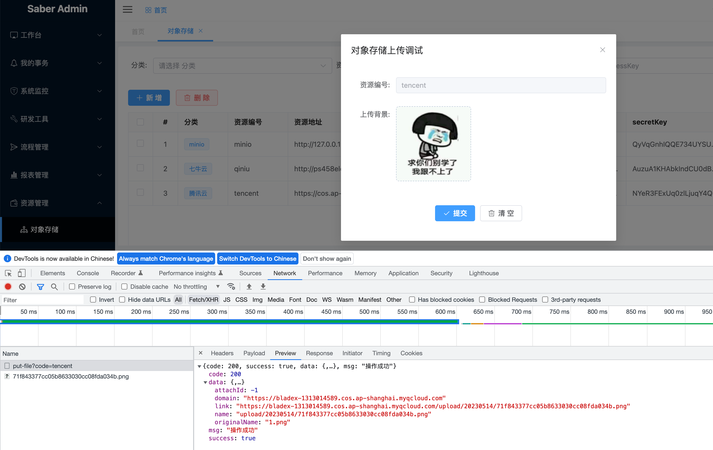
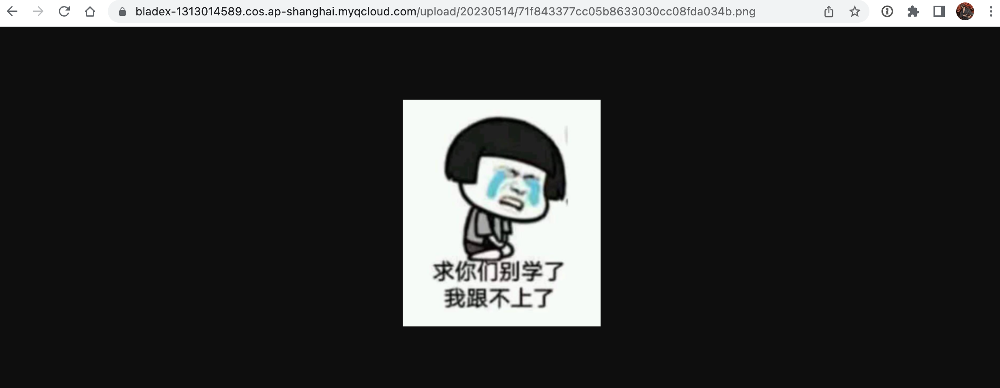

## 数据库结构升级

⚠️**本次升级涉及数据库表结构变动，将blade_model_prototype表的comment字段变更为jdbc_comment，以防止部分数据库关键词导致报错**


1. 升级数据库，执行/doc/sql/bladex-update文件夹下的sql更新脚本
2. 下载最新版本，将自己写的业务代码覆盖
3. 若变更了包名、结构，则更新的时候需要针对git提交记录进行逐条比对、更新
4. 推荐使用git远程分支合并，若有冲突可手动进行合并（推荐大家业务模块开发在bladex-biz，这样bladex只需跟随主分支更新即可）
   
5. 更新完毕后，记得将redis执行flushdb命令
6. 若修改包名或工程结构，导致无法直接通过git merge合并的同学，请看下方的注意点，不要遗漏～ 否则更新容易出错


## 升级注意点，请务必确认

1. 中央仓库全新升级，需要配置令牌认证后方可下载依赖，具体请见文档1.3.0章节：https://center.javablade.com/blade/BladeX-Doc

2. 若不想通过bladex中央仓库下载打包好的BladeX-Tool，可以自行构建BladeX-Tool并把依赖推送到自建的nexus私服

3. 增加了sign-key的快捷生成工具，Boot版本在test包的`org.springblade.test.SignKeyGenerator`，cloud版本在blade-auth的test包下

   

   

4. 支持国产崖山数据库（YashanDB），对应脚本已经提交至 doc/sql/yashan 目录

5. docker构建工具更换为fabric，打包推送命令变更为：`mvn clean package docker:build docker:push `

   与原先的变更对比请见下图，右边为新版本

   

   

   

   新服务在pom.xml加入如下配置便可(boot版仅有一个服务，无需操作)

   ```xml
   <plugins>
       <plugin>
           <groupId>io.fabric8</groupId>
           <artifactId>docker-maven-plugin</artifactId>
           <configuration>
               <skip>${docker.fabric.skip}</skip>
           </configuration>
       </plugin>
       <plugin>
           <groupId>org.apache.maven.plugins</groupId>
           <artifactId>maven-antrun-plugin</artifactId>
       </plugin>
   </plugins>
   ```

6. 增加了客户端重复登录的判断，现在可以配置：

   * 全平台仅有一个用户可登陆（不论是pc端还是手机端，均只有一个用户可以登陆操作） 

   * 客户端系统仅可一个用户登陆 （比如pc端、手机端就算两个客户端，这两个系统都可以有一个人在线）

   * 具体配置如下

     ```yaml
     #blade配置
     blade:
       #token配置
       token:
         #是否有状态
         state: true
         #开启单用户登陆
         single: true
         #全平台仅有一人
         single-level: all
         #客户端仅有一人
         #single-level: client
     ```

7. 控制台日志打印组件增加了url忽略的功能，现在可以自由控制哪些api的日志不需要打印在控制台了，配置如下

   ```yaml
   blade:
     #日志配置
     log:
       request:
         #开启控制台请求日志
         enabled: true
         #忽略控制台日志打印
         skip-url: 
           - /notice/list
           - /user/*
   ```

8. 有不少用户反馈腾讯云oss不会配置，现增加说明，大家两张图经过对比即可

   

   

   

   配置完毕后调试上传无误，浏览器可以正常访问

   

   

   

   

   