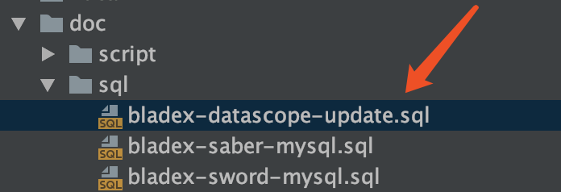
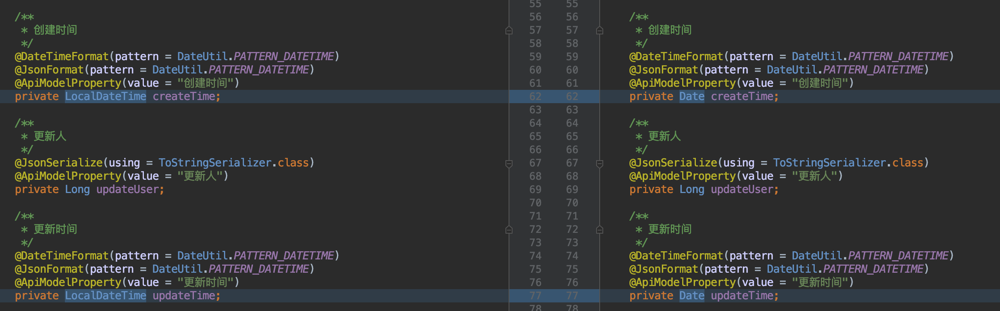
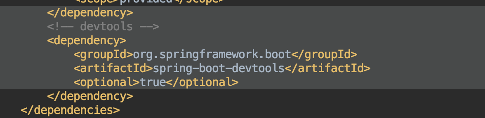

## 升级注意点
1. 升级数据库
找到对应的升级脚本，直接执行

2. 代码版本更新
* 前端工程可以直接覆盖
* 后端升级需有注意，由于mybatis-plus升级带来的问题，需要把原先Entity里的LocalDateTime修改为Date

* 同时需要把devtools的依赖排除，因为mybatis-plus也不支持，否则未来升级会有问题出现

3. 其他情况，下载最新代码直接覆盖即可
